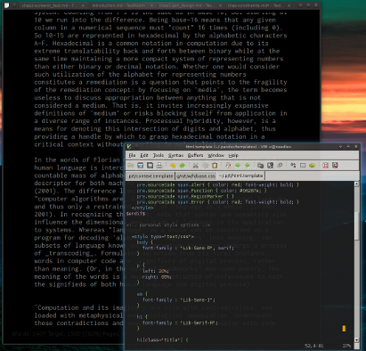

% Grammars of Process
% John Haltiwanger
%

# Acknowledgments #

# Introduction #

Today's new media theory increasingly invokes _materiality_ as a significant, perhaps even _the_ significant, mode of investigating digital objects and the media through which they are delivered. This thesis questions such a centrality of materiality through a practice-based, process-oriented approach. _Process_ is proposed as the atomic unit of that which new media theory investigates. This is true on a formal material level: applications run as either as individual process or as assemblages of process which are managed by an operating system and through which the application's code is accomplishes all of its tasks, from memory and access to algorithmic execution on the central processing unit. A process-oriented approach will be shown to provide superior methodologies for engaging with and understanding software than material analysis alone provides. For instance, certain problematics within Lev Manovich's concept of 'media hybridity' will be resolved by a re-orientation towards process (Manovich 2008). Process also allows a fresh perspective for examining human-digital relations. Human processes and digital processes are seen as inextricably intertwined, leaving any discussion of digital process that excludes relevant dimensions of human process necessarily unfinished.

=== FRESH ===

In this introduction, I will first briefly re-trace the vectors of medium theory as they have developed since the introduction of 'new media' as an academic institution. Such re-tracing necessarily begins with McLuhan, as his theory is intrinsic to one of the earliest theoretical frameworks of new media, the _remediation_ model of Jay David Bolter and Richard Grusin. This framework was eventually superceded by a discipline-wide turn towards investigations of materiality and medium specificity, spearheaded by the work of N. Katherine Hayles. Finally, Lev Manovich's manuscript _Software takes command_ provides concepts of _media hybridity_ and _deep remixability_. 
Throughout this swath of theory is woven an intrinsic focus on the _material_ modes of media. Media hybridity, for instance, relies on a medium having a specific dimensionality that is enlarged or otherwise augmented through hybridization with other mediums. In a significant example, the dimension of typography obtains velocity and physicality as it enters the 3D void of the After Effects window. I pose the following question to this explanation [WHUT WASS IT AGGIN>>??]. 
Rather than 'dimensionality,' I propose that we conceptualize these hybridizations as generating new levels of metapotentiality. This is a transposition of Gilbert Simondon's language of ontogenesis into new media discourse. Simondon utilizes the ideas of metastability and metapotential to describe active forms of those concepts: a metastability is likened to a substrate in which massive activity occurs. One example is a fluid suspension that happens to contain ideal conditions for crystalization: the metastability of the suspension drives its crystalization, and crystalization is the actualization of the suspension's metapotential. Yet crystalization is a singular process, a form of individuation for which identical crystals are said not to exist in nature. The metapotential of each substrate is fulfilled uniquely. And in natural or otherwise unbounded systems, crystals are often on-going processes of _individuation_---Simondon's term for the movement of a metastability through the courses of its own metapotential.
This thesis proposes that grammars are a key factor of enabling hybridization. Hybridization, in turn, expands and extends the metapotentials of involved processes. Thus, grammars are crucial mechanisms through which the metastability expands along its metapotential.

The method proposed to demonstrate these points is two-fold. The first is an analytic approach---the modes of operation of designers themselves are examined. Starting from the proprietary Mac OS X operating system, described here as a unique and powerful example of _process hybridity_, we progress to a discussion of the operations of designers as constrained by FLoSS (Free/Libre/open/Source Software). The second aspect of the method is a detailed interrogation of actual practice in the form of _digital typesetting_. This topic was chosen for several reasons. The first is a general lack of focus on the processes behind typesetting among new media theory---while the surfaces of text have been investigated in numerous ways (Bolter 2001; Fuller 2000), there has been a general lack of concern (or capacity) regarding the underlying processes of text in the metamedium (computers). This is especially evidenced as regards the _command line interface_, a realm where text becomes kinetic. Yet I  found that very little theory has been written regarding the command-line, despite its place as the historical interface (once contemporary with batch punch cards) by which digital processes were initiated. Far from being obsolete, both Microsoft and Apple ship command line interfaces within their operating systems. In Microsoft´s case, significant money has been spent developing a new grammar and implementing new functionalities into their modern command line implementation Powershell (as opposed to the grammar and functionalities of DOS).

The second reason for choosing typesetting is the supposed lack of media hybridity of typesetting--according to Manovich's definitions of the terms, typesetting has failed to move beyond 'multimedia' to a state of 'media hybridity' (this is opposed to typography, which undoubtedly has) (2008: 86). Media hybridity is Manovich´s formulation of the increasingly common ¨sharing of languages¨ between media. When media share language, they develop new dimensions (2008: 86). Language, then, demonstrates its capacity for modulation in a new context. While the proposition that ¨language can add dimensions to things¨ may at first consideration seem a bit too obvious for stating out loud, the kinetic properties of language within the context of the metamedium--that the code enabling the language sharing that enables media hybridity is _itself made of language and made executable by language_--seem to beg for consideration. Whereas much of the new media discourse relating to changes in media trends toward contemplating fast-paced visual cultures such as video games and cinema, this thesis aims to take the opportunity to contemplate the much slower-moving medium of text. This contemplation of screenic text leads to questions about the nature of media within a medium as well as to the introduction of a conception of processual hybridity that both underpins and exceeds the dynamics of media hybridity.

The third aspect is the allowance of a truly reflexive investigation in which multiple processes of digital typesetting are utilized to generate the thesis itself. This provides a means to integrate the process-oriented perspective into a software study of FLoSS typesetting software. Not only this, it provides a means to attempt what could be considered a _refractional_ methodology. Inspired by Gilbert Simondon´s adoption of the language of chemistry in the formulation of _transduction_ within his theory of ontogenesis, this thesis can be viewed as a distinct crystallization process, the composition of a whole from the process of that whole´s unfolding. The applicability of Simondon´s ontogenesis to matters of generative design will be interrogated in contrast to Jay David Bolter and David Grusin´s remediation theory (Bolter and Grusin 1996; Bolter 2001). Ontogenesis, albeit without Simondon, has already proven an effective angle for approaching Web 2.0 platforms (Langlois, McKelvey, Elmer, and Werbin 2009). Here the description of this thesis´own workflow will demonstrate Simondon´s ontogenesis as making unique contributions to the process-oriented perspective which this thesis attempts to invoke and instantiate. 

The fourth is the simple fact that screenic text has not been interrogated on a _subtextual_ level---surface analysis of text (and hypertext) have driven the discourse of screenic text in new media. 

# Screens #

As digital typesetting provides the focus for the application of the process-oriented perspective, the point of origin is necessarily that of the screen. Information transmission is increasingly screen-based, a fact that only intensifies with the exponentializing ubiquity of mobile devices such as the iPhone. The long-awaited advent of cheap "tablet" computers and e-readers is also now at hand. These devices may all be seen as mediums for _screenic processes_ in that their entire configuration and all of its computation exists to serve as the basis for screenic interactions with _human processes_. These phrasings introduce the perceptual angle attendent with this thesis, namely the centering of _process_ as the atomic unit of what is discussed in new media theory. The term _screenic_ simply means 'screen-based,' or (perhaps) 'screen-native.' It is analagous to 'printed.'

One way to define screens is in terms of their interactivity. Some screens, such as television screens, offer very limited interactivity: the choice of content. This choice itself can be constrained by varying degrees, such as the number of available channels and playback formats (VHS, DVD, Xvid, etc.), even to the point of disappearing (in the case of many televisions that appear in public spaces).[^1] The medium of the remote control should not be underestimated in its effects on human processes, to say nothing of the screens at which they are aimed. Indeed, they drive the interactivity of the video game consoles, an interactivity that clearly represents the cultural cutting edge of what a television screen can offer.

[^1]: Mobile devices are beginning to ship IR transeivers with full hardware access through software. That is, the _entire potential_ of the IR spectrum is available to them.

The computer screen, on the other hand, is defined by its seemingly limitless degree of interactivity. Remote controls can be run as screenic processes and can not only change television channels--processes on remote systems can be controlled with similar ease. Indeed, the entire screenic composition of one computer can be controlled over a network by a second computer using included, or easy to obtain, applications. Furthermore, the very interfaces to the screen (keyboards and mice) are examples of remote controls in cases where the screen has not itself become its own remote control (touch-screen devices). Typically the only element of a computer screen that the user does not effectively control are the structure and visual language of an operating system's graphical user interface (GUI). Even this, however, is generally accomplishable by a significantly informed user. In the case of GNU/Linux the task is not only accomplishable: in the case of a "from scratch" installation,[^2] the user is literally forced to make a choice of GUI structure and visual styling. Microsoft has generally shipped their operating systems with multiple choices for widget[^3] presentation, including re-mediations of widgets from previous versions of Windows. Users also developed Apple, however, maintains strict control of widget presentation, especially on their mobile devices.

[^2]: Such as is demanded by no-frills distributions such as Gentoo and ArchLinux, where manual installation and configuration of a GUI is required for use.

[^3]: A widget is the technical term for a GUI element. Scrollbars, titlebars, menus, and close/minimize/maximize buttons are widgets attached to most of the "windows" that appears on any given GUI-driven computer.

## Screens as material, screens as process ##

Screens offer an ideal point of juxtaposition between the material and processual frames. From a material view, the very formulation of "screens" as _the_ interface between humans and computers is problematic: what of the interfaces that have been developed to work around instances of blindness or other [disabilities] that prohibit visually screenic interaction?

From a processual orientation, the question becomes: how do interactions between humans and computers resolve themselves? The answer returns in the form of the _available_ remote controls and the _available_ response interfaces. The next step might be to investigate the degree of variance between these availabilities, and whether they problematize any umbrella-classification. While it would be _insensible_ to argue that material differences in inputs and outputs can--or do--not lead to a huge amount of variation between experiences within humans. Such variation is likely to occur in differentials. That is to say, the spectrum of possible feedback occurs at the level of the human individual---one's experiences are functionally irrepresentable without translation of some kind. [We can choose to call these translations mediums, or we can choose to call these processes.]

At this point the question becomes, then, whether it is necessary to instantiate these inherent divergences in every evocation of a broad level discussion of input and output mechanisms or whether the inherent, _core_ similarity between them all remains that in all instances they serve as _the point of contact_ between human and digital processes. Does it make a processual difference if the output technology is a braille screen or an LCD screen? Only inasmuch as to what degree the process being examined is unique to, or highlights differences between, one or the other. From a discursive level, _controls_ and _screens_ can capture the essence of these dual "action spaces" that together form the single point of contact between human and digital process.

Is it possible to remediate of the term screen into discussions of previous mediums? For instance could one speak of the "screen" of a newspaper or the "screen" of a cave wall? What about the "screen" of a radio? From a linguistic-conceptual perspective the final example certainly pushes the limits. From a process perspective, though, the presence of the radio/what it is playing/what listening choices are available/how and to what degree does the hardware support frequency tuning: these questions can all be conceived in terms of 'control' and 'screen.' The sounds of a radio do emit, after all, from the vibrations of a stretched membrane.

This thesis proposes a conceptual-linguistic shift in the discussions of screens as the _site of discourse_ through which digital processes yield the results of their execution. Likewise, the remote control, or simply _control_, is the site of discourse through which which human processes instigate and extend into the digital. There is no removing or reducing of this dyadic assemblage---even when the control and the screen are literally fused (as in most contemporary smartphones) the distinction between _control_ and _screen_ holds on both a conceptual and material level. Conceptually, human process still extends through the control into digital process, which still produces feedback through the screen. Materially, the screen is a Liquid Crystal Display driven by a graphics card that interfaces with coded drivers and display subsystems in the device's operating system. The control, on the other hand, is the glass suspended over the LCD which, through one or more of the multitude of available technical solutions for the process, reads point(s) of contact, pressure, and vectors (velocity and direction) of movement.

# From Screens to Text #

To discuss computer screens one must necessarily engage with the concept of _interface_, a topic that rightfully occupies a great deal of current new media discourse. Interface, then, represents one point of departure from our origin. While interfaces often utilize many visual metaphors (most of them inherited from the work done developing the first GUI at Xerox's Palo Alto Advanced Research Lab (PARC) in the 1970s), there are yet few computer interfaces that do not rely on text as their dominant mechanism for organizing and presenting a program's internal capabilities to a user. (Mobile screens, on the other hand, increasingly display developing trends of icon-only design, though the web browser remains a popular application). Despite the success of the GUI over the text-only command-line interface (CLI), text remains central to contemporary experiences of computer screens.

The command line is seen as a space of contestation for traditional
modes of media analysis. Remediation, for instance, will be demonstrated as inappropriate for discussing the CLI. As Google has just recently released a command line interface for interacting with Google services, I believe a discussion of the command line is essential for new media (Holt and Miller 2010).

(Unfortunate to note, this historiographic aspect is still **'to-do'**:

The centrality of text to the experience of computer screens represents the main avenue by which we proceed from the origin, constituting a trunk from which many additional concerns fork away and then face examination. The arguments of the paper are augmented by the inclusion of a historiography of digital typesetting. Engaging critically with the history of _software itself_ is considered a requisite for responsible software studies: a full range of influences (economic, cultural, technological) should be considered in the re-telling of a given processual unfolding. In this aspect of focus, it extends Lev Manovich's admirable positioning of history as central to a software study by broadening the scope of historical considerations.[^note] Inspiring this enagement is the work of Robin Kinross, whose _Modern typography: an essay in critical history_ is one of but a few texts covering a history of typography to adequately engage with the influence of factors outside of that field on the field itself (Kinross 2004). By integrating a critical history of digital typesetting with a process perspective, an equilibrium between human and digital processes will be illustrated.

[^note]: **Note:** This work largely remains unfinished in this draft, as it became apparent that I needed to work back through more discussions of basic infrastructural elements such as operating systems in order to fully describe the assemblage of process upon which computer-based design is situated.)

## Recognizing the Ontogenesis in Generativity ##

In his text _The Position of the Problem of Ontogenesis_, Simondon writes,

\startlongquote
By transduction we mean an operation--physical, biological, mental, social--by which an activity propagates itself from one element to the next, within a given domain, and founds this propagation on a structuration of the domain that is realized from place to place: each area of the constituted structure serves as the principle and the model for the next area, as a primer for its constitution, to the extent that the modification expands progresively at the same time as the structuring operation. (Simondon 2009: 11).
\stoplongquote

Note the distinct lack of 'computational' in Simondon's list of operations. Written prior to the advent of Manovich's formulation of the age of cultural computing, this absence might simply be read as a matter of temporal context. Nevertheless, Simondon's solution to the ontogenesis problematic provides a framework for describing digital processes of a generative nature.

This leads to another important element of this thesis, one that runs throughout the entirety of itself---the underlying processes of presentation required to 'typeset' the text itself. Through the utilization of FLoSS software, multiple output formats will be not only be investigated but also materially instantiated through a designed mechanism of process--a _processual hybridity_. These output formats represent two of the top formats currently used to manage and display texts digitally: HTML and PDF.

The process(es) of their generation offers an attempt at mapping Gilbert Simondon's language of ontogenesis onto file format translation or, to begin the project immediately, _individuation_. Coupled with Simondon's individuation is this concept of _transduction_. Repurposed from the language of chemistry, Simondon's metaphorically images transduction with the example of a substrate--swelling with _metapotential_--that crystallizes. The final formation is the substrate fulfilling this metapotential, a fulfillment that arises only through an unpredictable unfolding involving emergent factors. (The language of chemistry was likewise appropriated for the term 'interface' (Cramer and Fuller 2008: 149)). 

Through this mapping I hope to provide a convincing argument for shared properties between what I am calling process and individuation, and between transduction and what I am calling instantiation.

This relates with the increasingly generative nature of contemporary design. All of which are generated from a plain-text file whose syntax conforms to a format standard called 'markdown.' The polycephalous nature of _the text itself_ thus demands further branching into a discussion of formats. What are the attributes of the class of process to which formats belong? Formats are seen as stable, yet they move like glass (or glaciar) in the nano-magnitudes of the digital. Formats provide another point of contrast between process and material perceptual orientations.

The discussion of generativity provides further means to demonstrate the equilibrium of human and digital processes. Analyzed materially, these processes are chunks of code electronically lifted from hard drive platters, loaded into system memory, and then executed via the assemblage of chips on the computer's motherboard by way of instructions from the operating system currently residing as a mass of memory heaps in RAM chips. Analyzed _processually_, however, these digital processes are properly seen as deriving from interactions with human beings. That is to say, digital and human processes are intimately intertwined, from the design of their physical landscape of execution (microcircuitry) to the instructions derived from the user. From a process angle the computer becomes something of an external nervous system, extending and modifying the realm of human potentiality even as it surpasses the capacity of a single mind to functionally comprehend the entirety of its workings.[^4]

[^4]: The chips produced by Intel, for example, are too complex for any single person to ever hope to entirely understand.

### Print is static, code is process ###

The flat/deep distinction proposed by Hayles is, by its formualation, material. Problematizing this material focus is the interwoven history of text and code: the lens of typesetting allows us to focus on a unique intersection of the two. As the historiographic case will demonstrate, typesetting is a _non-reducible_ process (NP-Complete). This non-reducibility of typesetting reflects the non-reducibility of computational processing of language, as well as the non-reducibility of language, as signifier, into that which is actually signified. This "turtles all the way down" scenario has intriguing implications from a process perspective as we investigate the methods that have been developed in order to work around this non-reducibility.

When Hayles states that "materiality thus cannot be specified in advance; rather it occupies a borderland--or better, performs as connective tissue," she is provisionally correct (Hayles 2004: 72). However, this metaphor-ization of process is exemplary of new media practices: reference the complex with an abstract metaphor, obscuring complex and important dynamics with a metaphor. The metaphor works, to be sure. One could even consider it an ideal formulation. At issue is the fact that this borderland is not discussed in a technically correct manner. 

# Remote Controls #

I think it may be reasonable to take the remote control and use it to create a metaphor for all human-computer interaction.

Every digital process has, at its origin, a human. The rate of computation has increased the impact of human-digital processes in that the results deliver their results faster. The results will either match the intentions of the originating human process, or they will not. In the second case we can find the first evidence of the effects of digital process on human process: _the code behind the digital process will be re-arranged in an attempt to deliver an output that satisfies the intention of the human processes._ Whether this modulation of the executed code is through sliders/input boxes/etc within a GUI interface or through direct reworking of the source code itself, the effect is the same: the code executed has been re-configured according to the goal of human process. The result(s) of the digital process, experienced through a screen, can match, exceed, or fail this goal. In turn, human process is effected and the next move is made according to new goals or revised digital processes.

Video games, for example, can easily be represented by this model. Human process is obviously shaped by digital at the outset: there are a finite number of actions that a game offers within its context. In addition, these actions are often presented as pre-set mappings of action to controller button.

# Attributes of Process #

[It needs to be asserted that I am willingly engaging in my own appropriation of the term 'process' outside of any traditions other than my own. As the process oriented perspective arose under the looming shadow of the draft deadline, I admit to a lack of historical perspective on the use of this word in either new media or other contexts. Withstanding that, however, I sense a real applicability of this term in the discourse of new media. I'm looking forward to working on the final draft and using some of that time to construct historical perspective for this shift to process. One important angle is Ned Rossiter's work on "Processual Media Theory" in his book _Organized Networks_ (Rossiter 2007: 166-192), which this draft does make use of but which I would like to interweave more deeply. As it stands, this introduction was left relatively alone for the sake of fleshing out the middle part of this thesis. This was at the suggestion of the second reader.]

Process is reflective. It's outputs reflect its inputs. Additionally, process reconfigures the metapotential in any given system. It's reflectivity, then, has material effect. As it reflects the inputs into the outputs, the outputs in turn reflect new (or else simply different) potentials back into the _context_ which is the reciprocal contact point in which the processes began. This language is extrapolative into any set of intersections. This paper considers just the subset of human-digital recipricity, and within the relatively static domain of typesetting.

A new configuration of metapotential in any system results in the reconfiguration of (all) other systems as well. This fact reflects the _fractal_ nature of process--there is a degree of non-reducibility inherent in any discussion of process, as ultimately certain factors in its functioning are unknown to us.

# Why free software? #

There are multiple points of consideration that lead me to concentrate on free software. The first is its relative lack of presence within new media circles. Time and again I arrive at a conference only to see a room full of computers booted into proprietary operating systems. While I am not a 'zealot' who disavows any potential use or need for proprietary software, I find the general population of new media's reliance on proprietary operating systems--chiefly, by way of personal and anecdotal evidence, Mac OS X--disturbing. Hans Magnus Enzensberger outlined in his "Constituents of a Theory of the Media" the importance of issues of control with relation to mediums. Let us move through the juxtaposed elements of repressive versus emancipatory uses of media which Enzensberger provides and interrogate them in relation to Mac OS X and GNU/Linux (Enzensberger 1970: 269):

_Repressive versus Emancipatory_

Centrally controlled program vs. Decentralized program

:	This question is answered by asking the question: "Where is the source code of the operating system?"
	In the case of OS X, the source code resides only within the confines of Apple's corporate computers. It is likely heavily guarded by multiple mechanisms. Whereas in the case of GNU/Linux, the operating system source code is spread across dozens of mirrors on the Internet as well as the computers of programmers and users around the world. Each of these copies can be readily modified to the designs of any given user, demonstrating decentralized (in fact, distributed) control. Apple maintains sole, central control of the code and thus fully determines the functional possibilities of the operating system.

One transmitter, many receivers vs. Each receiver a potential transmitter

:	This is already demonstrated above: the code for GNU/Linux is globally distributed across hundreds of thousands of computers. Each one of these has the ability to modify the software and share those modifications with anyone who will listen. OS X can be modified by no one.

Immobilization of isolated individuals vs. Mobilization of the masses

:	OS X encourages the use of proprietary applications. These applications have restrictive license that generally allow only one individual the right to run the application. GNU/Linux, meanwhile,

Passive consumer behavior vs. Interaction of those involved, feedback

:	A major advantage for both users and developers in a free software ecosystem is the feedback that occurs between them. Users may suggest new features at any time. If they have the skill and/or time, they can add these features themselves. If the addition of the features is contentious in any way, the contributer can simply fork the codebase and continue evolving the software in new directions.
	In OS X, you run the binaries you are given.

Depoliticization vs. A political learning process

:	Mac OS X is pro-capitalist and promotes consumer culture. It can probably be said that it is politically "neutral" in its codedness, but this very codedness remains obfuscated and proprietary. GNU/Linux, in conservative judgment, at least does not actively promote consumerism. In an idealistic formulation, it destabilizes the capitalist ecosystem.[^discuss] It's politics are as multifaceted as its user base.
	In its well-deserved reputation as 'taking some work to make it work,' GNU/Linux forces its users to become active in the system's administration. This induced learning of an open approach to computer systems could be said to have political dimension.

[^discuss]: It is important to note that free software also plays a significant role in supporting this infrastructure, as the license provides no recourse on the terms of the softwares use (Pasquinelli 2008).

Production by specialists vs. Collective production

:	This seems self-explanatory.

Control by property owners or bureaucracy vs Social control by self-organization

:	Are you getting the picture?

In a presentation at the Libre Graphics Meeting 2010, Florian Cramer explains his theoretical positioning of free software as an entry point into media criticism. Aymeric Mansoux, also of the Networked Media design faculty at the Piet Zwart Institute and present with fellow faculty member Michael Murtough, describes the critical engagement in the error message common to GNU/Linux distributions, found in the Totem media player program complaining of a missing codec library that is required to decode common patent-encumbered media formats such as MPEG-Layer 3 (Cramer, Mansoux, and Murtaugh 2010). Behind the error message lies an assemblage of inter-related issues of intellectual property rights, cultural practices, and media accessibility. This is a clear instantiation of a "political learning process."

On 21 June 2010, Apple changed its privacy settings to allow the company to "collect store and share 'precise location data, including real-time the geographic location of your Apple computer or device'" (Marco 2010).

## Caveats ## 

Free software is not, however, a "magic bullet"--tied to the open systems theory which is philosophically related to the underpinnings of the Chicago school of economics, some of the philosophical foundations of free software, _and especially open source_, need to be interrogated (Cramer, Mansoux, and Murtaugh 2010; Pasquinelli 2008). Liberation does not automatically lead to a distribution of tools to all those that need them. However, even in this instance we see the power of FloSS in its capacity to inspire critical engagement with media.

\stopfrontmatter
\chapter{Crystalized Process: Text That Typesets Itself}

The time has come to for the self-reflective approach of this thesis to come into play. For a book called _Writing Space_, this work by Jay David Bolter provides scant discussion of actual writing environments on the computer. Originally written before the expansion of the World Wide Web into the sphere of popular culture, _Writing Space_ is concerns itself with "the space of electronic writing".[^second] In defining this space as "both the computer screen, where text is displayed, and the electronic memory, in which it is stored," Bolter belies the relative absence of process in materialist forms of media analysis (2001: 13). 

Bolter's over-simple definition of electronic writing space does not incorporate the act of writing, only the display of it. This surface-level analysis fits well the application of his remediation theory---the surface of a medium (it's "screen") is the host site of remediation. Bolter delves below the surface in his explanation of a shift to topographical writing. In the electronic writing space, "any relationships that can be defined as the interplay of pointers and elements" are representable (32). The writing space "itself has become a hierarchy of topical elements" (32). This is the effect of the computer's affinity for symbol-processing: "Any symbol in the space can refer to another symbol using its numerical address" (30). To highlight the dimensional shift in the writing space, Bolter describes the operation of outline processors. These programs abstract a text to the level of sections. These sections can be moved around and manipulated. Writing becomes _topological_ in the sense that they now have a spatial aspect. Sections of text have obtained a modularity and independence that allows visual arrangement.[^layoutproc] What he does not talk about is the formats generated by the Macintosh program that he uses in his figures. He mentions passing layouts around on floppies between friends, but that assumes a parity of operating systems and proprietary software (at least in his example) (!CITE!).

[^layoutproc]: Almost twenty years later, layout processors have been for the most part subsumed by word processors. The layout shifting process has been hybridized into the increasingly feature-ful assemblages of word processors where it has not morphed into a niche proprietary product.

(!!! WHERE WAS I GOING?? !!!)

[^second]: The second edition of the book, published in 2001, was used for this thesis. While it is updated to include the Web, its roots in a significantly older text are worth noting.

# Environment of Operation #

This text is not typed in the manner that you see it. The above header is instead written like this:

~~~~~~~~~~~~~~~~~~~~~~~~~~~~~~
  # Environment of Operation #
~~~~~~~~~~~~~~~~~~~~~~~~~~~~~~

Through the wrapper program `pandoc`, this input (written in Markdown) is converted into HTML and ConTeXt outputs.

HTML
:	`<h1>Environment of Operation</h1>`

ConTeXt
:	`\section{Environment of Operation}`

The syntax of HTML represents a semantic operation: "Dear Mr. Browser, treat this as a header of level 1." The syntax of ConTeXt, however, represents a macro command within a programming language. What it says is "call the sections of code that translate the text within the brackets to the parameters specified for the `\section{}` command."

The literal 'writing space' of this thesis is a program called Textroom. Textroom is a minimalist text editor in which there are no buttons, taskbars, or other clutter. Only you, your words, and (optionally) informational text reporting the time, word count, percentage to accomplishing your writing goal, etc. By writing in plain-text, I open myself to the opportunities afforded me by version control systems. Developed to enable collaboration of programmers on a code base, version control systems can track changes in text across time (useful for this project) and allow for massively distributed workflows involved tens of thousands of individuals (useful for the Linux kernel).

## Constraints ##

Above you see a necessary adaptation within my workflow. My netbook took a fall and lost the ability to use its screen. Because of the nature of the command line, I was able to log in to computer and execute commands that allowed me to establish remote access using a piece of software called `ssh`. This remote connection can also support the transmission of GUI applications using the client-server model at the heart of the X Windows system (which drives the GNU/Linux GUI). This was important a) to get files off the netbook, and b) the version of `pandoc` on my desktop had stopped working after a modular dependency was upgraded and I was finding it impossible to upgrade `pandoc` itself. In the image above we see the minimal editor Textroom and the editor gvim. Because of the pandoc incompatibility on the desktop, I was forced to use the netbook as the site of typesetting. This shaped the output of the project most likely by time. However, the simple ability to log in and enable remote access shaped this project immensely by allowing me to extract important work that would otherwise have been lost.

An unfortunate constraint is the inability to take advantage of elements of the TeX landscape that are reknowned for making life easier. The chief among these is BibTeX, which allows for a bibliography to be dynamically generated and citations to be inserted according to a variety of formats (that one can change with a single line of text, if desired). By abstracting myself from TeX by using Markdown as the "pre-format," I've lost the opportunity to easily manage bibliographic data and instead must input it by hand. That said, the MLA format is not currently available in BibTeX meaning that--even if I could use this software--the output would be necessarily shaped by the constraints of the tools.

## A pre-format necessarily complicates while it simplifies ##

Using the 'markdown' pre-format complicates several issues with typesetting documents in both HTML and ConTeXt. For instance, ConTeXt includes a `\chapter{}` macro, which influences the numbering of sections so that sections are relative to the chapter number, rather than to the entire text. Thus the first section of chapter two will be rendered into text as '2.1'. The issue arises because HTML has no similar distinction: sections are related to the depth of the header, such that H1 is the highest level section (the equivalent of ConTeXt's `\chapter{}`). In markdown, the top-level section appears as in the example above, that is using a single '`#`'. My initial solution was to include two sections with only one '`#`' per chapter, the first of which I would manually change from `\section{}` to `\chapter{}`, with the result that the sectioning of the chapter fits what is expected---chapter 2, section 1 is numbered as '2.1'.

This does not satisfy HTML, however, as there is nothing to change the first single '#' into: it is already inserting the highest level section, 'H1'. Thus, where ConTeXt begins numbering the sections within the chapter (2.1, 2.2, etc.), HTML increments the top-level section number, so that the second single '#' increments to '3', instead of to '2.1'. If a double '##' is used, the sectioning will appear as we desire in the HTML, but will appear as '2.0.1' in ConTeXt. This incompatibility requires either modifying the Pandoc source code directly or else the creation of a specific 'helper' script to create a sectioning parity between the two output formats. As I do not know Haskell, I've opted for the second solution.

Since markdown allows passing TeX commands, I solved the problem by using `\chapter{}` to designate the chapter title. Then, using a command-line script written in the Ruby programming language, a copy of the markdown file is created in which `\chapter{}` is replaced by a single '#' and all subsequent '#'s are increased by one '#' until the next `\chapter{}` is reached. From this copy we generate the HTML version, while the original can be processed into TeX. Perhaps this technical description appears to be more of a computer science discussion than it is a media theory one. However it highlights the ways in which processes hybridize: the conflicting grammars of ConTeXt and HTML create a complication which the wrapper program Pandoc either does not or can not address. To work around this issue, a separate program (the Ruby interpeter) is used to integrate a script file which deals with the problem. This is a common feature of a command-line based workflow: "glue" scripts are written in order to fuse processes together. This glue can result from .

### Regular Expressions and Process Hybridity ###

Regular expressions represent another avenue for demonstrating process hybridity. Since their introduction into the early text editors `QED` and `ed` by Ken Thompson, regular expressions have since been incorporated into many Unix commands such as `grep` and `awk`, newer editors such as `vi` and `emacs`, and programming languages such as Perl, PHP, Python, Ruby, and many more (_Regular expression_ 2010). Regular expressions are a means for describing parameters of text searches, whereby arranging esoteric control characters in and around the text one is looking to find allows for finely tuned pattern matching. 

The hybridity of regular expressions lies in it's adoption by nearly every major programming language: from Wikipedia, the list includes "Java, JavaScript, PCRE, Python, Ruby, Microsoft's .Net Framework, and the W3C's XML Schema" (_Regular expression_ 2010). This list of languages refers to those who have hybridized some form or derivative of Perl's implementation of regular expressions, which is considered more robust than Ken Thompson's original version.

Is it possible to say that these programming languages are 'remediating' the regular expressions from Perl? It is not beyond reason to assert that programming languages are 'mediums'---Ken Thompson has referred to Smalltalk as a new medium, for instance (!CITE!). However, mapping the term medium onto a programming language falls into the same trap of stretching the term medium until it becomes incomprehensible. Do different versions of the same language, representing different capabilities and even incompatible syntax changes, constitute separate mediums? What is useful about applying the term medium here, other than it enables us to discuss the prolific implementation of regular expressions as an example of 'remediation'? 

Programming languages often borrow concepts from each other, as this example of regular expressions clearly demonstrates. Saying that Perl remediates C syntax because it uses curly braces and semi-colons under-emphasizes Perl's own syntax. Rather it seems more evocative to describe ways in which Perl hybridizes elements of C's grammar while augmenting them with grammar of its own.

In other words, to say that

~~~~~~~~~~~~~~~~~~~~~~~~~~~~~~~~~~~~~~~~~~~~~~~~~~~~~~~~~~~~~~~
my $variable = "value";    # defining a variable in Perl
~~~~~~~~~~~~~~~~~~~~~~~~~~~~~~~~~~~~~~~~~~~~~~~~~~~~~~~~~~~~~~~

is a remediation of

~~~~~~~~~~~~~~~~~~~~~~~~~~~~~~~~~~~~~~~~~~~~~~~~~~~~~~~~~~~~~~~
char[5] variable = "value"; /* defining a variable in C */
~~~~~~~~~~~~~~~~~~~~~~~~~~~~~~~~~~~~~~~~~~~~~~~~~~~~~~~~~~~~~~~

is an over-simplification. It obfuscates significant algorithmic differences in the two approaches by focusing on the surface level syntax (which is relatively similar) over the significant internal differences in the way the two languages deal with variables (such as static versus dynamic typing). The grammar of C is hybridized by Perl---re-implemented rather than remediated, related yet irreconcilable. Implementation differences have huge implications on the utility and functionality of the languages, a theoretical framework that focuses on surface-level similarities is incapable of expressing the variation that occurs beneath those similarities. 

Rather than a remediation of regular expressions, then, we see a hybridization of specific grammars of regular expressions, with the most popularly hybridized grammar deriving from the version found in Perl. However, many of the languages that hybridize the Perl version of regular expressions only implement a particular subset of that version. Additionally, extensions may be added that are not included in Perl. The result is a proliferation of regex--in the programmer shorthand for 'regular expression'--grammars as they are integrated into various process hybridities such as programming languages, command line utilities, and text editors.

The website _Rubular_ stands as an example of how far-reaching the hybridization of regular expressions has come in terms of process assemblage complexity (Lovitt 2010). The website utilizes not only the HTTP protocol that drives the World Wide Web, it uses AJAX in order to provide real-time representations of pattern matching within a Ruby interpreter (of which there are many). The GUI browser is involved in this assemblage by design[^zen]. So is a web framework of some kind, from the looks of it the increasingly ubiquitous Ruby on Rails There could be an argument made against such far-reaching hybridity: Ruby can be programmed interactively, line by line, in it's interpreter. The layers of code wrapped around the processing of Ruby regexes could be seen as superfluous---in fact, this is a common attitude of certain hacker types who look with disdain upon any non-essential fuctionality. Questions of _essentiality_ in software remain an under-discussed topic in new media studies, despite the ever-present debates among developers on the issue.

\startlongquote
\input tufte
\stoplongquote

[^zen]: A zen (?koan?) for the 21^st century: Does a website truly exist if there is no browser to render it?

# Bibliography #

Birkel, Garrett. (2004). ¨The Command Line In 2004¨. Web. <[http://garote.bdmonkeys.net/commandline/index.html](http://garote.bdmonkeys.net/commandline/index.html)> (last accessed 20 June 2010).

Bolter, Jay David. (2001). _Writing Space: Computers, hypertext, and the remediation of print_. New York: Routledge. Print.

Bolter, Jay David and Richard A. Grusin. (1996). "Remediation". _Configurations_ 4:3. PDF.
Bringhurst, Robert. (2008). _The Elements of Typographic Style, version 3.2_. Vancouver: Hartley & Marks. Print.

Brooks, Frederick. (1975). _The Mythical Man-Month: Essays on software engineering_. Massachusetts: Addison-Wesley. PDF.
coons, ginger. (2010). "Why F/LOSS, why not F/LOSS". _Libre Graphics #0!_. Belgium: Drukkerij Bulckens nv. Print.

Cramer, Florian. (2001). "Digital Code and Literary Text". _netzlituratur_. Web. <[http://www.netzliteratur.net/cramer/digital_code_and_literary_text.html](http://www.netzliteratur.net/cramer/digital_code_and_literary_text.html)> (last accessed 5 June 2010).

Cramer, Florian. (2005). _Words Made Flesh: Code, Culture, Imagination_. Rotterdam: Piet Zwart Institute. PDF. <[http://pzwart.wdka.hro.nl/mdr/research/fcramer/wordsmadeflesh/wordsmadefleshpdf](http://pzwart.wdka.hro.nl/mdr/research/fcramer/wordsmadeflesh/wordsmadefleshpdf)>

Cramer, Florian and Matthew Fuller. (2008). "Interface". In _Software Studies: a lexicon_, edited by Matthew Fuller. MIT Press: Cambridge. Print.
	
Cramer, Florian, Aymeric Mansoux and Michael Murtaugh. (2010). "How to Run an Art School on Free and Open Source Software". Presentation at the Libre Graphics Meeting 2010, Brussels. Online video. <[http://river-valley.tv/how-to-run-an-art-school-on-free-and-open-source-software/](http://river-valley.tv/how-to-run-an-art-school-on-free-and-open-source-software/)> (last accessed 20 June 2010).

Fuller, Matthew. "It looks like you're trying to write a letter: Microsoft Word". 2000. Web. <[http://www.nettime.org/Lists-Archives/nettime-l-0009/msg00040.html](http://www.nettime.org/Lists-Archives/nettime-l-0009/msg00040.html)> (last accessed 5 June 2010).

Galloway, Alexander. (2010). "Interface". Presented at _A wedge between public and private conference_ on 22 April 2010, Amsterdam.

Garfinkel, Simson, Daniel Weise, and Steven Strassman (editors). (1994). _The UNIX-HATER´s Handbook_. San Mateo: IDG Worldwide. PDF. <[http://web.mit.edu/\~simsong/www/ugh.pdf](http://web.mit.edu/\~simsong/www/ugh.pdf)>.

Gitelman, Lisa. (2008). _Always Already New: Media, history, and the data of culture_. Cambridge: MIT Press. Print.

Gillimore, Dan. (2010). ¨This Mac devotee is moving to Linux¨. _Salon.com_. 20 June 2010. Web. <http://www.salon.com/technology/apple/index.html?story=/tech/dan_gillmor/2010/06/20/from_mac_to_linux> (last accessed 21 June 2010).

Hagen, Hans. (2009). _The history of luaTeX_. Netherlands: Pragma ADE. Web. <[http://www.pragma-ade.com/general/manuals/mk.pdf](http://www.pragma-ade.com/general/manuals/mk.pdf)> (last accessed 5 June 2010).

Hayles, N. Katherine. (2004) "Print is Flat, Code is Deep: The Importance of Media Specific Analysis". _Poetics Today_ 25:1. PDF.

Hayles, N. Katherine. (2008). _Electronic Literature: new horizons for the literary_. Notre Dame: University of Notre Dame. Print.

Holt, Jason and Tom Miller. (2010). "Introducing the Google Command Line Tool". _Open Source at Google_ blog. 18 June 2010. Web. <[http://google-opensource.blogspot.com/2010/06/introducing-google-command-line-tool.html](http://google-opensource.blogspot.com/2010/06/introducing-google-command-line-tool.html)> (last accessed 18 June 2010).

Illich, Ivan and Barry Sanders. (1988). _ABC: The Alphabetization of the Popular Mind_. San Fransisco: North Point Press. Print.

Kay, Alan and Adele Goldberg. (1977). "Personal Dynamic Media". From the collection _The New Media Reader_, edited by Noah Wardrip-Fruin and Nick Montfort, 2003. Cambridge: MIT Press. PDF. <[http://www.newmediareader.com/book_samples/nmr-26-kay.pdf](http://www.newmediareader.com/book_samples/nmr-26-kay.pdf)> (last accessed 15 June 2010).

_Kernel (computing)_. (2010). "Kernel (computing)". _Wikipedia_. Web. <[http://en.wikipedia.org/wiki/Kernel](http://en.wikipedia.org/wiki/Kernel)> (last accessed 18 June 2010).

Kinross, Robin. (2004). _Modern typography: an essay in critical history_. London: Hyphen Press. Print.

Knuth, Donald. (1984). _The TeXBook_. Massachusetts: Addison-Wesley. Print.

Knuth, Donald. (1999). _Digital Typography_. Stanford: CSLI. Print.

Kroker, Arthur and Marilouise Kroker. (2010). ¨Code Drift¨. _CTheory_. 14 April 2010. Web. <[http://ctheory.net/articles.aspx?id=633](http://ctheory.net/articles.aspx?id=633)> (last accessed 19 June 2010).

Lovitt, Michael. (2010). "Rubular: a Ruby regular expression editor". _rubular.com_. Web. <[http://rubular.com](http://rubular.com)> (last accessed 28 July 2010).

**Langlois, Ganaele, Fenwick McKelvey, Greg Elmer, and Kenneth Werbin. (2009). ¨Mapping Commercial Web 2.0 Spaces: Towards a New Critical Ontogenesis¨. _Fibreculture_ 14. Web. <[http://journal.fibreculture.org/issue14/issue14_langlois_et_al.html](http://journal.fibreculture.org/issue14/issue14_langlois_et_al.html)>

Manovich, Lev. (2001). _The Language of New Media_. MIT Press: Cambridge. Print.

Manovich, Lev. (2008). _Software Takes Comman_. MS Doc manuscript, published online 20 November 2008. <[http://softwarestudies.com/softbook/manovich_softbook_11_20_2008.doc](http://softwarestudies.com/softbook/manovich_softbook_11_20_2008.doc)>. Web.

Marco, Meg. (2010). "Privacy Change: Apple Knows Where Your Phone Is and Is Telling People". _The Consumerist_. 21 June 2010. Wev. <[http://consumerist.com/2010/06/privacy-change-apple-knows-your-phone-is-and-is-telling-people.html](http://consumerist.com/2010/06/privacy-change-apple-knows-your-phone-is-and-is-telling-people.html)> (last accessed 22 June 2010).

Maurer, Luna and Edo Paulus, Jonathan Puckey, Roel Wouters. (2008). "Conditional Design Manifesto". _conditionaldesign.org_. Web. <[http://www.conditionaldesign.org/manifesto/](http://www.conditionaldesign.org/manifesto/)> (last accessed 17 June 2010).

McLuhan, Marshall. (1964). "Media Hot and Cold". _Understanding Media: The Extensions of Man_. Cambridge: MIT Press, 1994. PDF. 

OSP. (2010). "OSP DIN". _Libre Graphics #0!_. Belgium: Drukkerij Bulckens nv. Print.

Pasquinelli, Matteo. (2008). "The Ideology of Free Culture and the Grammar of Sabotage". _generation online_. PDF. <[http://www.generation-online.org/c/fc_rent4.pdf](http://www.generation-online.org/c/fc_rent4.pdf)>

_Regular expression_. (2010). "Regular expression". _Wikipedia_. Web. <[http://en.wikipedia.org/wiki/Regular_expression](http://en.wikipedia.org/wiki/Regular_expression)> (last accessed 28 July 2010).

Rosenberg, Scott. (2008). _Dreaming in Code_. New York: Three Rivers Press. Print.

Simondon, Gilbert. (2009). "The Position of the Problem of Ontogenesis". Gregor Flanders, trans. _Parrhesia_ 7. PDF. <[http://www.parrhesiajournal.org/parrhesia07/parrhesia07_simondon1.pdf](http://www.parrhesiajournal.org/parrhesia07/parrhesia07_simondon1.pdf)> (last accessed 5 June 2010).

Snelting, Femke. (2009). "The Making of". _Tracks in electr(on)ic fields_. Brussels: Constant. Web. <http://ospublish.constantvzw.org/wp-content/uploads/makingof.pdf> (last accessed 5 June 2010).

Snelting, Femke and Pierre Huyghebaert. (2010). Personal interview, with John Haltiwanger. Brussels, Belgium.

Stephenson, Neal. (1999). ¨In the Beginning was the Command Line¨. Essay. Web. <[http://artlung.com/smorgasborg/C_R_Y_P_T_O_N_O_M_I_C_O_N.shtml](http://artlung.com/smorgasborg/C_R_Y_P_T_O_N_O_M_I_C_O_N.shtml)> (last accessed 16 June 2010).

_Windows 1.0_. (2010). "Windows 1.0". _Wikipedia_. Web. <[http://en.wikipedia.org/wiki/Windows_1.0](http://en.wikipedia.org/wiki/Windows_1.0)> (last accessed 19 June 2010).

_Windows XP_. (2010). "Windows XP". _Wikipedia_. Web. <[http://en.wikipedia.org/wiki/Windows_xp](http://en.wikipedia.org/wiki/Windows_xp)> (las
