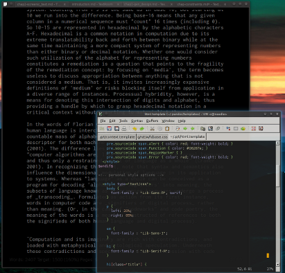

% Grammars of Process
% John C. Haltiwanger
%

# Acknowledgments #

The final shape of this thesis is deeply indebted to those who have helped me along the way. First I would like to thank Richard Rogers. Without his gentle-yet-forceful pressure to elevate the discussion contained within my thesis, I fear that the project would ultimately demonstrate little of whatever theoretical power it currently enjoys. Likewise, without Geert Lovink the project would not exist in the first place, as it was his request for a post-journal publishing platform that started me on this quest of generative typesetting for multiple output formats. Thanks also to Florian Cramer, not least for explaining that simply typesetting the thesis in two formats was enough technical work for a single-year masters thesis but also for providing a strong perspective from which to begin. I am deeply indebted to Michael Jason Dieter for introducting me to the work of Gilbert Simondon, without whose theory this thesis would not be feasible. Huge thanks go to Femke Snelting and Pierre Huyghebaert for their indispensible interview and for welcoming me into their extremely creative network. For issues with JavaScript in the HTML version of this thesis, Michael Murtaugh once again proves his potency as a programmer. Special thanks to my colleagues at the UvA, for helping me to stay sane in the midst of an insane project: Hania Pietrowska, Natalia Sanchez, Rakesh Kanhai, Sarah Moore, Morgan Curry, Marc Stumpel, Allison Guy, and Ramses Petronia. Every day I grow to further realize that without my friends, I am nothing. Finally, a sincere thanks to all those who have shared insights and conversations with me as I pushed to develop my ideas further.

And last, but never least, my family. Thank you mom, dad, Brett, Julia, and Ann. Thank you for your unwavering support!

# Introduction #

Today's new media theory increasingly invokes _materiality_ as a significant, perhaps even _the_ significant, mode of investigating digital objects and the media through which they are delivered. This thesis questions such a centrality of materiality through a practice-based, process-oriented approach. _Process_ is proposed as the atomic unit of that which new media theory investigates. This is true on a formal material level: applications run as either as individual process or as assemblages of process which are managed by an operating system and through which the application's code is accomplishes all of its tasks, from memory and access to algorithmic execution on the central processing unit. A process-oriented approach will be shown to provide an alternative methodology for engaging with and understanding software that may be more productive than what a material analysis alone provides. For instance, certain problematics within Lev Manovich's concept of 'media hybridity' will be resolved by a re-orientation towards process (Manovich 2008). Process also allows a fresh perspective for examining human-digital relations. Human processes and digital processes are seen as inextricably intertwined, leaving any discussion of digital process that excludes relevant dimensions of human process necessarily unfinished. 

Process has recently elevated as a focal point within the design world as more and more designers switch to, or otherwise integrate, generative workflows. _Generative design_ is a form of design in which software algorithms are used from the bottom up, through source code that directs all drawing and manipulation of the objects the source describes. This is opposed to the top-down, What You See Is What You Get (WYSIWYG) style of design embodied in the industry-standard applications from Adobe. New media theorist Florian Cramer has identified generative design as the cutting edge of design in the Netherlands (Cramer, Monsoux, and Murtaugh 2010). The emergence of generative design as a widespread practice is reflected by the Breda-based Graphic Design Museum's decision to host an installation of generative works called _InfoDecoData_, as well as a symposium of the same name.[^infoviz]

[^infoviz]: Though information visualization, or 'infoviz', is perhaps the highest profile form of generative design, the size and scope of this practice places it outside the bounds of what can reasonably be addressed here in specifics. As a form of generative design, however, the conclusions reached regarding the parent subject should be applicable to infoviz as well.

This space of generative design provides an ideal site for investigating questions of materiality and medium-specificity within the computer _metamedium_ for a number of reasons. The importance of source code to generative design intersects with an on-going dialog within software studies concerning where to position code in a study. Its position close to the cutting edge of what is being done with computers invites inquiry into the processes that are assembled to compose today's computers--_screens, controls, and operating systems_. Finally, the tendency of generative design to involve the command-line interface compels an investigation into this under-theorized medium, and with it the sustained primacy of text within computer interfaces. This primacy of text is reflected all the way from source code to the labels on buttons and menus in a GUI interface.

Before explaining in more detail the process-oriented perspective utilized by this thesis, however, it first seems prudent to visit some of the dominant strains of medium theory found in the history of media studies which will be interrogated in this thesis.

# Marshall McLuhan, the Tetrad, and the Temperature of Media #

Marshall McLuhan's prominence in media studies is in no small part related to the pionering role he had in shaping the field. Beginning with his work in analyzing advertising, published in 1951 as _The Mechanical Bride_, McLuhan critically integrated the language of an advertising industry that had developed a vocabulary for considering their new role in targetting not just print but also television and radio. This critical integration allowed for a consideration of media on a level that had not, up to that point, emerged. That is to say, it was his seminal work _Understanding Media_ that proposed that it is the study of _media themselves_, and not simply their content, that is necessary for critical engagement.

One of the means he proposed as a distinguishing characteristic between media was the "temperature" of a given medium. Though the wording is perhaps somewhat un-intuitive, McLuhan defines "hot" media as those media forms which extend "one single sense in 'high definition'" (McLuhan 1964: 24). The effect of such extension is a reduction in the involvement of the audience to the medium. A photograph, for instance is "hot," while a cartoon is "cool" because it contains relatively sparse amounts of visual information. The phonetic alphabet, McLuhan argues, is a "hot and explosive" medium, with vastly different effects than the cool medium of ideogrammic writing (25). In his view, he transformation of this alphabet by the printing press, this "hotting-up" of the writing, led to "nationalism and the religious wars of the sixteenth century" (25). The temperature of a medium reflected the ratio of its extension to perception. Hot media are those in which the ratio of extension for a sense overwhelms other senses.

The temperature of a medium interacts with the temperature of a culture in a way that necessarily redefines the culture (and, it could be argued, the medium as well, which may decrease in effective temperature as the temperature of a culture rises in relation). For instance, the "hot radio medium used in cool or nonliterate cultures has a violent effect, quite unlike its effect, say in England or America, where radio is felt as entertainment" (33). For this and similar views, Mcluhan received condemnations as a 'technological determinist,' someone who argues that technology defines culture.

Such a position, however, is complicated by the simple fact that McLuhan viewed mediums as extensions of human senses. "All media are extensions of some human faculty---psychic or physical," he wrote in _The Medium is the Massage_ (1967: 26). As extensions of the human, any changes imbued by media into culture necessarily maintain a root cause in the human themselves. This dynamic is asserted in this thesis as well, which views media as reflexive sites that develop in a state of dynamic equilibrium between humans and our media.

McLuhan also developed a pedagological tool he called the Tetrad. The tetrad is means of examining media and its effect on society. Phrased as four questions, by its very phrasing it proposes a sort of physics for media, a description of a dynamic through which all media undergo upon their development and introduction. 

- What does the medium enhance?
- What does the medium make obsolete?
- What does the medium retrieve that had been obsolesced earlier?
- What does the medium flip into when pushed to extremes?

This is a departure from pure techno-determinism because in the end it is human processes which develop new media forms and embed older forms within them---it is human processes that expect or demand that new media "masquerade" as older media. And, ultimately, it is human processes that the medium is designed to enhance.

# Bolter and Grusin's Double-Logic of Remediation #

Jay David Bolter and Richard Grusin take this question of what actually drives the physics described by the Tetrad. Their conclusion is a form of double-logic that envelopes one of the key elements of the Tetrad--that new media forms embed the older ones they replace, a process which they termed _remediation_--and explains it as the result of two interacting forces, _immediacy_ and _hypermediacy_. The logic of immediacy seeks to erase the "medium-ness" of a medium. This can be seen in the drive for "transparent" interfaces: "a transparent interface is one that erases itself, so that the user would no longer be aware of confronting a medium, but instead would stand in an immediate relationship to the contents of a medium" (Bolter and Grusin 1996: 318). Hypermediacy, on the other hand, "acknowledges multiple acts of representation and makes them visible" (328). Hypermediacy is, then, an opposing vector, one that delights in highlighting the presence of the medium rather than attempting to obfuscate or "disappear" it. The root cause of this process of double-logic, in the end, is the desire to "achieve the real":

(%grrrquote)
Hypermedia and transparent media are opposite manifestations of the same desire: the desire to get past the limits of representation and to achieve the real. They are not striving for the real in a metaphysical sense. Instead, the real is defined in terms of the viewers experience: it is that which evokes an immediate (and therefore authentic) emotional response. Transparent digital applications seek to get to the real by bravely denying the fact of mediation. Digital hypermedia seek the real by multiplying mediation so as to create a sense of fullness, a satiety of experience, which can be taken as reality. (Bolter and Grusin 1996: 343) 
/(%grrrquote)

Since Bolter and Grusin position mediations themselves as both real and representations of the real and remediation as the 'mediation of mediation,' then remediation reforms reality (346). As media are _ipso facto_ sites of mediation, media can be seen as reformative agents that are constantly reconfiguring reality. Mediation and reality thus become 'inseparable,' in a constant state of mutually reflexive reconfiguration. While their work provides a useful system for describing the dynamics of media, still missing is a solid definition of what constitutes a medium. In the case of the computer metamedium, the elusiveness of a definition for media will prove problematic for the accurate application of their framework.

# N. Katherine Hayles and Medium Specificity #

In her essay "Print is Flat, Code is Deep: The Importance of Media-Specific Anaylsis," N. Katherine Hayles presents a more technical, or at least _specifiable_, definition of media. Calling for a renewed focus on materiality, Hayles presents evidence that literary hypertext exists in printed books as well as within its familiar context of the computer. Both printed and screenic hypertext demonstrate _medium specificities_---that is, in the process of becoming embodied within one or the other materialities, literary hypertext displays characteristics that are specific to those materialities. Medium-specific analysis thus "attends to both the specificity of the form...and to citations and imitations of one medium in another" (Hayles 2004: 69).

Hayles sees materiality as an "interplay" between physical traits and strategies of signification, "a move that entwines instantiation and signification at the outset" (67). This formulation, though in different words, moves beyond a specified division of form from content into a holistic definition that sees those components as intrinsic and inseparable. This flies in the face of certain ideas surrounding web design, which holds--in its workflow if not also in its underlying conception--that form and content are separable and distinct.

Hayles' utilizes her media-specific analysis to demonstrate how the specificities of print and screen necessarily shape literary hypertexts through materially driven constraints. Her conception of media, though not explicit, apparently revolve around this concept of specificity. If there were no differences in the specificities of print and screen, then there would be no material differences in the texts she describes. Though Hayles admirably conceives of materiality as an amorphous interplay between physicality and process, the focus on specificities creates potential problems when moving into media specific to the computer. If specificities are used to determine media, and specificities may change even within different versions of a single program, where do we cease to apply to label 'medium'? Once again the elusiveness of a definition potentially short-circuits the application of Hayles' framework to computer-specific media.

# Lev Manovich and Media Hybridity #

Lev Manovich's _Software Takes Command_ is unique in this group in that the theories it presents are specific to the computer, or at least to _metamedia_. Manovich first develops a concept of _cultural software_ based on the premise that the software has become the "new engine of culture" (2008: 11). Software finds itself in this position thanks to the status of the computer as a metamedium, defined as such by its programmability. This programmability allows the computer to not only simulate other media, it also provides a space for the creation of entirely new media.

Manovich defines these new media according to their _hybridization_, a process for which he uses evolution as a metaphor. From this perspective, media hybrids are created constantly. After their creation they go through a process of selection and either "replicate" or die off after failing to propagate (90). Manovich is careful to state that he is "not making any claims that the actual mechanisms of media evolution are indeed like the mechanisms of biological evolution" (90).[^prov] Successful media hybrids go on to become "basic building blocks," ready for combination with other hybrids.

As a first example, Manovich presents the 'image map,' described as "a successful combination of media 'genes'" (90). Combining hyperlinks with an image, image maps hybridize both techniques of hypertext and techniques of image manipulation.

(%grrrquote)
When designers start attaching hyperlinks to parts of continuous images or whole surfaces and hiding them, a new "species" of media is born. As a new species, it defines new types of user behavior and it generates a new experience of media. (Manovich 2008: 91)
/(%grrrquote)

This phrasing provides a rough version of what, to Manovich, defines a medium: specificities of interaction and experience. If an image map is a new species of media, then it logically follows that it is a medium in its own right. The underlying mechanism that thrusts image maps into this position is the representation of hyperlinks as hidden within a surface that becomes "alive" and displays a continuum of hyperlinking in which some parts of this surface are "'more' strongly hyperlinked than others" (91). That the same effect (a surface with non-obvious internal linking) can be achieved within traditional HTML by disabling the coloring and underlining that typically denote hyperlinks seems to have escaped Manovich's attention.

This thesis takes a divergent approach, one that would never consider the image map as a specific medium. Rather, an image map is conceived as a new processual grammar that hybridizes processes of hypertext and static images to articulate a new domain of interaction with the user. It is now time to move to the foundations of such a framing.

[^prov]: This thesis provides a provisional elucidation of these mechanisms in providing a historical account of programmer interfaces through the lens of Gilbert Simondon's transduction.   

# Process-Oriented Perspective #

In his outlining of the nature of a 'processual media theory,' Ned Rossiter asserts that "a processual media theory examines the tensions and torques between that which has emerged and conditions of possibility; it is an approach that inquires into the potentiality of motion that underpins the existence and formation of a system" (2007: 178). While the argument that Rossiter builds in his chapter on the subject revolves mainly around interrogating and the processes that drive new media within its institutional settings, the thrust of his argument--that new media empirics must "reflexively engage with the field of forces that condition its methodology"--maps easily to a more general line of inquiry (171). This is perhaps best embodied in his explanation of a 'processual aesthetics of new media'[^aesthetics]:

(%grrrquote)
A processual aesthetics of new media goes beyond what is simply seen or represented on the screen. It seeks to identify how online practices are always conditioned by and articulated with seemingly invisible forces, institutional desires and regimes of practice. (Rossiter 2007: 174)
/(%grrrquote)

[^aesthetics]: Where aesthetics is used "to speak of the organization and management of sensation and perception" (Rossiter 2007: 166).

While a truly exhaustive investigation of the multitude of relations--social, economic, technological, ideological--involved in generative design is simply not within the scope of this thesis, I believe that it is important to begin filling in the "gap" between source code and execution. A process-oriented perspective encourages this by first defining a given materiality as an _assemblage of process_. This is as true in the physical world as it is in the digital, as all that exists has taken its shape as a result of _becoming_. From this recognition, this process-oriented perspective integrates the theoritization of ontogenesis proposed by Gilbert Simondon. This theory will be described in further detail in a later section (!WHICH!). For now, however, it is best to explain that in Simondon's ontogenesis[^onto], change in a system is the result of incongruency within that system. In other words, difference causes change. 

[^onto]: That is, the 'being of becoming.' 

To test this assertion, I survey historical developments within computing as well as practices of contemporary generative design and typesetting with open source software. Where do changes--or, in Simondon's language, _transductions_--occur within the domain of computation? How did the assemblages of process upon which generative design rely _become_ what they are today? The historical survey demonstrates that changes in computers do arise in response to "differences"--that is to say, problems. These problems can be 'real', 'virtual', 'imaginary', or otherwise. The solutions to these problems are influenced by the structure of relations within which the problems themselves arise. This observation demonstrates that Simondon's description of ontogenesis is sound, as well as applicable to describing the dynamics of the metamedium.

The second stage of the process-oriented perspective seeks to interrogate and critique the mode of existence of _mediums_ within the computer metamedium. When materiality within the computer is defined as 'assembled process,' mediums lose their seeming rootedness in materiality---that is, unless everything assembled within the computer is deemed a medium. To make this point clear: if a medium is defined by its material specificities, and within a computer every non-identical digital object contains--or is embedded within--particular specificities, then every unique digital object (or any unique application used to handle it) has the potential to be labelled a 'medium'. Variations in interface, say the difference between Windows Explorer and Mac OS X's Finder can be said to hold real, material specificities. Labelling them 'mediums', however, opens an un-closeable box through which every digital process that maintains its own interface becomes a medium. In my opinion, this is unacceptable. 

A separate element, outside of material specificities, must be invoked in order to explain and discuss mediums based within the computer metamedium. In response to this question I identify the existence of _grammars of process_ which enable, require, and inspire the assembling of process. Combined with a sufficiently conservative definition of 'medium,' these processual grammars provide space for discussing the vast variation in material specificities without diluting the term 'medium' into a troubling meaninglessness. While not entirely sufficient to resolve the boundaries of medium and not-medium, this concept of processual grammar nevertheless provides at least a tool for articulating and guiding discussions along those lines. 

## Attributes of Process ##

Every digital process has, at its ultimate origin, a human. Saying this is not an attempt to elide the latent unpredictability that at times characterizes human-digital interaction. Rather it is an attempt to highlight the human role in the human-digital metastability. The rate of computation has increased the impact of human-digital processes in that the results deliver their results faster. The results will either match the intentions of the originating human process, or they will not. In the second case we can find the first evidence of the effects of digital process on human process: _the code behind the digital process will be re-arranged in an attempt to deliver an output that satisfies the intention of the human processes._ Whether this modulation of the executed code is through sliders/input boxes/etc within a GUI interface or through direct reworking of the source code itself, the effect is the same: the code executed has been re-configured according to the goal of human process. The result(s) of the digital process, experienced through a screen, can match, exceed, or fail this goal. In turn, human process is effected and the next move is made according to new goals or revised digital processes.

Process is reflexive. It's outputs are "feedbacks" of their inputs, reconfigured by the process. These outputs reconfigure the metapotential in any given system. The reflexivity of process has material effect. As it reflects the inputs into the outputs, the outputs in turn reflect new (or else simply different) potentials back into the context which is the reciprocal contact point in which the processes began. This language is extrapolative into any set of intersections. This paper considers just the subset of human-digital recipricity, and within the relatively static domain of typesetting.

A new configuration of metapotential in any system results in the reconfiguration of (all) other systems as well. This fact reflects the _fractal_ nature of process--there is a degree of non-reducibility inherent in any discussion of process, as ultimately certain factors in its functioning are unknown to us.

Processes are organized, set in motion, and interacted with through processual grammars. These grammars represent an organizing logic surrounding process. In other words, grammars are the means through which processes are assembled. An obvious example of a processual grammar is the industrial assembly line: ruled by an organizational logic that hybridizes processes of craftsmanship, standardized units of measure and time, industrial fabrication tools, and the logic of commodity, any manufacturing that is to take place within an assembly line must organize according to the grammar that shapes it.

Generative design is also clearly ruled by grammars. Its foundational body consists of source code, a medium known by its total reliance on grammar for functionality.[^srccd] This thesis focuses on the grammars that enable generative design through investigations into historical processes that resulted in the contexts in which generative design occurs and into the process itself through a reflexive methodology.

[^srccd]: The positioning of source code as a medium is clarified in the discussion of the evolution of programming.

# Generative Design Begins With Words #

Generative design is a fruitful site for examining questions of medium specificity and materiality for a number of reasons. That its materiality is clearly a result of process is obvious when considering the 'workspace' of much of generative design: plain-text source files. These source files often, though not exclusively, undergo their processing within a command-line interface (CLI). The command-line interface is defined by the primacy of text in its workings. The centrality of text to generative design invites a corrective movement against a general overlooking of the processes behind typesetting among new media theory. While the surfaces of text and textual interfaces have been investigated in numerous ways (Bolter 2001; Fuller 2000), there has been a general lack of theoretical concern regarding the underlying processes of _text placement_ in the metamedium. Likewise, as opposed to the overflowing amount of literature relating to visually-rich computer interfaces, very little theory has been written regarding the command-line---despite its place as the historical interface (once contemporaneous with punch cards) by which digital processes were initiated. Far from being obsolete, both Microsoft and Apple ship command line interfaces within their operating systems. In Microsoft's case, significant money has been spent developing  their modern command line implementation Powershell. Additionally, Google recently found the command-line relevant enough to release a CLI tool for interacting with its online services (Holt and Miller 2010).

This centralization of text and the command-line raises pertinent questions that may help to clear up the almost-hopelessly fuzzy nature of materiality in the computer meta-medium. What aspects define the materiality of the command-line? What are its medium-specificities? Do existing theories such as _remediation_ apply to the workings of the command-line? What differences exist between various command-lines?

Furthermore, what processes have assembled in order to form the context of modern-day command-lines? Such a question delves into the origins of the personal computer and its perceived significance both before and after its introduction. In Alan Kay's vision of the _computer as metamedium_, the system supports and encourages the instantiation of new media forms by individuals who have no formal background in programming (Kay 1977). Apple's Macintosh famously delivered the vast majority of the human-computer interface innovations developed by Kay's team at Xerox PARC labs---without this key feature of easy programmability.[^jobs] The orginal Macintosh operating system also presented its total lack of a command-line as an ideal formulation. 

When Apple introduced Mac OS X a decade and a half later, its Unix underpinnings--complete with command-line--appeared in marketing as a selling point. For almost a decade the adoption of Apple computers has risen continuously. In chapter two, Mac OS X is described as a particular hybridization of process that both intersect with and reflect "external" processes such as economics, inertia, and ideology.

[^jobs]: In the video documentary series _Triumph of the Nerds_, Steve Jobs reports that "they showed me really three things. But I was so blinded by the first one I didn't even really see the other two" (PBS 1996). In his explanation he was so excited about the demonstration of PARC's graphical user interface that he was unable to absorb the importance of either the Smalltalk-80 object-oriented programming environment or the Ethernet networking technology.

# Processes Within the Borderland #

The centrality of source code itself--rather than the centrality of the source code as text--to generative design provides a second compelling reason for investigating materiality and medium-specificity within the metamedium. Currently at issue within the emerging field of software studies is where to responsibly place source code in its investigations. Some propose, as Lev Manovich does in his _The Language of New Media_, that understanding the logic of new media requires investigating the field of computer science for the "new terms, categories, and operations that characterize media that become programmable" (Manovich 2001: 48). This is a call to software as _logos_. It attempts to solidify theory by giving it a specific direction--the logic and objects of software. 

Wendy Hui Kyong Chun, however, questions this direction, criticizing the erasure of "the vicissitudes of execution and the structures that ensure the coincidence of code and its execution" that results when one elevates source code--and by extension software--as a totalizing logic (Chun 2008: 303). When theorists such as Alexander Galloway argue that source code is "automatically executable," they fetishize source code by collapsing source code with the effects of that code's execution. In other words, the execution itself is erased, along with the conditions buttressing that execution. Rather than approach a project of solidifying theory (that is, ending "vapor theory" as advocated by Geert Lovink and Galloway, among others) through reducing the computer metamedium to the code that it runs, Chun advocates an approach of code as a _re-source_, a perspective which "enables us to think in terms of the gap between source and execution" (321). This gap seemingly includes--or perhaps is--the "borderland" in Hayles positions materiality, "the connective tissue joining the physical and mental, the artifact and the user" (Hayles 2004: 72). That Chun identifies the 'code as re-source' perspective as positioning an "interface as a process rather than as a stable thing" resonates with the process-oriented perspective proposed in this thesis (Chun 2006: 321).

Similarly resonant is the recent series of lectures by David Crockford. While the series relates to the programming language JavaScript, Crockford utilizes his entire first lecture to describe the evolution of programming interfaces throughout the development of digital computers (Crockford 2010a). Starting from the "spaghetti code" of wires that provided the original means of programming, Crockford proceeds to explain in great detail the multitude of processes that defined programming prior to its current state. Integrating these observations with the memoir account of Severo Ornstein allows for an attempt to fill in historical elements that belong to this gap, or borderlands (Ornstein 2002). The historical evolution of these important sites of interaction between human and digital processes is seen as an overlooked aspect in both the field of computer science and in new media discourse. The relevance of _inertia_ in the composition of human-digital processes is demonstrated by examining the surprisingly large number of elements that remain a part of computing that have no reason for present-day integration other than the weight of history. This seems an important aspect within the inter-relations of human and digital processes.

# Reflexive Methodology #

In addition to the historical survey of digital processes and its attempt to map Gilbert Simondon's language onto that domain, this thesis has a separate case study: the typsetting of itself, in multiple output formats, through a generative workflow. This provides a secondary mechanism for interrogating Simondon's theory of ontogenesis. Central to ontogenesis is the question of _individuation_. 

By examining the underlying processes of presentation required to 'typeset' the text itself, this reflexive methodology further demonstrates the validity of classifying materiality as assembled process. Through the utilization of FLoSS software, multiple output formats will be not only be investigated but also materially instantiated through a designed mechanism of process--a _processual hybridity_. These output formats represent two of the top formats currently used to manage and display texts digitally: HTML and PDF. Questioning the materiality of the input format, Markdown, is a useful exercise:  what is the materiality of a format whose use implies an intention to convert to--to exist as--a multitude of _other materialities_? This type of materiality (transitional, "unfinished") runs throughout the field of generative design. By designing, documenting, and describing a genuine generative workflow I am able to integrate a significant degree of reflexivity into the thesis at a level of materiality as well as content. 

The environment employed in this project of generative typesetting is entirely composed of software for which I have access to the source. 
That is to say, it is composed entirely[^sumxp] "Free/Libre/Open Source Software", here to be abbreviated as FLoSS.[^o] Rather than delve deeply into a historical account of what I call here _ideological computing_[^ctrpt], I present an argument for the use of FLoSS based on the characterstics of represive and emancipatory media outlined by Hans Magnus Enzensberger in his essay "Constituents of a Theory of the Media" from 1970. Such a discussion seeks reflexivity into the ideology driving my own personal usage of FLoSS, rather than a reflexivity into the historical dynamics of ideological computing.

[^ctrpt]: 'Ideological computing' is phrased as a counterpoint to Manovich's elaboration of a 'cultural computing' in _Software Takes Command_ (Manovich 2008).

Historical dynamics do emerge, however, as I discuss the specificities of the formats used in this project. As the "content layer" of the World Wide Web, HTML is the most pervasive, if not also the most well-known, markup language on the planet. It is defined in its specification as  What processes does HTML hybridize in coming into existence? What specificities does it entail? What processes has it in turn inspired?

The second output format, PDF, is actually achieved through the use of an intermediary format. This intermediary format is composed of constructions for a process hybridity called ConTeXt. In specific terms, ConTeXt is a macro package for the venerable typesetting program called TeX (this year celebrating its 32nd, or 2^8, birthday). ConTeXt is a fast-moving project that provides a unique site for assessing process hybridity.   

[^sumxp]: In the interest of full disclosure, at times I edited the Markdown source file on Windows XP computers at my university.

[^o]: The use of the little 'o' represents both an aesthetic decision in terms of typographic flow and a (hopefully) non-confrontational means of representing my weighing in on the ideological differences between free and open source software development.

\chapter{Transduction}

In his text _The Position of the Problem of Ontogenesis_, Simondon writes,

(%grrrquote)
By transduction we mean an operation--physical, biological, mental, social--by which an activity propagates itself from one element to the next, within a given domain, and founds this propagation on a structuration of the domain that is realized from place to place: each area of the constituted structure serves as the principle and the model for the next area, as a primer for its constitution, to the extent that the modification expands progresively at the same time as the structuring operation. (Simondon 2009: 11).
/(%grrrquote)

Repurposed from the language of chemistry, Simondon's metaphorically images transduction with the example of a substrate--swelling with _metapotential_--that crystallizes. The final formation is the substrate fulfilling this metapotential, a fulfillment that arises only through an unpredictable unfolding involving emergent factors.[^approp]

[^approp]: The language of chemistry was likewise appropriated for the term 'interface' (Cramer and Fuller 2008: 149).

\chapter{Operating Systems}

# Alan Kay and a 'Metamedium' Vision for Personal Computing #

In his text _Software Takes Command_, it is Manovich's inclination to focus on the work of Alan Kay at Xerox PARC when discussing the development of _cultural software_. He notes that there are multiple entry potential entrypoints for consideration: the work of Douglas Englebart and his team, the development of the LINC computer at the MIT's Lincoln Lab, and Donald Sutherland's SketchPad. The development of the Xerox Alto, however, is unique in multiple ways. First and foremost is the architecture of the software: by developing and employing an object-oriented approach to software design, users were positioned as inventors of new media through their ability to design their own interfaces that both enabled and spurred new modes of creation native to the screen. These screenic modes of creation represented a new, vital dimension to computing---the willful, _shaping into existence_ through design and implementation of new digital processes. Kay's team was specifically dedicated to applying intersections between education and computation. In the process of teaching the system to children and adults alike, those they taught often ended up developing their own unique applications out of the _objects_ that could be shared between applications as well as extended through the inheritance model of object-oriented programming.

Cultural software--and the _cultural computing_ which it facilitates--is defined by Manovich as software that is "directly used by hundreds of millions of people" and that "carries 'atoms' of culture (media and information, as well as human interactions around these media and information)" (2008: 3). Alan Kay is a pioneer figure in the computing world, an individual who not only theoritically formulated a vision of the computer as a 'metamedium' but also did a great deal of practical work in order to achieve this vision. Unfortunately, as is all too common in the lives of visionaries, key elements of Kay's ideal never breached into the mainstream even as other aspects were appropriated and commodified wholesale by Apple and Microsoft.

The first, and probably most important, element of Kay's original platform that failed to transfer from his ideal "Alto" personal computing platform to the commercial GUI-drive operating systems that now define the landscape of cultural software[^foss_exception] is the concept of _easy programmability_. To this end Kay founded the basis of all the Xerox PARC work in personal computing on a programming language called Smalltalk. In his text "The Early History of Smalltalk," he explains that the computer science work of the 1960s began to look like "almost a new thing" as the funding of the United States' Advanced Research Projects Agency (ARPA) led to the development of techniques of "human-computer symbiosis" that include screens and pointing devices (Kay 1993). Kay's focus became investigating what, from this standpoint of "almost a new thing," what the "actual 'new things' might be." Any shift from room-size, mainframe computers to something suitable for personal use presented new requirements of "large scope, reduction in complexity, and end-user literacy" that "would require that data and control structures be done away with in favor of a more biological scheme of protected universal cells interacting only through messages that could mimic any desired behavior" (Kay 1993).

To this end, Kay and other members of the PARC team developed this Smalltalk language  to facilitate a "qualitative shift in belief structures--a new Kuhnian paradigm in the same spirit as the invention of the printing press" (Kay 1993). The technical details of Smalltalk are indeed impressive to those who can read and understand them: Smalltalk is _object-oriented_, _dynamically typed_,[^dyntype] and _reflective_ (_Smalltalk_ 2010). All three of these approaches have found increasing adoption in computer programming languges. For instance, Yukhiro Matzumoto's popular language Ruby offers all three of these characteristics. That the processual grammar--that is, the organizing logic--of Smalltalk continues to influence language design today invites an inquiry into what exactly it offers. 

[^dyntype]: For the sake of reference, the idea of dynamic typing remains controversial among programming language designers from the implementation of Smalltalk in the 1970s until this very day.

## The Organizing Logic of Smalltalk ##

One of dynamic typing's greatest attribute--and perhaps at least a part of why some choose to object to it--is that it makes the programmer's job easy. Whereas _statically typed_ languages such as Java or C require the declaration of the kind ('type') of data the programmer expects to store in a given variable, a dynamically typed language has no such limiting expectations. Instead anything can be stored within any variable, something which allows for a great deal of flexibility in the hands of a programmer.

Object-oriented programming, though, represents an even larger shift in the potentials presented to programmers. Object-orientation metaphorically maps the concept of 'objects' onto the practice of programming, providing a means to encapsulate sections of code in a way that encourages reusability and thus increases programmer productivity. It is also said to be easier for the human mind to learn to think in the metaphor of objects over, for instance, the functional programming paradigm that is heavily influenced by the lambda calculus and which represents relatively steep initial barriers to those for whom discrete mathematics is not a second language. Since objects can contain other objects as well as maintain inherited relationships with yet other objects (using the abstract form called a 'class,' which is a pre-instantiated description of what an object will contain once it is called into existence), the potential for constructing programs out of the pieces of other programs was greatly increased.[^I will return to this topic when we reach discussions of 'process hybridity.']

The last attribute of Smalltalk on this list, its _reflectivity_, simply means that every object can explain its own properties, i.e. which "methods" (blocks of code oriented towards performing a specific task) it provides, what variables it is keeping track of, etc. The result is that "objects can easily be inspected, copied, (de)serialized and so on with generic code that applies to any object in the system" (_Smalltalk_ 2010). This capacity for writing "generic" code once again has a positive impact on programmer productivity, as demonstrated by Kay and Goldberg's description of a hospital simulation designed to be able to compute "any hospital configuration with any number of patients" in their ground-breaking essay presentation of their work, "Personal Dynamic Media" (Kay and Goldberg 1977[^kg]: 400).

[^kg]: The page numbers refer to the article's position within _The New Media Reader_, published in 2003. The original date of publication has been maintained in order to respect the publication's true chronological position in computer history.

This digression into the specific mechanisms by which Smalltalk eases the tasks of programming highlights the focus of Kay and his group (the Learning Research Group) at Xerox PARC. The intentions of their research--as Kay says in a passage quoted earlier--was a paradigm shift on the level of the printing press. Given the degree to which the mechanics of contemporary computing received their "start" within the Learning Research Group as well as the pervasive impact of that contemporary ("cultural") computing, it can reasonaly be said that they achieved this goal. Further testament to the success of their system was the fact that "children really can write programs that do serious things" (Kay and Goldberg 1977: 394). Indeed, a "young girl, who had never programmed before, decided that a pointing device _ought_ to let her draw on the screen. She then built a sketching tool without ever seeing ours" (399).

There is, however, one major element of their implementation--central to the capacities for children programming--that did not find manage to find its way through the commercialization of their ideas via Apple and Microsoft: that of unlimited access to the building blocks of the system itself. While Kay clearly saw not only the potentials but also the real, invigorating effects of providing "exceptional freedom of access so kids can spend a lot of time proving for details, searching for a personal key to understanding the processes they use daily" (404), unfortunately for the un-folding of cultural computing neither the Apple Macintosh nor Microsoft Windows shipped with the capacity for unfettered tinkering with the platform itself. Even worse, they generally shipped without the programming tools required to simply make a program on one's own, irregardless of the degree of availability of “building blocks.” Considering the enthusiasm with which children interacted with Kay's system, it is hard not to question where computer literacy--the ability to read _and_ write within the computer--in the age of the GUI might be should either of those seminally-positioned products have shipped with the kind of development environment to be found in Kay's largely-forgotten prototype.

# The Evolving Nature of Operating Systems #

The conceptions and roles of operating systems have been evolving along with the hardware. The original operating system of the computer could perhaps be said to be _human_, in that the computer was once attended by people known as 'operators' whose responsibility it was to 
load programs into the machine and to maintain it in  working order. These operators were an element in an organizational grammar called _batch computing_. Batch computing was driven by a logic of maximizing computer time, which was at this point quite an expensive commodity. The operators also served to insulate the machine from any accidents, such as a spilled cup of coffee, that might damage the computer and result in expensive downtime.

Batch computing had serious ramifications on _programmer time_, however. Batch processing involved queuing programs in a linear order. Each program ran one at a time, and if the program failed--as many do--the programmer would have to return in to the back of the line once the problem had been debugged. Batch, then, represents a particular processual grammar that elevated computer time as a priority over human time. It is a distinct result of particular processes, from organizational tendencies toward hierarchies and division of labor to technological and manufacturing constraints that resulted in a high cost for computing time.

Inevitably, however, batch computing would face a challenging logic. The prioritization of machine time over programmer time is clearly pregnant with conflict. The programmer, who could possibly know exactly what went wrong with a failing program and how to fix it within minutes, would have to wait hours, minutes, or even days before being able to run the modified version. If there were another bug, the process would be repeated. This led to large debugging cycles even for relatively minor problems (Ornstein 2002: 40-41).

The processual grammar that developed in response to this conflict within the metastability of early computing was _time-sharing_. Time sharing first began simply by allowing programmers to operate the machine themselves and to continually modify their program and test it during the debugging process. Initially this practice was found only on the margins of computing, in specialized research labs that had the resources to allow this kind of intimate programmer-computer interaction. However, economic, technological, and social processes continued to evolve: social adoption of computers was increasing as more and more problem domains turned to "computerization" in order to solve their problems, driving economic processes to invest in the development of new and improved technological developments that in turn drove down the cost of new computers, lowering the barrier for adoption into new problem domains, and so forth.
This dynamic eventually led to the development of operating systems--and programmer interfaces--designed to facilitate the contemporaneous utilization of the machine by multiple individuals at the same time. 

Originally the operating system of a computer was intimately tied to its hardware. It was the development and _dissemination_ of Unix by software engineering luminaries Ken Thompson and Dennis Ritchie that sparked the ontogenesis of operating systems as a "hardware independent" process, enabling _cross-platform code_ as a dimension in the software process. While operating systems had been previously developed to abstract the system to some extent, for instance to hold segments of code for handling routine tasks (incidentally, these segments of code are often called 'code routines') such that they need not be input every time that operation is to be performed, the introduction of Unix accelerated this process of abstraction.

In 1999, more than twenty years after this milestone in abstraction, speculative fiction writer and trained programmer Neal Stephenson released a novella-length essay entitled ¨In the Beginning, Was the Command Line¨ (Stephenson 1999). This essay delivers an analysis of (consumer) operating systems and a critique of the reign of the graphical user interface. By means of distinguishing the cultures and manifestations of the operating systems--Microsoft's Windows, Apple's original Mac OS, Be's BeOS, and GNU/Linux--Stephenson offers cars as analogy. Mac OS becomes an expensive European car, streamlined but expensive to maintain. Windows becomes a station wagon, the un-sexy, utility-oriented choice of the masses. The (now-defunct) BeOS is a Batmobile. And GNU/Linux is a tank without a price tag.

Computer programmer Garrett Birkel, writing in his update/response to Stephenson--"The Command Line in 2004"--notes the extreme pace of evolution of computer hardware. Despite the expanding set of elements contained within a personal computer "we don't call our new Dell machine a 'computing collective'. We consider it one device, with a singular name. And our concept of an 'Operating System' has evolved right along, neatly obscuring this complexity" (Birkel 2004). This leads Birkel to clarify that what Stephenson's text concerns itself is not so much the distinctions and separations between hardware and software as the mode of interactions with which we engage information:

(%grrrquote)
The crucial separation here is not between the computer (hardware) and the Operating System (software). Those are so deeply integrated these days that they have effectively merged into the same beast. The crucial division is between ourselves, and our information. And how that division is elucidated by the computer, with hardware and software working in tandem, really determines how useful the computer is to us. In other words, it's all about User Interface, and even though "In the Beginning, There Was the Command Line", it's also true that In The Beginning, Information Took Fewer Forms. (Birkel 2004)
/(%grrrquote)

The operating system is the initial site of formation for the processes that define this division between "ourselves" and "our information," but it is far from the end of story, and perhaps far from the most influential. I will return to Stephenson and Birkel in the next chapter, which begins with a discussion of the command line. For now, the point has been made that there is no true means of separating hardware from software---without an operating system, there is no means for hardware to access its own functionality. The materiality, then, of a personal computer is inherently tied to process---without an OS, the PC is not a metamedium, it is dead weight.

## Unix as a Processual Grammar ##

The capacity of Unix to migrate across hardware while maintaining a consistent interface to both users and programmers has been criticized as well as lauded, for example in the _UNIX-HATER´s Handbook_ wherein the authors liken it to ¨a computer virus with a user interface¨ (Garfinkel, Weiss, and Strassman 1994: 4). The author´s complain that the portability of Unix results from an under-designed infrastructure, which they call _incoherent_. The virus metaphor works, for them, because of this portability (whatever its origins), the ability to ¨commandeer the resources of hosts¨ (of which there were, even at the time of their writing, many), and Unix´s capacity for rapid mutation (Garfinkel, Weiss, and Strassman 1994: 4).

This capacity for rapid mutation is evidence of Unix´s _evolutionary superiority_ over other operating systems, which the UNIX-HATERS note is not concomitant with _technical superiority_ and, they assert, in the case of Unix the balance is far too the side of evolution over technical soundness (6). Unix, then, could be considered a successful hybrid from the standpoint of Lev Manovich's evolutionary metaphor. By hybridizing the grammar of hardware independence with processes of time sharing and source code distribution, Unix successfully spread throughout the metastability of the computer industry. But these processes that were hybridized are not necessarily media, leaving Manovich's explanation that successful hybrids are constructed from the "genes" of media an incomplete articulation of what actually unfolded.

From its initial existence as a system shared freely in code across research institutions to its fractured existence as inconsistently implemented proprietary offerings to its resurgence as free (GNU/Linux) and open source (Free/Open/Net/etc-BSD) software, Unix exemplifies the concept of processual grammar.

The introduction of an ontological premise for software, Richard Stallman´s _free software_, has multiplied the evolutionary superiority of operating systems by orders of magnitude. Though his GNU operating system project is, as a whole, unfinished after more than two decades of development, the environment surrounding that effort--the GNU compilers, the libraries of code upon which they depend, and a vast array of available commands and applications--provides a "genetic library" from which one can extract whatever processes are useful for one's own ends (provided one follows the rules of the code´s licensing terms, the GNU Public License (GPL)). As a result, GNU code appears in not only virtually every non-proprietary platform, it also ships with, and provides important underpinnings to, that proprietary flagship of the designing class: Mac OS X.

## Mac OS X: Process Hybridity in Action ##

As the Apple platform has long been the preferred environment for professional designers--since before OS X's first release in 2001--it necessarily invokes itself as an important object of study. It allows us to investigate the concept of _process hybridity_ that I introduced within the introduction. Mac OS X is a multi-layered system that contains both open and closed source elements with distinct historical lineages. As an assemblage, it can be represented as containing a high degree of process hybridity as it combines not only various separate projects into unified commodity, it also bridges ideological boundaries by combining proprietary, open, and free code into a single commercial object.

This hybridity reaches into the very core of OS X, into the kernel itself. The kernel of an operating system handles the specific task of delivering the instructions deriving from software to the specific pieces of hardware that pertain to those intructions. A simplistic analogy can be made to a traffic cop, whose role it is to direct traffic in a way that the competing interests at an intersection proceed in an orderly fashion. Kernels come in two flavors: the _monolithic kernel_ and the _microkernel_. The distinction between the two resides in the size of the tasks they are expected to perform, as well as a material distinction between where operating system code should be executed (_kernel_ memory or _user_ memory) (_Kernel (computing)_ 2010).

Without entering into a lengthy discussion of the differences between the two--a discussion that has sparked a great degree of vitriol between their respective advocates--let us note that a monolithic kernel contains the code for everything from networking to video display drivers to encryption mechanisms. A microkernel, on the other hand, delegates these processes to _servers_ that run outside of the kernel's memory space in the user memory (or _userland_, as it is often called). The result is that there is a great deal less chance of crashing a system that runs on a microkernel, as a bug in user space cannot affect the operation of the hardware whereas a bug in kernel space necessarily can. Microkernel's are also much more modular, as servers can be replaced with (theoretic) ease due to the fact that it sits outside the kernel's code. OS X's kernel, however, is a hybridization of the monolithic and microkernel designs (_XNU_ 2010). Due to speed concerns, it was decided that elements of the FreeBSD project's monolithic kernel would be welded onto the Mach microkernel.

 ](images/os_x_architecture.png)

Moving up from the kernel we encounter the system utilities. These are directly imported from BSD Unix, specifically FreeBSD. This is the last layer of what constitutes the "core OS", which is released under an open-source license. It must be noted, however, that the vast majority of code within this part of the operating system was licensed under terms that allow Apple to withhold any and all code whatsoever (i.e. _open source_ licenses such as BSD or MIT). The major exception to this is the GNU C Compiler (GCC) and its attendant libraries, which are _free_ (as in freedom) software and is licensed under terms that force Apple to make available the code of their modifications whenever they publicly release new binaries of their version of the GCC. On the other hand, specific improvements to BSD-licensed code is available only at Apple's whim. It is impossible to monitor whether the source code they make available represents all the improvements they have made or whether they have been selective with their source in order to maintain their proprietary advantage.

Above the core OS level we find further evidence of OS X's storied history. The roots of Mac OS X reside in the operating system NeXTSTEP, developed at Steve Jobs' NeXT, Inc. after he left Apple in 1985. Like all GUI-based operating systems, NeXTSTEP necessarily incorporates a large number of metaphors developed first at Xerox PARC. In addition, however, it was built from the ground up to be easier to develop applications for than other operating systems at the time. To this end the Objective-C language, object-oriented and heavily influenced by Smalltalk, was adopted. While certain systems (such as the microkernel) might be written in C, applications were developed in Objective-C and all the servers above the kernel spoke exclusively with applications in this language. The programming environment was also a leap forward in ease of use: GUI windows could be designed in a WYSIWYG fashion, where their component widgets (buttons, menus, etc) could be easily tied to blocks of code which would inform the computer what was to be done upon a given widget interaction. NeXTSTEP thus represented somewhat of a resurgance for Alan Kay's original vision of personal computing. However, NeXT's first computers were priced at $9,999 dollars---resulting in slow adoption outside of academic or institutional contexts. It was within such a context that Tim Berners-Lee developed the first web browser, WorldWideWeb, on a NeXT computer.

Three other hybridities occur within this top level of Mac OS X: Carbon, Classic, and Java (the programming environment of NeXTSTEP was renamed Cocoa in OS X). Carbon was developed as a new way of writing Macintosh applications that would allow developers an easier transition path from Mac OS Classic to OS X. Applications written for Carbon could run on both the older Mac OS as well as OS X, allowing companies like Adobe to refashion their code without changing programming languages. Classic was an emulation layer that allowed "non-Carbonized" Mac applications to run on OS X (this hybridity has been removed since Apple's transition to Intel microprocessors). Java is a programming language and environment designed to allow universal execution of programs regardless of underlying architectures: if Java has been ported to an OS, then theoretically any Java program can then be run on that OS[^java].

[^java]: However, there are many different versions of Java, making this ideal of "write once, run everywhere" somewhat problematic. Microsoft was even successfully sued for trying to hijack the language with by leveraging an incompatible implementation through the virtual industry standardization of its Visual Studio development environment.

The hybridities present in Mac OS X have material effects from the execution of code to the variability of its cultural enablement. It allows for a vast assortment of applications from various lineages and paradigms to coexist and interoperate within a single operating system context. Short of labelling each of these hybridized elements a "medium," there is currently no proposed language within new media for articulating the hybridity of the assemblage as a whole. In this fashion, _process hybridity_ provides a mechanism with which we can describe the facets of OS X. Perhaps UNIX is a medium, perhaps not. However, as a standard, it can be recognized as a formalized resolution of a design process. In an environment where 3D cinema is not even presented as a new medium in popular discourse, the term itself appears to me to have lost its utility. 

Mac OS X hybridizes not only material processes (code) but also ideological processes (licensing terms). It's success is a function of economic (the backing of a large firm) as well as cultural processes (Apple's ability to mass-produce computers is a function of their position as the introducers of the personal computer). This allows OS X its status as the only successful, commercial UNIX on the desktop as well as its status as an easy-to-use, GUI-driven development platform. This development platform is based on Objective-C, a language which hybridizes the grammars of C and Smalltalk. Thus the hybridization of process that constitutes Mac OS X incorporates even more closely the grammars of Alan Kay's Dynabook. 

\chapter{Crystalized Process: Text That Typesets Itself}

The time has come to for the self-reflective approach of this thesis to come into play. For a book called _Writing Space_, this work by Jay David Bolter provides scant discussion of actual writing environments on the computer. Originally written before the expansion of the World Wide Web into the sphere of popular culture, _Writing Space_ is concerns itself with "the space of electronic writing".[^second] In defining this space as "both the computer screen, where text is displayed, and the electronic memory, in which it is stored," Bolter belies the relative absence of process in materialist forms of media analysis (2001: 13). 

Bolter's over-simple definition of electronic writing space does not incorporate the act of writing, only the display of it. This surface-level analysis fits well the application of his remediation theory---the surface of a medium (it's "screen") is the host site of remediation. Bolter delves below the surface in his explanation of a shift to topographical writing. In the electronic writing space, "any relationships that can be defined as the interplay of pointers and elements" are representable (32). The writing space "itself has become a hierarchy of topical elements" (32). This is the effect of the computer's affinity for symbol-processing: "Any symbol in the space can refer to another symbol using its numerical address" (30). To highlight the dimensional shift in the writing space, Bolter describes the operation of outline processors. These programs abstract a text to the level of sections. These sections can be moved around and manipulated. Writing becomes _topological_ in the sense that they now have a spatial aspect. Sections of text have obtained a modularity and independence that allows visual arrangement.[^layoutproc] What he does not talk about is the formats generated by the Macintosh program that he uses in his figures. He mentions passing layouts around on floppies between friends, but that assumes a parity of operating systems and proprietary software (at least in his example) (!CITE!).

[^layoutproc]: Almost twenty years later, layout processors have been for the most part subsumed by word processors. The layout shifting process has been hybridized into the increasingly feature-ful assemblages of word processors where it has not morphed into a niche proprietary product.

(!!! WHERE WAS I GOING?? !!!)

[^second]: The second edition of the book, published in 2001, was used for this thesis. While it is updated to include the Web, its roots in a significantly older text are worth noting.

# Environment of Operation #

This text is not typed in the manner that you see it. The above header is instead written like this:

~~~~~~~~~~~~~~~~~~~~~~~~~~~~~~
  # Environment of Operation #
~~~~~~~~~~~~~~~~~~~~~~~~~~~~~~

Through the wrapper program `pandoc`, this input (written in Markdown) is converted into HTML and ConTeXt outputs.

HTML
:	`<h1>Environment of Operation</h1>`

ConTeXt
:	`\section{Environment of Operation}`

The syntax of HTML represents a semantic operation: "Dear Mr. Browser, treat this as a header of level 1." The syntax of ConTeXt, however, represents a macro command within a programming language. What it says is "call the sections of code that translate the text within the brackets to the parameters specified for the `\section{}` command."

The literal 'writing space' of this thesis is a program called Textroom. Textroom is a minimalist text editor in which there are no buttons, taskbars, or other clutter. Only you, your words, and (optionally) informational text reporting the time, word count, percentage to accomplishing your writing goal, etc. By writing in plain-text, I open myself to the opportunities afforded me by version control systems. Developed to enable collaboration of programmers on a code base, version control systems can track changes in text across time (useful for this project) and allow for massively distributed workflows involved tens of thousands of individuals (useful for the Linux kernel).

## Constraints ##

Above you see a necessary adaptation within my workflow. My netbook took a fall and lost the ability to use its screen. Because of the nature of the command line, I was able to log in to computer and execute commands that allowed me to establish remote access using a piece of software called `ssh`. This remote connection can also support the transmission of GUI applications using the client-server model at the heart of the X Windows system (which drives the GNU/Linux GUI). This was important a) to get files off the netbook, and b) the version of `pandoc` on my desktop had stopped working after a modular dependency was upgraded and I was finding it impossible to upgrade `pandoc` itself. In the image above we see the minimal editor Textroom and the editor gvim. Because of the pandoc incompatibility on the desktop, I was forced to use the netbook as the site of typesetting. This shaped the output of the project most likely by time. However, the simple ability to log in and enable remote access shaped this project immensely by allowing me to extract important work that would otherwise have been lost.

An unfortunate constraint is the inability to take advantage of elements of the TeX landscape that are reknowned for making life easier. The chief among these is BibTeX, which allows for a bibliography to be dynamically generated and citations to be inserted according to a variety of formats (that one can change with a single line of text, if desired). By abstracting myself from TeX by using Markdown as the "pre-format," I've lost the opportunity to easily manage bibliographic data and instead must input it by hand. That said, the MLA format is not currently available in BibTeX meaning that--even if I could use this software--the output would be necessarily shaped by the constraints of the tools.

## A pre-format necessarily complicates while it simplifies ##

Using the 'markdown' pre-format complicates several issues with typesetting documents in both HTML and ConTeXt. For instance, ConTeXt includes a `\chapter{}` macro, which influences the numbering of sections so that sections are relative to the chapter number, rather than to the entire text. Thus the first section of chapter two will be rendered into text as '2.1'. The issue arises because HTML has no similar distinction: sections are related to the depth of the header, such that H1 is the highest level section (the equivalent of ConTeXt's `\chapter{}`). In markdown, the top-level section appears as in the example above, that is using a single '`#`'. My initial solution was to include two sections with only one '`#`' per chapter, the first of which I would manually change from `\section{}` to `\chapter{}`, with the result that the sectioning of the chapter fits what is expected---chapter 2, section 1 is numbered as '2.1'.

This does not satisfy HTML, however, as there is nothing to change the first single '#' into: it is already inserting the highest level section, 'H1'. Thus, where ConTeXt begins numbering the sections within the chapter (2.1, 2.2, etc.), HTML increments the top-level section number, so that the second single '#' increments to '3', instead of to '2.1'. If a double '##' is used, the sectioning will appear as we desire in the HTML, but will appear as '2.0.1' in ConTeXt. This incompatibility requires either modifying the Pandoc source code directly or else the creation of a specific 'helper' script to create a sectioning parity between the two output formats. As I do not know Haskell, I've opted for the second solution.

Since markdown allows passing TeX commands, I solved the problem by using `\chapter{}` to designate the chapter title. Then, using a command-line script written in the Ruby programming language, a copy of the markdown file is created in which `\chapter{}` is replaced by a single '#' and all subsequent '#'s are increased by one '#' until the next `\chapter{}` is reached. From this copy we generate the HTML version, while the original can be processed into TeX. Perhaps this technical description appears to be more of a computer science discussion than it is a media theory one. However it highlights the ways in which processes hybridize: the conflicting grammars of ConTeXt and HTML create a complication which the wrapper program Pandoc either does not or can not address. To work around this issue, a separate program (the Ruby interpeter) is used to integrate a script file which deals with the problem. This is a common feature of a command-line based workflow: "glue" scripts are written in order to fuse processes together. This glue can result from .

### Regular Expressions and Process Hybridity ###

Regular expressions represent another avenue for demonstrating process hybridity. Since their introduction into the early text editors `QED` and `ed` by Ken Thompson, regular expressions have since been incorporated into many Unix commands such as `grep` and `awk`, newer editors such as `vi` and `emacs`, and programming languages such as Perl, PHP, Python, Ruby, and many more (_Regular expression_ 2010). Regular expressions are a means for describing parameters of text searches, whereby arranging esoteric control characters in and around the text one is looking to find allows for finely tuned pattern matching. 

The hybridity of regular expressions lies in it's adoption by nearly every major programming language: from Wikipedia, the list includes "Java, JavaScript, PCRE, Python, Ruby, Microsoft's .Net Framework, and the W3C's XML Schema" (_Regular expression_ 2010). This list of languages refers to those who have hybridized some form or derivative of Perl's implementation of regular expressions, which is considered more robust than Ken Thompson's original version.

Is it possible to say that these programming languages are 'remediating' the regular expressions from Perl? It is not beyond reason to assert that programming languages are 'mediums'---Ken Thompson has referred to Smalltalk as a new medium, for instance (!CITE!). However, mapping the term medium onto a programming language falls into the same trap of stretching the term medium until it becomes incomprehensible. Do different versions of the same language, representing different capabilities and even incompatible syntax changes, constitute separate mediums? What is useful about applying the term medium here, other than it enables us to discuss the prolific implementation of regular expressions as an example of 'remediation'? 

Programming languages often borrow concepts from each other, as this example of regular expressions clearly demonstrates. Saying that Perl remediates C syntax because it uses curly braces and semi-colons under-emphasizes Perl's own syntax. Rather it seems more evocative to describe ways in which Perl hybridizes elements of C's grammar while augmenting them with grammar of its own.

In other words, to say that

~~~~~~~~~~~~~~~~~~~~~~~~~~~~~~~~~~~~~~~~~~~~~~~~~~~~~~~~~~~~~~~
my $variable = "value";    # defining a variable in Perl
~~~~~~~~~~~~~~~~~~~~~~~~~~~~~~~~~~~~~~~~~~~~~~~~~~~~~~~~~~~~~~~

is a remediation of

~~~~~~~~~~~~~~~~~~~~~~~~~~~~~~~~~~~~~~~~~~~~~~~~~~~~~~~~~~~~~~~
char[5] variable = "value"; /* defining a variable in C */
~~~~~~~~~~~~~~~~~~~~~~~~~~~~~~~~~~~~~~~~~~~~~~~~~~~~~~~~~~~~~~~

is an over-simplification. It obfuscates significant algorithmic differences in the two approaches by focusing on the surface level syntax (which is relatively similar) over the significant internal differences in the way the two languages deal with variables (such as static versus dynamic typing). The grammar of C is hybridized by Perl---re-implemented rather than remediated, related yet irreconcilable. Implementation differences have huge implications on the utility and functionality of the languages, a theoretical framework that focuses on surface-level similarities is incapable of expressing the variation that occurs beneath those similarities. 

Rather than a remediation of regular expressions, then, we see a hybridization of specific grammars of regular expressions, with the most popularly hybridized grammar deriving from the version found in Perl. However, many of the languages that hybridize the Perl version of regular expressions only implement a particular subset of that version. Additionally, extensions may be added that are not included in Perl. The result is a proliferation of regex--in the programmer shorthand for 'regular expression'--grammars as they are integrated into various process hybridities such as programming languages, command line utilities, and text editors.

The website _Rubular_ stands as an example of how far-reaching the hybridization of regular expressions has come in terms of process assemblage complexity (Lovitt 2010). The website utilizes not only the HTTP protocol that drives the World Wide Web, it uses AJAX in order to provide real-time representations of pattern matching within a Ruby interpreter (of which there are many). The GUI browser is involved in this assemblage by design[^zen]. So is a web framework of some kind, running in the Ruby interpreter. There could be an argument made against such far-reaching hybridity: Ruby can be programmed interactively, line by line, in it's interpreter. The layers of code wrapped around the processing of Ruby regexes could be seen as superfluous---in fact, this is a common attitude of certain hacker types who look with disdain upon any non-essential fuctionality. Questions of _essentiality_ in software remain an under-discussed topic in new media studies, despite the ever-present debates among developers on the issue. In this case, remediation seems to be at play. By hybridizing regular expressions with a Web 2.0 interface, the example of _Rubular_ demonstrates perfectly the urge for immediacy described by Bolter and Grusin, even to the extent of real-time "Match/No Match" evaluation of the regular expression that one is testing. 

However, . There is a conflict between the apparent remediation of regular expressions from the command domain to the Web and the fact that both the web site and the regular expressions are running in a Ruby interpreter. Are they 

(%grrrquote)
Like calculus (which McLuhan considered a conquest of the tactile area of numbers) regular expressions anticipate the unpredictable and bring repeatability to the immeasurable. A simple * (which means "zero or more of the preceding item") compresses everything from zero to infinity into a calculable scheme. (Oram 2002)
/(%grrrquote)

Regular expressions are a specific grammar of process that provide the functionality that enables the generative typesetting workflow of this thesis. They are imperative in the specific, as they allow me to reconfigure the original Markdown source into two intermediate Markdown files that each contain 

"while text parses and subdivides thought, * dissolves and absorbs all text. Gutenberg separated oral speech into figure and ground, but * combines them again. Like the electron in its post-Newtonian atom shell, * ranges freely and resides nowhere" (Oram 2002).

[^zen]: A zen thought for the 21^st century: Does a website truly exist if there is no browser to render it?

\chapter{Conclusion}

# Origins of This Thesis #

This thesis springs from a practical consideration, namely the issue of _cross-media publishing_, a consideration that came into play as soon as I began to contemplate the various options for arranging text on the screen. Not once during the writing of this thesis have I been contradicted when broaching the observation that the best option we currently have for reading text on the screen is PDF, a format that was designed to contain documents intended for printing. PDF, or Portable Document Format. However, disregarding issues of display and presentation, the HTML format underlying the World Wide Web provides significantly more malleability in relation to the text it contains. In light of calls within the field of new media for investigating _medium-specficities_, analyzing these formats seemed a prudent course. Likewise, the strident focus on _materiality_ within the field becomes an open question as we involve a third format, Markdown, which was designed specifically to be translated into other formats.[^mkd] 

[^mkd]: Initially the focus was simply on converting to HTML, though it has since been used to produce a multitude of output formats, as we will soon see.

"Each new medium is justified because it fills a lack or repars a fault in the predecessor, because it fulfills the unkempt promise of an older medium" (Bolter and Grusin 1996: 351).

# Bibliography #

This is where all the words will go.

\input tufte
