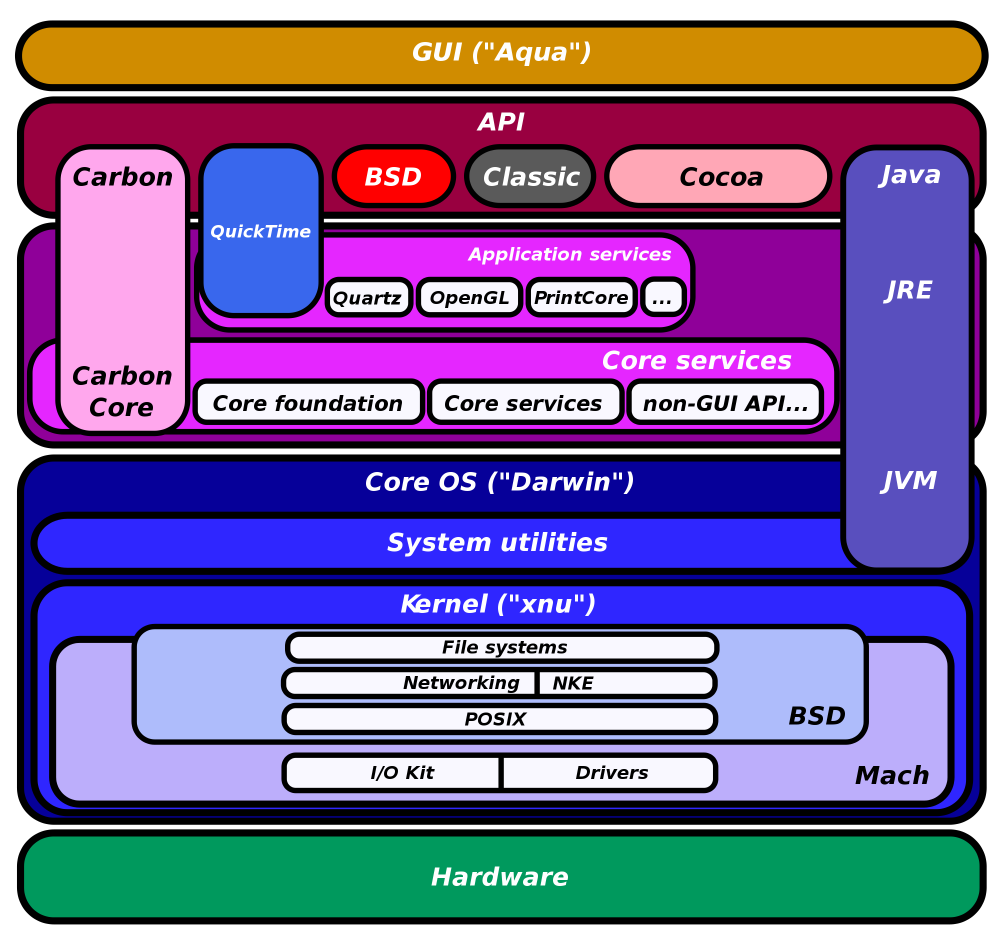

% Grammars of Process
% John C. Haltiwanger
%

# Acknowledgments #

The final shape of this thesis is deeply indebted to those who have helped me along the way. First I would like to thank Richard Rogers. Without his pressure to elevate the discussion contained within my thesis, I fear that the project would ultimately demonstrate little of whatever theoretical power it currently enjoys. Likewise, without Geert Lovink the project would not exist in the first place, as it was his request for a post-journal publishing platform that started me on this quest of generative typesetting for multiple output formats. Thanks also to Florian Cramer, not least for explaining that simply typesetting the thesis in two formats was enough technical work for a single-year masters thesis but also for providing a strong perspective from which to begin. I am deeply indebted to Michael Jason Dieter for introducing me to the work of Gilbert Simondon, without whose theory this thesis would not be feasible. Huge thanks go to Femke Snelting and Pierre Huyghebaert for their indispensable interview and for welcoming me into their extremely creative network. To that end, I'd like to offer additional thanks An Mertens, Michael Murtaugh, Peter Westenberg, Jon Phillips, and all the great folks I met at the Libre Graphics Meeting and the Active Archives workshop.

To my colleagues at the UvA, for helping me to stay sane in the midst of an insane project: Hania Pietrowska, Rakesh Kanhai, Sarah Moore, Morgan Curry, Marc Stumpel, Allison Guy, Ramses Petronia, and Natalia Sanchez. Every day I grow to further realize that without my friends, I am nothing. Finally, a sincere thanks to all those who have shared insights and conversations with me as I pushed to develop my ideas further.

And last, but never least, my family. Thank you Mom, Dad, Brett, Julia, and Ann for your unwavering love and support. It could not have happened without you.

# Introduction #

The core idea of this thesis springs from a practical consideration, namely the requirements of modern academic publishing in an open-access context. In order to be viewable on the Web, writing must be published in the format of the web, HTML (HyperText Markup Language). Yet HTML is not known for a high degree of typographic quality or even stability, as documents look different between operating systems and browser implementations. The answer is the use of PDF (Portable Document Format), a format which theoretically looks the same regardless of which program is viewing it and, through its roots as a format intended for printing, contains a great deal more typographic features than HTML. Additionally, neither format is particularly friendly for writing directly: HTML's syntax is notoriously chunky, while writing directly into a PDF in an interface similar to that of Microsoft Word requires expensive proprietary software such as Adobe InDesign.

However, it is possible to address this issue from a perspective of _generative design_ wherein we seek to output both HTML and PDF through the coupling of a user-friendly input format (i.e. much simpler and less intrusive than HTML) and translation software that could take this input and generate both outputs. This represents idea of a thesis which not only writes about generative design but which also practices it. My case study, then, is the _generative typesetting_ of the thesis itself. In order to theoretically engage this case study, it is my opinion that the _conditions_ in which the study is performed need to be sufficiently elaborated before the study begins. To this extent, a great deal of the content of this thesis focuses on reviewing past and current media theory as well as the historical development of the operating systems and interfaces through which generative design is practiced. In other words, _the conditions surrounding the case study need to be visible before the case study can proceed_.

Through the elaboration of these conditions, specific problems with contemporary media theory are highlighted and a new theoretic framework is proposed based on viewing media through an _analytic of becoming_. It is important to begin by noting, however, that the theoretical investigation _results from_ the case study itself---the tools required to describe the dynamics of the case study were assembled through the process of its performance. In other words, the generative typesetting of this thesis represents a _reflexive_ case study which informs both the content and presentation of the end result in an inextricable fashion. Because the case study crosses traditional lines of media in an interesting way, the first point of order is to begin with the conditions of our theoretical understanding of media today.

# The Elusive Definition of 'Medium' #

Throughout the history of media studies, an actual academic definition of what constitutes a _medium_ has remained elusive. This is perhaps a result of the influence in the field of Marshall McLuhan, the man who famously coined phrase "the medium is the message." What he meant by this is that it is only through analyzing a medium itself that one can begin to understand the effects of that medium. This approach has been fruitful for many years and remains the impulse behind the current theories within the field of new media. The details of these theories will be discussed in the first chapter. For now it is important to note that when theory has strayed from McLuhan's formula, the results have been lackluster and counterproductive. The best example of this is the _vapor theory_ of the 1990s. 

The theoretical work being produced in the United States dureing the early 1990s was often heavily inflected "techno-utopian" rhetoric and was espoused by figures such as _Wired_ magazine's Kevin Kelly, _Whole Earth Catalog_ founder Stewart Brand, and theorist Howard Rheingold, all of whom believed in the potential for a libertarian 'Jeffersonian democracy' to unfold as the result of the Internet. The fallacies of such an approach were first outlined by Richard Barbrook and Andy Cameron in their essay 'The Californian Ideology,' pointing out that "this utopian fantasy of the West Coast depends upon its blindness towards--and dependence on--the social and racial polarisation of the society from which it was born" (Barbrook and Cameron 1995). Despite their accurate refutation of several main tenets of this libertarian vapor theory, it was not until the crash of the dot-com bubble that new media texts by and large overcame the utopianist rhetoric. The theory at hand derived its popularity "from the very ambiguity of its precepts," and the collapse of the economy built according to their neoliberal vision seemed to demonstrate this (Barbrook and Cameron 1995).

This actual term 'vapor theory' was coined by Peter Lunenfeld to describe "a gaseous flapping of the gums about technologies, their effects and aesthetics, usually generated with little exposure, much less involvement with those self-same technologies and artworks" (Lunenfeld 2000). In an interview with Geert Lovink, Lunenfeld explains that he sees vapor theory as a result of the conditions surrounding the emergence of new media, an emergence that was attended by "an almost fully formed theoretical context for digital art and design even before they were fully functional as media technologies" (Lunenfeld 2000).

The result was a call for "[n]o more vapor theory anymore" (Galloway 2004: 17). The result was a a return to McLuhan's media formalism: the studying of _media as media_ . This is the turn that inspires the current drive towards discussing media "materiality." The  reorientation has been productive, spawning the emergent field of _software studies_ as well as N. Katherine Hayles' 'medium-specific analysis' (both of which will be discussed in Chapter 1). Yet it has not necessarily led to clarifying what exactly a medium _is_. This situation is only beginning to be fully discussed within new media studies. An interesting perspective is provided by Australian media theorist Sean Cubitt,

(%grrrquote)
Mostly when we say ‘medium’ we mean something of a pretty high order
of complexity: TV, say. Or, saints preserve us, ‘digital’ (I once
wrote a book called Digital Aesthetics: hubris, to believe that there
was only one aesthetics for the whole digital realm). These media are
constructs, not just feats of engineering but imaginary engines,
imaginary in that we ascribe to them a coherence they do not actually
possess. Convergence is the tip of the iceberg: so many elements which
comprise the digital (and TV) are shared with other media. Take lens
technologies for example. There are no analog or digital lenses. Each
medium is already a dozen technologies arranged in a system. To label
one assemblage ‘photography’ is almost silly: we have to look a) at
the elements from which it is composed and b) the commonalities it has
with other media. (Cubitt 2010)
/(%grrrquote)

This centering of compositional elements is shared by the approach taken here, but this attempt to highlight commonalities with other media seems too ambitious when a definition of 'medium' remains elusive. In order to surmount this "missing link" of media theory--the result of only investigating media _as_ media rather than involving their external influences--this thesis approaches media through an _analytics of becoming_. This _process-oriented perspective_ follows along the lines of an increasingly prevalent focus on process---Latour's Actor-Network Theory and Ned Rossiter's processual media in the world of theory and the rise of generative design in the world of practice. The analytics of becoming presented here is based on Simondon's theory of individuation. Individuation in a sense dissolves the distinction between human and nonhuman actors: in his theory, both are formed through individuation and the categories do not exist in the preindividual/metapotential (Simondon 2009). As the result of an abundance of metapotential, differences arise within a system. The effect of these differences are individuations, which _become_ through a process called transduction. 

Simondon's theory is further articulated in the Chapter 2, where I demonstrate the applicability of this analytics of becoming to discussions of generative design. What is most important to keep in mind for the purposes of this introduction is the proposed shift from the current discursive mode of analyzing media from their characteristics _as media_ to an analytic of becoming which questions the conditions from which a medium arose as well as the conditions it engenders through its _individuation_. Through the elucidation of these conditions, a more conservative view of media emerges wherein a given medium becomes an ecosystem of process hybridities organized by particular _grammars of process_.

Hybridization through grammars (i.e. organizational logic) aligns with what Bernard Stiegler calls 'grammatization,'

(%grrrquote)
By grammatization, I mean the process whereby the current and
continuities shaping our lives become discrete elements. The history
of human memory is the history of this process. Writing, as the
breaking into discrete elements of the flux of speech (let us invent
the word discretization for this possibility), is an example of a
stage in the process of grammatization. (Stiegler 2010: 70)
/(%grrrquote)

This invented word 'discretization' is complimentary to the idea of processual grammars in that any process hybridity represents an assembling of these discrete parts under a new organizational logic. Hybridity is enabled by discretization. Further, Stiegler's concept of grammatization is both constitutive and transformative of the human as a set of distributed agencies. Tied to an analytics of becoming, the undertaking of grammatization--or, _hybridization of process_--results in a viewpoint from which we can respond to and influence this distribution of agency.

# Constraints as Engines of Individuation #

As mentioned above, Simondon's individuations result from differences within the metastasis. Theorist Adrian Mackenzie eloquently articulates this idea in his book _Transductions_:

(%grrrquote)
For the process of transduction to occur, there must by some
disparity, discontinuity or mismatch within a domain; two different
forms or potentials whose disparity can be modulated. Transduction is
a process whereby a disparity or a difference is topologically and
temporally restructured across some interface. It mediates different
organizations of energy. (Mackenzie 2002: 25)
/(%grrrquote)

These 'mismatches in the metastasis' exist as the result of _constraints_. The resulting transductions--each of which are an individuation and represent a new hybridization of process--demonstrate the reflexivity of constraint: by its existence, a constraint accumulates and generates differences ("this is possible, this is not"), yet at the same time it seems to accumulate and generate solutions as well. These solutions modify the nature of the constraint, either by erasing it or highlighting its existence in unexpected ways. The relevance of the constraint has been visited before: from Oulipo's creative engagement with constraints in their "game-like artificial restriction on writing" to Donald Sutherland's integration of constraints as a technique for visual design into his Sketchpad software, constraints can be viewed in light of what they _enable_ as much as for what they _disable_ (Cramer 2005: 90; Manovich 2008: 62). Sutherland in particular saw the constraint as a crucial element of "man-machine communications" (Manovich 2008: 63). An analytics of becoming requires that we look into the conditions shaping a given individuation. Our observation of these conditions will yield the presence of systemic constraints which are continuously transducting with new individuations. As these individuations restructure the constraints, they distribute agency in specific ways across the metastability.

## Interface, Constraint ##

As an obvious introductory example, a significant constraint as regards a computer is the means one is presented for interacting with the machine. This site of interaction--the interface--has undergone significant change since the early programmable computers. Each stage of the evolution represents a new hybridization that emerges as the result of constraints inherent in the conditions from which that new stage--or individuation--springs. The conditions under which the GUI (graphical user interface) and the CLI (command-line interface)--the two major interfaces in use today--_became_ are elaborated in the third and fourth chapters through a discussion of Alan Kay's work on the modern GUI at Xerox PARC and the evolution of the CLI as it relates to the individation of computer programming interfaces, respectively. These two dominant grammars represent not only divergent means of organizing processes: through their separate organizational logics, these grammars distribute agency in significantly different ways.

The GUI presents its assemblages of process using metaphors that clearly imply the existence of a fully formed product. The interrelations of menus, buttons, toolbars, and entry fields are all contained within the window(s) of a program. The entire collection of metapotential represented by the program is assumed to be embedded within these interrelationships, which through their navigability denote an already-present existence: the feature is there, waiting to be enabled or invoked. 

The CLI, on the other hand, hosts mostly programs for which various options must be enabled at run-time in order to take effect.[^ncurses] These latent options are generally listed and described in files called 'manpages,' named after the `man` program with which they are read. Whereas the GUI is characterized by its high degree of interactivity, CLI programs require that you define the conditions of their operation before their execution. This is done by obeying the syntax outlined in the program's manpage and formulating an expression of one's intentions into this syntax. In this way, the CLI distributes agency more equally between the user and the computer. In other words, the CLI is _less abstract_ (though obviously not devoid of abstraction) in regards to the operations of the computer than the heavily metaphoric interface presented in the GUI.

[^mpw]: Despite Apple's proudly CLI-deficient Macintosh operating system, in 1985 the company found it sufficiently prudent to develop a CLI for use in programming the GUI applications of the Macintosh (_Macintosh Programmer's Workshop_ 2010).

[^ncurses]: The `ncurses` library enables the development of "GUI-like interfaces" on the CLI (_ncurses_ 2010). However, this kind of interactivity is not characteristic of the CLI as a whole. Indeed, applications that fit this form are sometimes grouped under the retronym TUI, for 'Text User Interface' (_Text user interface_ 2010). These programs represent an in-between category of programs on the CLI that do not act like "traditional" CLI programs.

# The Position of Source Code in Ontogenesis #  
 
While perhaps it is not always clearly marked, the objects of study within the field of new media are not necessarily media at all. Or rather, they are perhaps more properly called _metamedia_ in that they can play host to other, older forms of media as well as act as a platform for the development of entirely new media forms (Kay 1977). These features are the result of the programmable nature of metamedia, wherein the boundaries of operation of a machine can be altered by changing the software which the machine runs. As metamedia are defined by this programmability, they are ruled by Galloway's conception of protocol in its generation of both the boundaries and the metapotential defined by the tension between those boundaries. That is, "[p]rotocol outlines the playing field for what can happen, and where" (Galloway 2004: 167). The political stakes as regards metamedia, then, are the degree which they can be programmed to enforce constraints. The potential for locking down emerging metamedia platforms, exemplified by Apple's approach with its notoriously gatekept iOS-based devices (iPhone, iPad, etc.), demonstrates this malleability of constraints within the metamedium. Here the constraints enable features that are not necessarily beneficial for their users: strict hierarchical control in which the Apple patriarch defines what is and is not available (and runnable) to users,[^jailbreak] what programming languages those users can write their programs in, and a standing order not to duplicate functionality already delivered by Apple software (Hansell 2008; Slepak 2010).

An alternative to this locking down is found within the ecosystem of Free/Libre/Open Source Software (FLoSS[^o]), wherein the capacity to individually modify the system is a defining characteristic. This ecosystem exists as a result of an on-going process of _collective becoming_ wherein a worldwide, distributed set of programmers develop software in order to overcome constraints. In the case of free software, which is characterized by the _un-incorporability_ of its source code into any software that does not also release its own source code for modification, the primary constraint that initiated the movement's transduction was the shift from an originally characteristic shared code approach to programming computers to an increasingly corporate environment in the 1980s that sought to "divide the users and conquer them" (Stallman 1985: 546). The position of source code in the emerging field of software studies has been a contested issue, a point which will be discussed further in Chapter 1.

[^o]: The use of the little 'o' represents both an aesthetic decision in terms of typographic flow and a (hopefully) non-confrontational means of representing my weighing in on the ideological differences between free and open source software development.

[^jailbreak]: Tools to "jailbreak" these iOS devices were developed quickly after their release and their emergence easily demonstrates the productive aspects of constraints. In this case, it effectively to erases the constraint (Apple's authority on the device) for an individual system. However the constraint can return through mechanisms such as system updates (which jailbroken phones cannot as easily participate in) and new techniques of determining whether an iOS device is engaged in "unauthorized uses" that can not only remotely deactivate services on the device but can also send GPS location details of the phone (Foresman 2010).

# Reflexive Methodology: Generative Typesetting as a Case Study #

As mentioned at the outset, this thesis has a specific case study: the typesetting of itself in multiple output formats through a generative workflow. Central to ontogenesis is the question of _individuation_. As this thesis literally individuates into multiple versions of itself, this invocation of _applied_ generative design allows ample room for the application of Simondon's ontogenesis. This thesis exists additionally, then, within a complex materiality that highlights the confusion attendant to defining media in terms of material specificity or as media hybrids.

By examining the underlying processes of presentation required to 'typeset' the text itself, this reflexive methodology provides its own relevance in its very formulation. How did the words on this page (or screen) _come to be?_ Through the utilization of FLoSS[^o] software, multiple output formats will be not only be investigated but also materially instantiated through an intentional organization of process. These output formats represent two of the top formats currently used to manage and display texts digitally: HTML (Hypertext Markup Language) and PDF (Portable Document Format). The outputs are individuated translations of an input file, written in the Markdown format. Questioning the materiality of this Markdown format is an interesting exercise:  What is the materiality of a format whose use implies an intention to convert to--to exist as--a multitude of _other materialities_? This type of materiality (transitional, "unfinished") runs throughout the field of generative design. By designing, documenting, and describing a genuine generative workflow I am able to integrate a significant degree of reflexivity into the thesis at a level of materiality as well as content. 

The historical dynamics shaping the condition of this project emerge as I discuss the specificities of the formats used in this project. As the "content layer" of the World Wide Web, HTML is the most pervasive, if not also the most well-known, markup language on the planet. What were the conditions under which HTML emerged? What specificities does it entail? What processes has it in turn inspired?

The second output format, PDF, is actually achieved through the integration of an intermediate format, ConTeXt. In specific terms, ConTeXt is a macro package for the venerable typesetting program called TeX. ConTeXt is a fast-moving project with roots firmly embedded in a deeper history[^2to8] and as such it provides a unique site for articulating process hybridity. What conditions can be seen as defining ConTeXt? What is its relationship with PDF? 

## The Relevance of this Case Study ##

It is a seemingly rare phenomenon for a media theorist to _practically engage_ with their objects of investigation. Notable exceptions exist, for example Lev Manovich, who worked in the field of the 'cultural computing' about which he theorizes, and Wendy Hui Kyong Chun, whose background in Systems Design Engineering heavily informs her work (Manovich 2008; Chun 2004). Also of note is the Digital Methods Initiative, which develops the software it uses in its sociological research. Yet a significant majority of new media theory seems to operate at a distinct level of distance from the practices involved in producing their objects of study. This abstraction to some extent mirrors the lack of a solid definition of 'medium' within the field as a whole.

In the case of this thesis, the path of pursuing and interacting with a practical concern has proven quite productive. Not only does it inspire a shift to an _analytics of becoming_ through its exposure of problems in applying existing theory to the case study, it _additionally results in a proposed augmentation to the practice of generative typesetting that could constitute a better organized processual grammar_. In other words, this thesis aims to improve theory not only by contributing its own perspective---through its implemented, reflexive methodology, it aims to improve the _production_ of theory as well. The primary practical suggestion found in this thesis is a type of separation of _translation_ from _effect_ in regards to generative typesetting. The experiences which inspire this suggestion are outlined in the final chapter, which covers the case study of generative typesetting. In order to proceed towards this analysis of the case study, we will now move on to the theoretical conditions of new media at the time of writing this thesis.

\chapter{Theoretical Conditions}

Today's new media theory increasingly invokes _materiality_ as a significant, perhaps even _the_ significant, mode of investigating digital objects and the media through which they are delivered. This thesis questions such a centrality of materiality through a practice-based, process-oriented approach. This approach represents a shift from a critical discourse based on interrogating media _as media_ to one founded upon an _analytics of becoming_, a move which will be shown to provide an alternative methodology for engaging with and understanding software-based media that may be more productive than what material specificity or effects analysis currently provide. Process also allows a fresh perspective for examining the relationship between human and non-human actors, in this case the computer metamedium and the software that runs on it. The human and non-human are seen as inextricably intertwined, inhabiting and conditioning the same _metastability_, and continuously undergoing collective change. This collective change can be described through Gilbert Simondon's theory of _ontogenesis_ in which distinctions such as 'human' and 'non-human' do not exist in the _preindividual_ state (the _metastability_) from which all individuation emerges (Simondon 2009).

Process has recently elevated as a focal point within the design world as more and more designers switch to, or otherwise integrate, generative workflows. _Generative design_ is a form of design in which software algorithms are used from the bottom up, through source code that directs all drawing and manipulation of the objects the source describes. This is opposed to the top-down, What You See Is What You Get (WYSIWYG) style of design embodied in the industry-standard applications from Adobe. New media theorist Florian Cramer has identified generative design as the cutting edge of design in the Netherlands (Cramer, Monsoux, and Murtaugh 2010). The emergence of generative design as a widespread practice is reflected by the Breda-based Graphic Design Museum's decision to host an installation of generative works called _InfoDecoData_, as well as a symposium of the same name.

This space of generative design provides an ideal site for investigating questions of materiality and medium-specificity within the computer _metamedium_ for a number of reasons. The importance of source code to generative design intersects with an on-going dialog within software studies concerning the position of source code in a study. Generative design's position close to the cutting edge of what is being done with computers invites inquiry into the processes that are assembled to compose today's computers. Finally, the tendency of generative design to involve the command-line interface (CLI) compels an investigation into specificities this under-theorized, text-based medium and, by extension, the sustained primacy of text within computer interfaces. This primacy of text is reflected all the way from source code to the labels on buttons and menus in a graphical user interface (GUI).

Before explaining in more detail the process-oriented perspective utilized by this thesis, however, it first seems prudent to visit some of the dominant strains of medium theorization found in the history of media studies which will be interrogated in this thesis.

# Marshall McLuhan and Media Formalism #

Marshall McLuhan's prominence in media studies is in no small part related to the pionering role he had in shaping the field. Beginning with his work in analyzing advertising, published in 1951 as _The Mechanical Bride_, McLuhan critically integrated the language of an advertising industry that had developed a vocabulary for considering their new role in targetting not just print but also television and radio. This critical integration allowed for a consideration of media on a level that had not, up to that point, emerged. That is to say, it was his seminal work _Understanding Media_ that proposed that critical engagement with the media requires studying _media themselves_, and not simply their content. This angle of investigation can be considered _media formalism_, in which the most relevant avenue for investigating media lies within examinations of media as they are. 

One of the means he proposed as a distinguishing characteristic between various media was the "temperature" of a given medium. Though the wording is perhaps somewhat counter-intuitive, McLuhan defines "hot" media as those media forms which extend "one single sense in 'high definition'" (McLuhan 1964: 24). The effect of such extension is a reduction in the involvement of the audience to the medium. A photograph, for instance is "hot," while a cartoon is "cool" because it contains relatively sparse amounts of visual information. The phonetic alphabet, McLuhan argues, is a "hot and explosive" medium, with vastly different effects than the cool medium of ideogrammic writing (25). In his view, the transformation of the alphabet by the printing press, this "hotting-up" of writing, led to "nationalism and the religious wars of the sixteenth century" (25). The temperature of a medium reflected the ratio of its extension to perception. Hot media are those in which the ratio of extension for a particular sense overwhelms other senses.

The temperature of a medium interacts with the temperature of a culture in a way that necessarily redefines the culture (and, it could be argued, the medium as well, which may decrease in effective temperature as the temperature of a culture rises in relation). For instance, the "hot radio medium used in cool or nonliterate cultures has a violent effect, quite unlike its effect, say in England or America, where radio is felt as entertainment" (33). For this and similar views, McLuhan received condemnations as a 'technological determinist,' someone who argues that technology defines culture (Williams 1974).

Such a position, however, is complicated by the simple fact that McLuhan viewed mediums as extensions of human senses: "All media are extensions of some human faculty---psychic or physical" (1967: 26). As extensions of the human, any changes imbued by media into culture necessarily maintain a root cause in the human themselves. This dynamic is asserted in this thesis as well, which views media as reflexive sites that develop in a state of dynamic equilibrium between human and non-human actors.

McLuhan also developed a pedagogical tool he called the Tetrad. The tetrad is means of examining media and its effect on society. Phrased as four questions, by its very phrasing it proposes a sort of physics for media, a description of a dynamic through which all media undergo upon their development and introduction.

- What does the medium enhance?
- What does the medium make obsolete?
- What does the medium retrieve that had been obsolesced earlier?
- What does the medium flip into when pushed to extremes? 

(%grrrquote)
(McLuhan 1988)
/(%grrrquote)

This is a departure from pure techno-determinism because in the end it is human actors who develop new media forms and embed older forms within them, though the media themselves come to influence humans as well (as demonstrated by McLuhan's elaboration on the effects of 'hot' media on 'cool' societies).

# Bolter and Grusin's Double-Logic of Remediation #

Jay David Bolter and Richard Grusin take this question of what actually drives the physics described by the Tetrad. Their conclusion is a form of double-logic that envelopes one of the key elements of the Tetrad--that new media forms embed the older ones they replace, a process which they termed _remediation_--and explains it as the result of two interacting forces, _immediacy_ and _hypermediacy_. The logic of immediacy seeks to erase the "medium-ness" of a medium. This can be seen in the drive for "transparent" interfaces: "a transparent interface is one that erases itself, so that the user would no longer be aware of confronting a medium, but instead would stand in an immediate relationship to the contents of a medium" (Bolter and Grusin 1996: 318). Hypermediacy, on the other hand, "acknowledges multiple acts of representation and makes them visible" (328). Hypermediacy is, then, an opposing vector, one that delights in highlighting the presence of the medium rather than attempting to obfuscate or "disappear" it. The root cause of this process of double-logic, in the end, is the desire to "achieve the real":

(%grrrquote)
Hypermedia and transparent media are opposite manifestations of the same desire: the desire to get past the limits of representation and to achieve the real. They are not striving for the real in a metaphysical sense. Instead, the real is defined in terms of the viewers experience: it is that which evokes an immediate (and therefore authentic) emotional response. Transparent digital applications seek to get to the real by bravely denying the fact of mediation. Digital hypermedia seek the real by multiplying mediation so as to create a sense of fullness, a satiety of experience, which can be taken as reality. (Bolter and Grusin 1996: 343) 
/(%grrrquote)

Since Bolter and Grusin position mediations themselves as both real and representations of the real, and remediation as the 'mediation of mediation,' then remediation reforms reality (346). As media are _ipso facto_ sites of mediation, media can be seen as reformative agents that are constantly reconfiguring reality. Mediation and reality thus become 'inseparable,' in a constant state of mutually reflexive reconfiguration. While their work provides a useful system for describing the dynamics of media, a solid definition of what constitutes a medium remains absent. In the case of the computer metamedium, the elusiveness of a definition for media proves problematic for the accurate application of their framework.

# N. Katherine Hayles and Medium Specificity #

In her essay "Print is Flat, Code is Deep: The Importance of Media-Specific Anaylsis," N. Katherine Hayles presents a more technical, or at least _specifiable_, definition of media. Calling for a renewed focus on materiality, Hayles presents evidence that literary hypertext exists in printed books as well as within its familiar context of the computer. Both printed and screenic hypertext demonstrate _medium specificities_---that is, in the process of becoming embodied within one or the other materialities, literary hypertext displays characteristics that are specific to those materialities. Medium-specific analysis thus "attends to both the specificity of the form...and to citations and imitations of one medium in another" (Hayles 2004: 69).

Hayles sees materiality as an "interplay" between physical traits and strategies of signification, "a move that entwines instantiation and signification at the outset" (67). This formulation moves beyond a specified division of form from content into a holistic definition that sees those components as intrinsic and inseparable. This flies in the face of certain ideas surrounding web design, which holds--in its workflow as well as in its underlying conception--that form and content are separable and distinct.

Hayles' utilizes her media-specific analysis to demonstrate how the specificities of print and screen necessarily shape literary hypertexts through materially driven constraints. Her conception of media, though not explicit, revolves around this concept of specificity. If there were no differences in the specificities of print and screen, then there would be no material differences in the texts she describes. Though Hayles admirably conceives of materiality as an amorphous interplay between physicality and process, the focus on specificities creates potential problems when moving into media specific to the computer. If specificities are used to determine media, and specificities may change even within different versions of a single program, where do we cease to apply the label 'medium'? Once again the elusiveness of a definition potentially short-circuits the application of Hayles' framework to computer-specific media.

# Lev Manovich and Media Hybridity #

Lev Manovich's _Software Takes Command_ is unique in this group in that the theories it presents are specific to the computer, or at least to _metamedia_. Manovich first develops a concept of _cultural software_ based on the premise that the software has become the "new engine of culture" (2008: 11). Software finds itself in this position thanks to the status of the computer as a metamedium, defined as such by its programmability. This programmability allows the computer to not only simulate other media, it also provides a space for the creation of entirely new media.

Manovich defines these new media according to their _hybridization_, a process for which he uses evolution as a metaphor. From this perspective, media hybrids are created constantly. After their creation they go through a process of selection and either "replicate" or die off after failing to propagate (90). Manovich is careful to state that he is "not making any claims that the actual mechanisms of media evolution are indeed like the mechanisms of biological evolution" (90).[^prov] Successful media hybrids go on to become "basic building blocks," ready for combination with other hybrids.

As a first example, Manovich presents the 'image map,' described as "a successful combination of media 'genes'" (90). Combining hyperlinks with an image, image maps hybridize both techniques of hypertext and techniques of image manipulation.

(%grrrquote)
When designers start attaching hyperlinks to parts of continuous images or whole surfaces and hiding them, a new "species" of media is born. As a new species, it defines new types of user behavior and it generates a new experience of media. (Manovich 2008: 91)
/(%grrrquote)

This phrasing provides a rough version of what, to Manovich, defines a medium: specificities of interaction and experience. If an image map is a new species of media, then it logically follows that it is a medium in its own right. The underlying mechanism that thrusts image maps into this position is the representation of hyperlinks as hidden within a surface that becomes "alive" and displays a continuum of hyperlinking in which some parts of this surface are "'more' strongly hyperlinked than others" (91). That the same effect (a surface with non-obvious internal linking) can be achieved within text-only HTML by disabling through CSS the coloring and underlining that typically denote hyperlinks seems to have escaped Manovich's attention.

This thesis takes a divergent approach, one that would never consider the image map as a specific medium. Rather, an image map is conceived as a new processual grammar that hybridizes processes of hypertext and static images to articulate a new domain of interaction with the user. Whereas Manovich expresses a hybridization of _media_, then, this thesis views such a formulation problematic inasmuch as the concept of 'medium' is increasingly vague.

[^prov]: This thesis provides a provisional elucidation of these mechanisms in providing a historical account of programmer interfaces through the lens of Gilbert Simondon's transduction.   

# Process-Oriented Perspective #

In his outlining of the nature of a 'processual media theory,' Ned Rossiter asserts that "a processual media theory examines the tensions and torques between that which has emerged and conditions of possibility; it is an approach that inquires into the potentiality of motion that underpins the existence and formation of a system" (2007: 178). While the argument that Rossiter builds in his chapter on the subject revolves mainly around interrogating and the processes that drive new media within its institutional settings, the thrust of his argument--that new media empirics must "reflexively engage with the field of forces that condition its methodology"--maps easily to a more general line of inquiry (171). This is perhaps best embodied in his explanation of a 'processual aesthetics[^aesthetics] of new media':

(%grrrquote)
A processual aesthetics of new media goes beyond what is simply seen or represented on the screen. It seeks to identify how online practices are always conditioned by and articulated with seemingly invisible forces, institutional desires and regimes of practice. (Rossiter 2007: 174)
/(%grrrquote)

[^aesthetics]: Where aesthetics is used "to speak of the organization and management of sensation and perception" (Rossiter 2007: 166).

While a truly exhaustive investigation of the multitude of relations--social, economic, technological, ideological--involved in generative design is simply not within the scope of this thesis (if it is possible at all), I believe that it is important to begin filling in the "gap" between source code and execution. A process-oriented perspective encourages this by first defining a given materiality as an _assemblage of process_. This is as true in the physical world as it is in the digital, as all that exists has taken its shape as a result of _becoming_. From this recognition, this process-oriented perspective integrates the theorization of ontogenesis proposed by Gilbert Simondon. This theory will be described in further detail in the first chapter. For now, however, it is best to explain that in Simondon's ontogenesis (or, the 'being of becoming'), change within a system is the result of incongruency within that system and incongruency is seen as the result of an abundance of metapotential.

To test this assertion, I survey historical developments within computing as well as practices of contemporary generative design and typesetting with open source software. Where do changes--or, in Simondon's language, _transductions_--occur within the domain of computation? How did the assemblages of process upon which generative design rely _become_ what they are today? The historical survey demonstrates that changes in computers do arise in response to "differences"--that is to say, problems. These problems can be 'real', 'virtual', 'imaginary', or otherwise. The solutions to these problems are influenced by the structure of relations within which the problems themselves arise. This observation demonstrates that Simondon's description of ontogenesis is sound and can be applied in describing the dynamics of change within the metamedium.

The second stage of the process-oriented perspective seeks to interrogate and critique the mode of existence of a _medium_ within the computer _metamedium_. When materiality within the computer is defined as 'assembled processes,' media lose their seeming rootedness in material specificities---that is, unless everything assembled within the computer is deemed a medium. To make this point clear: if a medium is defined by its material specificities, and within a computer every non-identical digital object contains--or is embedded within--particular specificities, then every unique digital object (or any unique application used to handle it) has the potential to be labelled a 'medium'. Variations in interface, say the difference between Windows Explorer and Mac OS X's Finder can be said to hold real, material specificities. Labeling them each as distinct 'media', however, opens an un-closeable box through which every digital process that maintains its own interface becomes a medium. In my opinion, this is unacceptable. 

A separate element, outside of material specificities, must be invoked in order to explain and discuss media native to the computer. In response to this question I identify the existence of _grammars of process_ which enable, require, and inspire the assembling of process. Combined with a sufficiently conservative definition of 'medium,' these processual grammars provide space for discussing the vast variation in material specificities without diluting the term 'medium' into a troubling meaninglessness. While not entirely sufficient to resolve the boundaries of medium and not-medium, this concept of processual grammar nevertheless provides at least a tool for articulating and guiding discussions along those lines. 

## Attributes of Process ##

Process is reflexive. Its outputs are "feedbacks" of their inputs, reconfigured by their relations to that process. These outputs reconfigure the metapotential in any given system. The reflexivity of process has material effect. As it reflects the inputs into the outputs, the outputs in turn reflect new (or else simply different) potentials back into the context of the reciprocal contact point in which the processes began. This language is extrapolative into any set of intersections. A new configuration of metapotential in any system results in the reconfiguration of all other connected systems as well.

Processes are organized, set in motion, and interacted with through processual grammars. These grammars represent an organizing logic surrounding processes, a logic that integrates these processes into distinct _process hybridities_. In other words, grammars are the means through which processes are assembled. An obvious example of a processual grammar is the industrial assembly line: ruled by an organizational logic that hybridizes processes of craftsmanship, standardized units of measure and time, industrial fabrication tools, and the logic of commodity, any manufacturing that is to take place within an assembly line must organize according to the grammar that shapes it.

Generative design is clearly ruled by grammars. Its foundational body consists of source code, a medium known by its total reliance on grammar for functionality.[^srccd] This thesis focuses on the grammars that enable generative design through investigations into historical processes that resulted in the contexts in which generative designs occur and into the process itself through a reflexive methodology of generative typsetting around which I build my case study.

[^srccd]: The positioning of source code as a medium is clarified in the discussion of the evolution of programming interfaces.

# Generative Design Begins With Words #

Generative design is a fruitful site for examining questions of medium specificity and materiality for a number of reasons. That its materiality is clearly a result of process is obvious when considering the 'workspace' of much of generative design: plain-text source files. These source files often, though not exclusively, undergo their processing on a command-line interface (CLI). The CLI is defined by the primacy of text in its workings. The centrality of text to generative design invites a corrective movement against a general overlooking of the processes behind typesetting among new media theory. While the surfaces of text and textual interfaces have been investigated in numerous ways (Bolter 2001; Fuller 2000), there has been a general lack of theoretical concern regarding the underlying processes of _text placement_ in the metamedium. Likewise, as opposed to the overflowing amount of literature relating to visually-rich computer interfaces, very little theory has been written regarding the command-line---despite its place as the historical interface (once contemporaneous with punch cards) by which digital processes were initiated. Far from being obsolete, both Microsoft and Apple ship command line interfaces within their operating systems. In Microsoft's case, significant money has been spent developing  their modern CLI Powershell. Additionally, Google recently found the command-line relevant enough to release a CLI tool for interacting with its online services (Holt and Miller 2010).

This centralization of text and the command-line raises pertinent questions that may help to clear up the almost-hopelessly fuzzy nature of materiality in the computer metamedium. What aspects define the materiality of the CLI? What are its medium-specificities? Do existing theories such as _remediation_ apply to the workings of the CLI?

Furthermore, what processes have assembled in order to form the context of modern-day CLIs? Such a question delves into the origins of the personal computer and its perceived significance both before and after its introduction. In Alan Kay's vision of the _computer as metamedium_, the system supports and encourages the instantiation of new media forms by individuals who have no formal background in programming (Kay 1977). Apple's Macintosh famously delivered the vast majority of the human-computer interface innovations used by Kay's team at Xerox PARC labs---without this key feature of easy programmability.[^jobs] The original Macintosh operating system also presented its total lack of CLI as an ideal formulation for interfacing with software.[^mpw] 

In stark contrast, when Apple introduced Mac OS X a decade and a half later, its Unix underpinnings--complete with a CLI--appeared in marketing materials as a selling point. For almost a decade the adoption of Apple computers has risen continuously. In chapter two, Mac OS X is described as a particular hybridization of process that both intersects with and reflects "external" processes such as economics, inertia, and ideology.

[^jobs]: In the video documentary series _Triumph of the Nerds_, Steve Jobs reports that "they showed me really three things. But I was so blinded by the first one I didn't even really see the other two" (PBS 1996). In his explanation he was so excited about the demonstration of PARC's GUI that he was unable to absorb the importance of either the Smalltalk-80 object-oriented programming environment or the Ethernet networking technology.

[^mpw]: There is, however, a program called Macintosh Programmer's Workshop that includes a CLI. The desiribility of the CLI from a programmer's perspective will be addressed during the discussion of the evolving interfaces of computer programmers.

# Processes Within the Borderland #

The centrality of source code itself--rather than the centrality of the source code as text--to generative design provides a second compelling reason for investigating materiality and medium-specificity within the metamedium. Currently at issue within the emerging field of software studies is where to responsibly place source code in its investigations. Some propose, as Lev Manovich does in his _The Language of New Media_, that understanding the logic of new media requires investigating the field of computer science for the "new terms, categories, and operations that characterize media that become programmable" (Manovich 2001: 48). This is a call to software as _logos_. It attempts to solidify theory by giving it a specific direction--the logic and objects of software. 

Wendy Hui Kyong Chun, however, questions this direction, criticizing the erasure of "the vicissitudes of execution and the structures that ensure the coincidence of code and its execution" that results when one elevates source code--and by extension software--as a totalizing logic (Chun 2008: 303). When theorists such as Alexander Galloway argue that source code is "automatically executable," they fetishize source code by collapsing source code with the effects of that code's execution. In other words, the execution itself is erased, along with the conditions buttressing that execution. Rather than approach a project of solidifying theory (that is, ending "vapor theory" as advocated by figures such as Peter Lunenfeld, Geert Lovink and Galloway) through reducing the computer metamedium to the code that it runs, Chun advocates an approach of code as a _re-source_, a perspective which "enables us to think in terms of the gap between source and execution" (321). This gap seemingly includes--or perhaps is--the "borderland" in Hayles positions materiality, "the connective tissue joining the physical and mental, the artifact and the user" (Hayles 2004: 72). That Chun identifies the 'code as re-source' perspective as positioning an "interface as a process rather than as a stable thing" resonates with the process-oriented perspective proposed in this thesis (Chun 2006: 321).

Similarly resonant is the recent series of lectures by David Crockford. While the series relates to the programming language JavaScript, Crockford utilizes his entire first lecture to describe the evolution of programming interfaces throughout the development of digital computers (Crockford 2010a). Starting from the "spaghetti code" of wires that provided the original means of programming, Crockford proceeds to explain in great detail the multitude of processes that defined programming prior to its current state. Integrating these observations with the memoir account of Severo Ornstein allows for an attempt to fill in historical elements that belong to this gap, or borderlands (Ornstein 2002). The historical evolution of these important sites of interaction between human and digital processes is seen as an overlooked aspect in both the field of computer science and in new media discourse. The relevance of _inertia_ in the composition of our current metapotential is demonstrated by examining the surprisingly large number of elements that remain a part of computing that have no reason for integration into present-day processes other than the weight of history.

[^sumxp]: In the interest of full disclosure, at times I edited the Markdown source file on Windows XP computers at my university.

[^o]: The use of the little 'o' represents both an aesthetic decision in terms of typographic flow and a (hopefully) non-confrontational means of representing my weighing in on the ideological differences between free and open source software development.

[^2to8]: As Donald Knuth released the first version of TeX in 1978, in 2010 the platform celebrated its 32nd, or 2^8, birthday.

\chapter{Ontogenesis and Generative Design}

Dealing as it does with the nature of 'becoming' rather than 'being,' Gilbert Simondon's theory of ontogenesis provides an ideal framework from which to begin describing the operation of generative design. Like all digital objects, a generative design within the computer necessarily involves an assemblage of process common to the metamedium---electrical current, computer memory, cycles in the central processing unit, screens, etc. (It is important to note that not all generative design takes place within a computer, a fact that I return to in my overview of various forms of generative design.)

Unlike most other digital design practices, however, generative design involves writing source code. Source code is a medium of great variability in its processual grammars. There are literally thousands of programming languages out there, each presenting a process hybridity assembled under a specific organizing logic. The medium itself satisfies an urge for immediacy by striving for an ever-increasing fluidity in expressing the intentions of the programmer. One of the significant traits of this medium is that the processes developed within it are abstract expressions of intent that require a specific stage of translation in order to realize that intent. (This stage of translation exists for both software and "code works," the latter being translated by a mind rather than a compiler or interpreter.) This triple-materiality--as programmer _intention_, abstract _representation_, and executable _object_--of source code-native processes naturally invokes the requirement of a framework that describes becoming. 

# The Transduction of Source Code #

In his text "The Position of the Problem of Ontogenesis," Simondon writes,

(%grrrquote)
By transduction we mean an operation--physical, biological, mental, social--by which an activity propagates itself from one element to the next, within a given domain, and founds this propagation on a structuration of the domain that is realized from place to place: each area of the constituted structure serves as the principle and the model for the next area, as a primer for its constitution, to the extent that the modification expands progressively at the same time as the structuring operation. (Simondon 2009: 11).
/(%grrrquote)

Repurposed from the language of chemistry and microbiology, Simondon's word choice provides a visual metaphor of transduction through the example of a substrate--swelling with _metapotential_--that crystallizes. The final formation is the substrate fulfilling this metapotential, a fulfillment that arises only through an unpredictable unfolding involving emergent factors.[^approp]

[^approp]: The language of chemistry was likewise appropriated for the term 'interface' (Cramer and Fuller 2008: 149).

The model of Simondon's ontogenesis is built around the question of _individuation_, a historically debated topic within philosophy. Rather than focusing on the problematic of _being_, as the question of individuation was typically phrased in the West, Simondon provides the much more useful observation that individuation is rather a process of _becoming_. His philosophy has only recently been translated into English, a fact that demonstrates his notion of transduction: the translation reconfigures the space of English-based theory through its structural integration into theoretical frameworks, which in turn modify the landscape in which new theory occurs. 

This example of translation-as-transduction applies equally to source-based processes, wherein the process of translation represented by code compilation/interpretation results in an executable object that modifies the computer metamedium by altering its state of metapotential. As with theory, to what degree this alteration occurs depends on the utility and dissemination/adoption of the software.

## Elements of Ontogenesis ##

Simondon's ontogenesis relies on several key concepts. The first is the idea of a _metastable equilibrium_. The lack of understanding of a metastable equilibrium, Simondon claims, is the reason why individuation has "not been able to be adequately thought out" (2009: 6). Prior to the scientific formulation of a metastable equilibrium defined by multiple energy states and transitions between these states, the concept of equilibrium was tied to stability. A stable equilibrium cannot host 'becoming' because it is "the equilibrium that is reached in a system when all of the possible transformations have been realized and no more force exists" (Simondon 2009: 6). Simondon's individuation is the result of a resolution of a metastable system, following the logic of the crystallization of substrates---the substrate is a metastable equilibrium that undergoes transformation as a result of its own composition.

The second, especially valid for the domain of generative design and--specifically--the workflow of this thesis, is the concept of the _preindividual_. The preindividual regime is _"more than unity, and more than identity"_ (6; original emphasis). Simondon articulates this, as is his fashion, by referring to the as-yet scientifically incompatible dynamics of quantum and wave mechanics, both of which articulate specific realities about photons but neither of which explain the _reality_ of the photon. Simondon proposes that they can be considered "_two manners of expressing the preindividual_" (7; original emphasis). This concept of preindividuality certainly relates to the dynamics engendered by converting "pre-formats" into output formats, such as is done in the construction of this thesis. When Simondon speaks of a preindividual nature that "is a source for future metastable states from which new individuations can emerge," he could easily be referring to the Markdown source format I am using---Markdown could just easily become an OpenOffice.org document as an HTML file (8). I will return to this when I discuss the specificities of my workflow.

The final concept is that of transduction, the definition of which I already presented in relation to source code. There are several additional attributes to consider. First is its position as a totalizing expression of ontogenesis:

(%grrrquote)
Transduction corresponds to this existence of relations that are born when the preindividual being individuates itself; it expresses individuation and allows it to be thought; it is therefore a notion that is both metaphysical and logical. {\em It applies to ontogenesis, and is ontogenesis itself}. (Simondon 2009: 11)
/(%grrrquote)

Second is the recognition that _transductions are the result of incompatibilities within the preindividual state_. These incompatibilities are not 'negative' in the sense of the dialectic---rather, they are "the other side of the richness in potential" (11). Transduction is the mechanism through which structuration occurs within problem domains. As Simondon has explained that transduction _is_ ontogenesis, it can be understood that within this framework all becoming is the result of problems arising through the existence of potential within metastability.

The resolution of the problem diverges from the forms of _deduction_, _induction_, and _dialectic_. It differs from _deduction_ in that "it extracts the resolving structure from the tensions of the domain themselves" rather than looking outside the domain for resolution (12). Like induction all the terms within the domain are maintained. However, induction seeks only the commonalities between these terms. Transduction, on the contrary, is characterized by its _losslessness_: "each of the terms of the domain can come to order itself without loss, without reduction, in the newly discovered structures" (12). And, while it may resemble dialectic in its resolution of opposition, there is no presupposition of a prior time because "_time comes out of the preindividual just like the other dimensions according to which individuation occurs_" (12; original emphasis).

It is this mechanism of problem-resolution that provides a means of testing Simondon's theory against the backdrop of the computer history that converges today to form the backdrop of generative design. The reflexive generation of the thesis itself provides a focused environment of becoming that likewise enables an examination of this articulation of ontogenesis. I will begin, however, by applying this mechanism to several of the forms of generative design.

# Examples of Generative Design #

## Information Visualization ##

Information visualization, or 'infovis', is perhaps the highest profile form of generative design. Infovis involves taking raw datasets and writing code that is taylored to displaying that data in a visually rich manner that aims to facilitate the understanding of the data. Projects such as the _Washington Post's_ two-year investigation "Top-Secret America" demonstrate the effectiveness of infovis (Priest and Arkin 2010). By articulating raw data of Defense Department spending through generative visualization, the viewer is able to absorb enormous data sets through interactive visualizations of industry-agency connections and a map of government and company work locations.

Infovis clearly emerges from the problem domain of data absorption. It is a hybridization of previous developments in statistical visualizations such as graphs with the interactivity and programmability of the computer.  The existing statistical representation methods grew out of a need for displaying discrete items--data points--in a continuous way. These techniques of representation can be seen as a true remediation (from number to line), driven by the call for immediacy. Infovis extends this impulse through its hybridization of programmability and interactivity in response to increasingly complex forms of information.

Infovis thus emerges from a problem domain. It preserves the terms of its preindividuated state--the remediation of data into visually decodable information, the urge for immediacy, and the existence of a programmable, interactive metamedium--as it emerges into the new reconfiguration that houses its individuated existence. The techniques of infovis are continuously evolving as new methods are tried, where previous techniques serve as "the principle and the model" for the techniques that are developed next. Infovis thus seems to follow the rules of Simondon's ontogenesis.

## Generative Computer Demos ##

Though an under-studied phenomenon in the field of new media studies, the "demoscene" extends back to the very first personal computers. Not long after the introduction of the personal computer was the introduction of pirated software. This software often required 'cracks' in order to bypass mechanisms developed by the software industry to protect their products. Groups of individuals would dedicate themselves to working around the copy-protection schemes in a competitive manner---it mattered to these people that they would "release" first. Demos arose as a means of distinguishing these groups from one another---they would play either when a user ran the crack program to unlock the copy-protection, or alternatively they might play as the now-unlocked program loaded. 

Due to the constraints of these early computers, generative techniques were developed that resulted in, for instance, constantly morphing backgrounds or endlessly running visualizations. Visual objects could be generated and manipulated through coded algorithms rather than presented through the size-intensive bitmap formats of early images. Over time the demoscene became its own genre of artistic practice, having separated from the pirated software "warez" scene quite some time ago. 

Demos arose in the problem domain of identifying which group of software pirates had cracked an illegally obtained program. The terms of the preindividuated space--constrained but graphically capable computational capacity and competitive dynamics between groups--are carried over with the individuation of the demo-making practice. The competitive nature of the scene means that advancements made in an individual demo inspire other groups to "do it better," displaying the characteristics of a transduction wherein modulations occur at the same time as structuration.

It is also important to note that the individuation of any demo emerges under an interplay with constraint. Demos consistently push against the edges of possibility, both of the hardware on which it runs as well as scene-specific constraints on form such as extreme limits on file size such as 4- or 64-kilobytes per demo in the 'Intro' category, a formal holdover from the early days of associating with piracy and fitting demos into extra space left on floppy disks (_Demo_ 2010).

## Generative Efficiency ##

For workflows of a certain size and complexity, generative design can become a matter of efficiency. Florian Cramer gives the example of Dutch designer Pietr van Blokland, house designer of Rabobank. Faced with the task of producing brochures in 32 different languages, van Blokland has "thrown away" Adobe and WYSIWYG design in his studio in favor of a generative workflow (Cramer, Mansoux, and Murtaugh 2010).

The problem domain in van Blokland's case is feasibility. With a WYSIWYG workflow, every difference in language and output (brochure, letter, website, etc) must be accomodated by hand do to its basis within the GUI. A generative workflow, however, enables a flexibility of form that drastically reduces the manual labor required for addressing these differences. The original term--individual documents must appear in 32 languages--remains though the landscape of van Blokland's workflow has reconfigured around a generative design that makes such an objective tenable.

Another example of this is the TeX macro package ConTeXt which I use in my case study. This package is developed by Hans Hagen of Pragma ADE,[^ade] a Dutch publisher of learning materials for corporate clients and, eventually, textbooks. Generative typesetting through TeX proved the ideal solution for enabling a workflow that was flexible enough to handle complex math, at which point Hagen began experimenting with various commercial TeX packages (Hagen 2006). Constraints within those packages led to heavy modification which eventually became so extensive that Hagen realized he had effectively written a new macro package. In his words, "[w]riting the macros took time, but we could update documents and (progress) reports so quickly that it paid off. We could offer authors high quality output immediately" (Hagen 2006). The original term--high quality document design flexible enough to produce multiple outputs from a single source--remains inside ConTeXt to this day.

[^ade]: ADE stands for 'Advanced Document Engineering'.

## Extrapolative Generativity ##

An emergent form of generative design relies on remediating processual grammars of generativity from the computer into the physical world. One such example of this is the work "Placement/Displacement" by Edo Paulus and Luna Maurer "in which people simulate the logic of computers" (Paulus and Maurer 2005). Utilizing the familier 'if/then' grammar of procedural programming, an algorithm is constructed by which people seat themselves according to the gender and relative heights of their neighbors: "IF both of your neighbors are of the same gender as you/THEN move to the closest free seat on another row/IF the person in front of you is taller than you/THEN move to the closest free seat in your current row/REPEAT."

This movement from one medium into another demonstrates the fluidity with which some processual grammars migrate. The audience participating in the piece undergo a collective individuation as they "process" the algorithm, modifying and structuring simultaneously.

# Transindividuation: The Relevance of Ontogenesis #

The applicability of ontogenesis, transduction, and individuation has been demonstrated for generative design. However, this is only a part of the relevance of that theory here. A theory as broad-reaching and general as ontogenesis must, if it is applicable at all, find applicability in a great deal of places. The purpose of using this theoretical framework is not simply to show its validity or to provide a suitable means for describing the dynamics of generative design. Rather, the utilization of ontogenesis allows us a means of articulating the opportunity for a collective becoming based on the individuation of free software.

Simondon addresses the idea of collective becoming through his concept of the _transindividual_. He writes,

(%grrrquote)
Individuation in the form of the collective turns the individual into a group individual, linked to the group by the preindividual reality that it carries inside itself and that, when united with the preindividual realities of other individuals, individuates itself into a collective unity. Both individuations, the psychic and the collective, are reciprocal to one another; they allow for the definition of a category of the transindividual, which can be used to explain the systematic unity of the interior (psychic) individuation and the exterior (collective) individuation. (Simondon 2009: 8).
/(%grrrquote)

FLoSS software is a transindividuated entity, "living" in the sense that "its becoming is a permanent individuation, or rather, _a series of outbreaks of individuation_ advancing from one metastability to another" (Simondon 2009: 8). Yet, again, this theory is probably applicable in a vast array of situations. For example, proprietary software can be described in the same way. _The crucial difference lies in the distribution of agency across the metastability as the "permanent individuation" unfolds_. In the case of FLoSS, we have the potential to restructure constraints following organizational logics which distribute agency in a reciprocal way. This line of thought will be picked up again at the end of the next chapter. First, however, we will begin with a historical overview of the evolution of operating systems.

\chapter{Operating Systems}

# Alan Kay and a 'Metamedium' Vision for Personal Computing #

In his text _Software Takes Command_, it is Manovich's inclination to focus on the work of Alan Kay at Xerox PARC when discussing the development of _cultural software_. He notes that there are multiple potential entry points for consideration: the work of Douglas Englebart and his team, the development of the LINC computer at the MIT's Lincoln Lab, and Donald Sutherland's SketchPad. The development of the Xerox Dynabook, however, is unique in multiple ways. First and foremost is the architecture of the software: by developing and employing an object-oriented approach to software design, users were positioned as inventors of new media through their ability to design their own interfaces that both enabled and spurred new modes of creation native to the screen. These screenic modes of creation represented a new, vital dimension to computing---the willful, _shaping into existence_ through design and implementation of new digital processes. Kay's team was specifically dedicated to applying intersections between education and computation. In the process of teaching the system to children and adults alike, those they taught often ended up developing their own unique applications out of the _objects_ that could be shared between applications as well as extended through the inheritance model of object-oriented programming.

Cultural software--and the _cultural computing_ which it facilitates--is defined by Manovich as software that is "directly used by hundreds of millions of people" and that "carries 'atoms' of culture (media and information, as well as human interactions around these media and information)" (2008: 3). Alan Kay is a pioneer figure in the computing world, an individual who not only theoretically formulated a vision of the computer as a 'metamedium' but also did a great deal of practical work in order to achieve this vision. Unfortunately, as is all too common in the lives of visionaries, key elements of Kay's ideal never breached into the mainstream even as other aspects were appropriated and commodified wholesale by Apple and Microsoft.

The first, and most important, element of Kay's original platform that failed to transfer from his ideal 'Dynabook' personal computing platform to the commercial GUI-drive operating systems that now define the landscape of cultural software is the concept of _easy programmability_. In order to facilitate this, Kay founded the basis of all the Xerox PARC work in personal computing on a programming language called Smalltalk. In his text "The Early History of Smalltalk," he explains that the computer science work of the 1960s began to look like "almost a new thing" as the funding of the United States' Advanced Research Projects Agency (ARPA) led to the development of techniques of "human-computer symbiosis" that include screens and pointing devices (Kay 1993). Kay's focus became investigating what, from this standpoint of "almost a new thing," what the "actual 'new things' might be." Any shift from room-size, mainframe computers to something suitable for personal use presented new requirements of "large scope, reduction in complexity, and end-user literacy" that "would require that data and control structures be done away with in favor of a more biological scheme of protected universal cells interacting only through messages that could mimic any desired behavior" (Kay 1993).

To this end, Kay and other members of the PARC team developed this Smalltalk language  to facilitate a "qualitative shift in belief structures--a new Kuhnian paradigm in the same spirit as the invention of the printing press" (Kay 1993). The technical details of Smalltalk are indeed impressive to those who can read and understand them: Smalltalk is _object-oriented_, _dynamically typed_,[^dyntype] and _reflective_ (_Smalltalk_ 2010). All three of these approaches have found increasing adoption in computer programming languages. For instance, Yukhiro Matzumoto's popular language Ruby offers all three of these characteristics. That the processual grammar--that is, the organizing logic--of Smalltalk continues to influence language design today is only one example of how Kay's particular formulation of the computer metamedium continues to hold influence today. However, the lack of easy programming tools on both the original Macintosh platform and early Windows machines seem to have led to a conception of the personal computer far-removed from Kay's vision of the metamedium as a site of conversation between humans and computers (Kay and Goldberg 1977). In other words, the heavily "productized" nature of Macintosh and Windows software, in which everything was packaged and proscribed ahead of time by people other than the one using the computer, has resulted in a vastly different distribution of agency than what would exist if Kay's vision had been realized in either or both of those platforms. Contrary to this vision, computers are by and large not seen as sites for experimentation so much as spaces for the accomplishing of pre-defined tasks using pre-defined software.

The Dynabook also represents a clear processual grammar, one that defines the metamedium of computers as an assemblage of processes that incorporates hardware, an operating system, and a capacity for programming. While the pedagogical component of his work--that programming should be accessible to non-professionals--is somewhat missing from current instantiations of the Dynabook's organizing logic is alleviated to some extent that the three major platforms--Windows, Mac OS X, and GNU/Linux--either ship with or provide downloads for programming tools. 

The processual grammars of the GUIs developed at Xerox PARC have likewise been hybridized and extended within the assemblages of modern operating systems. The original individuation of the GUI as a distinct medium has resulted in a specific modication and structuring of the human-computer metastability. It was not even required that the systems at Xerox PARC were commercially successful---their individuation resulted in transduction across the system due to the potency of the interface's metaphors. The organizational logic of windows and cursors has been embraced by every GUI up until the advent of small, touch-screen capable smartphones.

The individuation of the Dynabook retains key conditions from its preindividuated landscape. The impulse towards immediacy is obviously retained. Interface elements such as windows and mice had already developed prior to the Dynabook in systems such as those developed by Douglas Englebart or the LINC computer that emerged from Lincoln Labs. Severo Ornstein, who worked on the LINC prior to moving to a position at PARC, comments, "In many ways, the Alto was also a descendent of the LINC, but of course in much more modern dress--so much so that the quantitative changes resulted in qualitatively different user capabilities" (220). Ornstein's observation demonstrates perfectly the carry-over of terms that, when reconfigured, produce a significantly altered potential. The processual grammar embodied by the Dynabook (and its cousin the Alto) has since moved on to modify and structure the entire metastability of computation.

[^dyntype]: For the sake of reference, the idea of dynamic typing has been controversial among programming language designers from the conditions of the computer science field circa the implementation of Smalltalk in the 1970s until this very day.

# The Evolving Nature of Operating Systems #

The original operating system of the computer could perhaps be said to be _human_, in that the computer was once attended by people known as 'operators' whose responsibility it was to load programs into the machine and to maintain it in working order. These operators were an element in an organizational grammar called _batch computing_. Batch computing was driven by a logic of maximizing computer time, which was at this point quite an expensive commodity. The operators also served to insulate the machine from any accidents, such as a spilled cup of coffee, that might damage the computer and result in expensive downtime.

Batch computing had serious ramifications on _programmer time_, however. Batch processing involved queuing programs in a linear order. Each program ran one at a time, and if the program failed--as many do--the programmer would have to return in to the back of the line once the problem had been debugged. Batch, then, represents a particular processual grammar that elevated computer time as a priority over human time. It is a distinct result of particular processes, from organizational tendencies toward hierarchies and division of labor to technological and manufacturing constraints that resulted in a high cost for computing time.

Inevitably, however, batch computing would face a challenging logic. The prioritization of machine time over programmer time is clearly pregnant with conflict. The programmer, who could possibly know exactly what went wrong with a failing program and how to fix it within minutes, would have to wait hours, minutes, or even days before being able to run the modified version. If there were another bug, the process would be repeated. This led to large debugging cycles even for relatively minor problems (Ornstein 2002: 40-41).

The processual grammar that developed in response to this conflict within the metastability of early computing was _time sharing_. Time sharing first began simply by allowing programmers to operate the machine themselves and to continually modify their program and test it during the debugging process. Initially this practice was found only on the margins of computing, in specialized research labs that had the resources to allow this kind of intimate programmer-computer interaction. However, economic, technological, and social processes continued to evolve: social adoption of computers was increasing as more and more problem domains turned to "computerization" for solutions, driving economic processes to invest in the development of new and improved technological developments that in turn drove down the cost of new computers, lowering the barrier for adoption into new problem domains, and so forth. This dynamic eventually led to the development of operating systems--and programmer interfaces--designed to facilitate the contemporaneous utilization of a given machine by multiple individuals at the same time. 

Even after this transition to hardware, the operating system of a computer was intimately tied to its hardware. The result was a proliferation of platforms and a staggeringly complex ecosystem of effort duplication as computerized processes were written over and over again in the processual grammars specific to each platform. It was the development and _dissemination_ of Unix by software engineering luminaries Ken Thompson and Dennis Ritchie that sparked the ontogenesis of operating systems as a "hardware independent" process, enabling _cross-platform code_ as a dimension in the software process. While operating systems had been previously developed to abstract the system to some extent, for instance to hold segments of code for handling routine tasks (incidentally, these segments of code are often called 'code routines') such that they need not be input every time that operation is to be performed, the introduction of Unix accelerated this process of abstraction.

In 1999, more than twenty years after this milestone in abstraction, speculative fiction writer and trained programmer Neal Stephenson released a novella-length essay entitled "In the Beginning, Was the Command Line" (Stephenson 1999). This essay delivers an analysis of (consumer) operating systems and a critique of the reign of the GUI. By means of distinguishing the cultures and manifestations of the operating systems--Microsoft's Windows, Apple's original Mac OS, Be's BeOS, and GNU/Linux--Stephenson offers cars as analogy. Mac OS becomes an expensive European car, streamlined but expensive to maintain. Windows becomes a station wagon, the un-sexy, utility-oriented choice of the masses. The (now-defunct) BeOS is a Batmobile. And GNU/Linux is a tank without a price tag.

Computer programmer Garrett Birkel, writing in an update/response to Stephenson in 2004, notes the extreme pace of evolution of computer hardware. Despite the expanding set of elements contained within a personal computer "we don't call our new Dell machine a 'computing collective'. We consider it one device, with a singular name. And our concept of an 'Operating System' has evolved right along, neatly obscuring this complexity" (Birkel 2004). This leads Birkel to clarify that what Stephenson's text concerns itself is not so much the distinctions and separations between hardware and software as the mode of interactions with which we engage information:

(%grrrquote)
The crucial separation here is not between the computer (hardware) and the Operating System (software). Those are so deeply integrated these days that they have effectively merged into the same beast. The crucial division is between ourselves, and our information. And how that division is elucidated by the computer, with hardware and software working in tandem, really determines how useful the computer is to us. In other words, it's all about User Interface, and even though "In the Beginning, There Was the Command Line", it's also true that In The Beginning, Information Took Fewer Forms. (Birkel 2004)
/(%grrrquote)

The operating system is the initial site of formation for the processes that define this division between "ourselves" and "our information," but it is far from the end of story, and perhaps far from the most influential. I will return to Stephenson and Birkel in the next chapter during the discussion of the command line and the evolution of programmer interfaces. At this point, there is no true means of separating hardware from software---without an operating system, there is no means for hardware to access much of its own functionality. The materiality, then, of a personal computer is inherently tied to a processual grammar that hybridizes hardware and operating system---without an OS, the PC is not a metamedium---it is dead weight.

## Unix as a Processual Grammar ##

The aforementioned capacity of Unix to migrate across hardware while maintaining a consistent interface to both users and programmers has been criticized as well as lauded, for example in the _UNIX-HATER´s Handbook_ wherein the authors liken it to "a computer virus with a user interface" (Garfinkel, Weiss, and Strassman 1994: 4). The author's complain that the portability of Unix results from an under-designed infrastructure, which they call _incoherent_. The virus metaphor works, for them, because of this portability, the ability to "commandeer the resources of hosts," and Unix's capacity for rapid mutation (Garfinkel, Weiss, and Strassman 1994: 4).

This capacity for rapid mutation is evidence of Unix's _evolutionary superiority_ over other operating systems, which the UNIX-HATERS note is not concomitant with _technical superiority_ and, they assert, in the case of Unix the balance is far too the side of evolution over technical soundness (6). Unix, then, could be considered a successful hybrid from the standpoint of Lev Manovich's evolutionary metaphor. By hybridizing the grammar of hardware independence with processes of time sharing and source code distribution, Unix successfully individuated across the metastability of the computer industry. But these processes that were hybridized behind the processual grammar of Unix are not necessarily media in any traditional sense, leaving Manovich's explanation that successful hybrids are constructed from the "genes" of media an incomplete articulation of what in reality unfolded. Important parts of the genetic structure of Unix are its root in source code sharing and its impulse towards organizational and logical compatibility across vastly variant hardware configurations. These aspects related to constraints that could be more closely described as grammatical or 'material' aspects of the computer metamedium as it individuated in--and transducted across--the conditions of the past 7 decades.

From its initial existence as a system shared freely in code across research institutions and corporate labs to its fractured existence as inconsistently implemented proprietary offerings during the "Unix Wars" to its resurgence as free (GNU/Linux) and open source (Free/Open/Net/etc-BSD) software, Unix exemplifies the concept of processual grammar. As the success of GNU and the Linux kernel imply, it is possible to develop systems that follow this processual grammar without incorporating any of the source code found in Thompson and Ritchie's original release. The standardization of a Unix specification in light of increasing incompatibility between industry implementations demonstrates how grammars of process facilitate and organize processes: as the implementations diverged into incompatible versions of the organizing logic, processes could no longer be easily shared between platforms. Only a return to a shared grammar offered reprieve from this damaging fragmentation. As open source luminary Eric S. Raymond writes in _The Art of Unix Programming_, "The largest-scale pattern in the history of Unix is this: when and where Unix has adhered most closely to open-source practices, it has prospered. Attempts to proprietize it have invariably resulted in stagnation and decline" (Raymond 2003).

Unix preserves the original terms of its preindividuated state as it solves the problem of fragmentation that resulted from a proliferation of incompatible operating systems: the CLI, the logic of time-sharing and code sharing, and a desired capacity for writing machine-independent programs. The metastability after its individuation is irrevocably changed (much to the chagrin of the UNIX-HATERs) as the processual grammar of Unix propagates throughout the computer industry. When system interoperability again became a problem due to proprietary deviations from the original Unix grammar, a process of standardization was undertaken in order to resolve the issue.

Another effect of the "proprietization" of Unix was the introduction of a replacement version of Unix emerging from from Richard Stallman's ideo-ontological premise for software. Stallman's _free software_ has completely rearranged the metastability of operating systems. Though his GNU (GNU's Not Unix) operating system project is, as a whole, unfinished after more than two decades of development, the environment surrounding that effort--the GNU compilers, the libraries of code upon which they depend, and a vast array of available commands and applications--provides a highly active and comprehensive ensemble of metapotential from which one can extract whatever processes are useful for one's own ends (provided one follows the rules of the code's licensing terms, the GNU Public License (GPL)). As a result, GNU code appears in not only virtually every non-proprietary platform, it also ships with, and provides important underpinnings to, that proprietary flagship of the designing class: Mac OS X.

## Mac OS X: Process Hybridity in Action ##

As the Apple platform has long been the preferred environment for professional designers--since before OS X's first release in 2001--is an important object of study. The architecture of its current operating system allows us to investigate the concept of _process hybridity_. Mac OS X is a multi-layered system that contains both open and closed source elements with distinct historical lineages. As an assemblage, it can be represented as containing a high degree of process hybridity as it combines not only various separate projects into unified commodity,it also bridges ideological boundaries by combining proprietary, open, and free code into a single commercial object.

This hybridity reaches into the very core of OS X, into the kernel itself. The kernel of an operating system handles the specific task of delivering the instructions deriving from software to the specific pieces of hardware that pertain to those intructions. A simplistic analogy can be made to a traffic cop, whose role it is to direct traffic in a way that the competing interests at an intersection proceed in an orderly fashion. Kernels come in two flavors: the _monolithic kernel_ and the _microkernel_. The distinction between the two resides in the size of the tasks they are expected to perform, as well as a material distinction between where operating system code should be executed (_kernel_ memory or _user_ memory) (_Kernel (computing)_ 2010).

Without entering into a lengthy discussion of the exact differences between the two--a discussion that has sparked a great degree of vitriol between their respective advocates--let us note that a monolithic kernel contains the code for everything from networking to video display drivers to encryption mechanisms. A microkernel, on the other hand, delegates these processes to _servers_ that run outside of the kernel's memory space in the user memory (or _userland_, as it is often called). The result is that there is a great deal less chance of crashing a system that runs on a microkernel, as a bug in user space cannot affect the operation of the hardware whereas a bug in kernel space necessarily can. Microkernel's are also much more modular, as servers can be replaced with (theoretic) ease due to the fact that it sits outside the kernel's code. OS X's kernel, however, is a hybridization of the monolithic and microkernel designs (_XNU_ 2010). Due to speed concerns, it was decided that elements of the FreeBSD project's monolithic kernel would be welded onto the Mach microkernel.

Moving up from the kernel we encounter the system utilities. These are directly imported from BSD Unix, specifically FreeBSD. This is the last layer of what constitutes the "core OS", which is released under an open-source license. It must be noted, however, that a majority of code within this part of the operating system was licensed under terms that allow Apple to withhold any and all code whatsoever (i.e. _open source_ licenses such as BSD or MIT). A major exception to this is the GNU C Compiler (GCC) and its attendant libraries, which are _free_ (as in freedom) software and is licensed under terms that force Apple to make available the code of their modifications whenever they publicly release new binaries of their version of the GCC. On the other hand, specific improvements to BSD-licensed code is available only at Apple's whim. It is impossible to monitor whether the source code they make available represents all the improvements they have made or whether they have been selective with their source in order to maintain a proprietary advantage.

Above the core OS level we find further evidence of OS X's storied history. The roots of Mac OS X reside in the operating system NeXTSTEP, developed at Steve Jobs' NeXT, Inc. after he left Apple in 1985. Like all GUI-based operating systems, NeXTSTEP necessarily incorporates a large number of metaphors developed first at Xerox PARC. In addition, however, it was built from the ground up to be easier to develop applications for than other operating systems at the time. To this end the Objective-C language, object-oriented and heavily influenced by Smalltalk, was adopted. While certain systems (such as the microkernel) might be written in C, applications were developed in Objective-C and all the servers above the kernel spoke exclusively with applications in this language. The programming environment was also a leap forward in ease of use: GUI windows could be designed in a WYSIWYG fashion, where their component widgets (buttons, menus, etc) could be easily tied to blocks of code which would inform the computer what was to be done upon a given widget interaction. NeXTSTEP thus represented somewhat of a resurgance for Alan Kay's original vision of personal computing. However, NeXT's first computers were priced at $9,999 dollars---resulting in slow adoption outside of academic or institutional contexts.[^tbl]

[^tbl]: It was within such a context that Tim Berners-Lee developed the first web browser, WorldWideWeb, on a NeXT computer.

Three other hybridities occur within this top level of Mac OS X: Carbon, Classic, and Java (the programming environment of NeXTSTEP was renamed Cocoa in OS X). Carbon was developed as a new way of writing Macintosh applications that would allow developers an easier transition path from Mac OS Classic to OS X. Applications written for Carbon could run on both the older Mac OS as well as OS X, allowing companies like Adobe to refashion their code without changing programming languages. Classic was an emulation layer that allowed "non-Carbonized" Mac applications to run on OS X (this hybridity has been removed since Apple's transition to Intel microprocessors). Java is a programming language and environment designed to allow universal execution of programs regardless of underlying architectures: if Java has been ported to an OS, then theoretically any Java program can then be run on that OS[^java].

[^java]: However, there are many different versions of Java, making this ideal of "write once, run everywhere" somewhat problematic. Microsoft was even successfully sued for trying to hijack the language by leveraging an incompatible implementation through the near-monopoly of its Visual Studio development environment.

The top layer is Aqua, a "lickable interface" that also extends an aspect of NeXTSTEP: the hybridization of print-oriented grammars into display technology. In the case of NeXTSTEP, the relatively early programming language for printing PostScript was fused into Display PostScript (_Display PostScript_ 2010). In Mac OS X, PostScript's evolutionary successor PDF is integrated into the Quartz rendering system. Quartz itself is an example of a generative process in that "[e]ach context rasterizes the drawing at the desired resolution without altering the data that defines the drawing" (_Quartz 2D_ 2010). This abstraction of _what is to be rendered_ from _what is rendering it_ allows for output potentials in various formats such as bitmap and PDF (Apple 2010). It provides a seamless transition to printing as well. It's modularized approach no doubt eased the introduction of GPU (Graphics Processing Unit) acceleration into the rendering pipeline (_Quartz 2D_ 2010, Apple 2010).

The hybridities present in Mac OS X have material effects from the execution of code to the variability of its cultural enablement. It allows for a vast assortment of applications from various lineages and paradigms to coexist and interoperate within a single operating system context. Short of labeling each of these hybridized elements a "medium," there is currently no proposed language within new media for articulating the hybridity of the ensemble as a whole. In this fashion, _process hybridity_ provides a mechanism with which we can describe the facets of OS X. 

Mac OS X hybridizes not only material processes (code, hardware) but also ideological processes (licensing terms). It's success is a function of economic (the backing of a large firm) as well as cultural processes (Apple's ability to mass-produce computers is a function of their position as the introducers of the first commercially successful personal computer). This allows OS X its status as the only successful, commercial UNIX on the desktop as well as its status as an easy-to-use, GUI-driven development platform. This development platform is based on Objective-C, a language which hybridizes the grammars of C and Smalltalk. Thus the hybridization of process that constitutes Mac OS X incorporates even more closely the processual grammar of Alan Kay's Dynabook.

Furthermore, OS X provides an interesting observation of the dynamics of one of the key elements of Marshall McLuhan's Tetrad: when the medium of the GUI, exemplified by the original, "no command-line" classical Macintosh operating system, is pushed to its limits, it apparently reverts--in this case at least--to hosting a CLI. The reverse case seems to be true for the CLI, which when pushed to its most extreme becomes host to GUIs that in turn embed the CLI through programs known as 'terminal emulators.'

# Individual Operating Systems Are Processual Grammars #

A media theory based on either specificities or effects would likely characterize individual operating systems as separate media. Certainly there is great "material" variance (and thus variance of effect) from a user interaction point of view between various operating systems. However, a close examination of these specificities implies that beneath the variation in interface lie common processes---it is the logic of their organization that varies. File manipulations, drawing to the screen, and the multitasking of multiple applications at once (to name but a few) are processes common to all modern operating systems. While implementation and organization differ between individual systems, from a process-oriented perspective there is only one medium involved: the medium of the operating system. In other words, grammatic specificities do not imply the emergence of a new medium. To argue otherwise leads us to the trap of labelling each iteration of software that changes its interface a separate medium. _It is not the surface of a system that determines its 'medium-ness'_.

# Why free software? #

There are multiple points of consideration that lead me to concentrate on free software. The first is its relative lack of presence within new media circles. Time and again I arrive at a conference only to see a room full of computers booted into proprietary operating systems. While I am not a 'zealot' who disavows any potential use of proprietary software, I find the general population of new media's reliance on proprietary operating systems--chiefly, by way of personal and anecdotal evidence, Mac OS X--disturbing. Hans Magnus Enzensberger outlined in his "Constituents of a Theory of the Media" the importance of issues of control with relation to mediums. Let us move through the juxtaposed elements of repressive versus emancipatory uses of media which Enzensberger provides and interrogate them in relation to Mac OS X and GNU/Linux (Enzensberger 1970: 269):

## Attributes of Repressive versus Emancipatory Media ##

Centrally controlled program vs. Decentralized program

:	This question is answered by asking the question: "Where is the source code of the operating system?"
	In the case of OS X, the source code resides only within the confines of Apple's corporate computers. It is likely heavily guarded by multiple mechanisms. Whereas in the case of GNU/Linux, the operating system source code is spread across dozens of mirrors on the Internet as well as the computers of programmers and users around the world. Each of these copies can be readily modified to the designs of any given user, demonstrating decentralized (in fact, distributed) control. Apple maintains sole, central control of the code and thus fully determines the functional possibilities of the operating system.

One transmitter, many receivers vs. Each receiver a potential transmitter

:	This is already demonstrated above: the code for GNU/Linux is globally distributed across hundreds of thousands of computers. Each one of these computers has the ability to modify the software and share those modifications with anyone who will listen. Though it has been successfully hacked in order to run on non-Apple hardware, no one can legally modify OS X and doing so at a significantly deep level is virtually impossible.

Immobilization of isolated individuals vs. Mobilization of the masses

:	OS X encourages the use of proprietary applications. These applications have restrictive license that generally allow only one individual the right to run the application. Even when these applications can be altered through user scripts, they cannot be said to be reflexive because their underlying grammars cannot be modified.

Passive consumer behavior vs. Interaction of those involved, feedback

:	A major advantage for both users and developers in a free software ecosystem is the feedback that occurs between them. Users may suggest new features at any time. If they have the skill and/or time, they can add these features themselves. If the addition of the features is contentious in any way, the contributor can simply fork the codebase and continue evolving the software in new directions.
	In OS X, you run the binaries you are given. This is an example of an emphasis on 'product' over 'process,' as the programs that ship with OS X are available only in their current form and offer no reflexivity to the user, who must use them as they are designed and implemented.

Depoliticization vs. A political learning process

:	Mac OS X is pro-capitalist and promotes consumer culture. It can probably be said that it is politically "neutral" in its codedness, but this very codedness remains obfuscated and proprietary. GNU/Linux, in conservative judgment, at least does not actively promote consumerism. In an idealistic formulation, it destabilizes the capitalist ecosystem.[^discuss] It's politics are as multifaceted as its user base.
	In its well-deserved reputation as 'taking some work to make it work,' GNU/Linux forces its users to become active in the system's administration. This induced learning of an open approach to computer systems has political dimension.

[^discuss]: It is important to note that free software also plays a significant role in supporting this infrastructure, as the license provides no recourse on the terms of the software's use (Pasquinelli 2008).

Production by specialists vs. Collective production

:	Apple, Inc has an enormous amount of money, reportedly earning a net income of $5.7 billion dollars in the 2009 fiscal year (Helft and Vance 2010). This places them on an entirely different level than the corporations dominant in the business of providing and supporting GNU/Linux distributions: Red Hat, Novell, and Canonical. Of these companies, only Canonical is remotely poised as a company providing a consumer-oriented operating system. In July 2010. the GNOME Project, a prominant free software _desktop environment_ for Unix systems, released its first census of contributions. This census provides an interesting glimpse into the vital metric of _source code contributions_. The largest single category of code 'commits' come from volunteers, who are responsible for alomst 30% of the code used in GNOME (Neary 2010). Even though they do not represent a majority, volunteers represent the largest block of contribution. The prevalence of contributions of paid programmers does not bely a "production by specialists" because no single corporation is responsible for producing the entirety of GNOME. Thus, GNOME is the result of collective production, as opposed to Apple which maintains a close grip on the OS X source code and thus positions itself as the sole specialists involved in the production of the operating system. 

Control by property owners or bureaucracy vs Social control by self-organization

:	The community of OS X users has no direct control over the evolution of the operating system. GNU/Linux, by contrast, is characterized by its _collective becoming_---the code contributed to the operating system comes from a diverse and distributed collection of people who literally self-organize across the Internet in order to develop the software. Though there are gatekeepers and hierarchies that could be considered bureaucratic (Linus Torvalds, for instance, dictates what code is added to and distributed with the source code of the Linux kernel), the software itself cannot be contained by these bureaucracies: FLoSS can be appropriated by anyone, for any purpose, and with any intention so long as the terms of the licensing agreement are met. 

## Example: FLoSS as a Foundation for Critically Engaging Media Design ##

In a presentation at the Libre Graphics Meeting 2010, Florian Cramer explains his theoretical positioning of free software as an entry point into media criticism. Aymeric Mansoux, also of the Networked Media design faculty at the Piet Zwart Institute and present with fellow faculty member Michael Murtough, describes the critical engagement in the error message common to GNU/Linux distributions. This is found in the Totem media player program (the default in Ubuntu) complaining of a missing codec library that is required to decode common patent-encumbered media formats such as MPEG-Layer 3 (Cramer, Mansoux, and Murtaugh 2010). Behind the error message lies an assemblage of inter-related issues of intellectual property rights, cultural practices, and media accessibility. This is a clear instantiation of a "political learning process."

## Caveats ## 

Free software is not, however, a "magic bullet"--tied to the open systems theory which is philosophically related to the underpinnings of the Chicago school of economics, some of the philosophical foundations of free software, _and especially open source_, need to be interrogated (Cramer, Mansoux, and Murtaugh 2010; Pasquinelli 2008). Liberation does not automatically lead to a distribution of tools to all those that need them. However, even in this instance we see the power of FloSS in its capacity to inspire critical engagement with media.

## Reciprocal Conversations of Code ##

In response to Enzensberger's essay, Jean Baudrillard wrote a paper entitled "Requiem for the Media" in which he critiques Enzensberger's position as an incomplete solution for supporting a revolution (Baudrillard 1972). In Baudrillard's opinion, Enzensberger's advocacy for utilizing existing media for revolutionary purposes fails to recognize that media enable a sort of "speech without response" that creates a division between the two sides of media transmissions: the _sender_ and the _receiver_. This constructed division demolishes the 'symbolic exchange relation' that exists within reciprocal conversation and engenders an imbalanced power dynamic, as "power belongs to the one who can give and _cannot be repaid_" (281). 

Baudrillard's criticisms rely significantly on the concept of "functional objects,"

(%grrrquote)
There is no {\em response} to a functional object: its function is already there, an integrated speech to which it has already responded, leaving no room for play, or reciprocal {\em putting in play} (unless one destroys the object, or turns its functions inside out). (Baudrillard 1972: 281)
/(%grrrquote)

Proprietary systems are purely functional objects: "its function is already there." Systems such as the iPhone cannot begin to engage in "play" outside of the boundaries of Apple's software and its control of available applications until it has been "destroyed" through the process of jailbreaking. Even where applications provide a means of scripting or adding new functionality, the conversation is still controlled inasmuch as the features that may be scripted and the language in which they are scripted are still pre-defined.

In the case of FLoSS, however, no destruction is required in order to modify or extend functionality---the functioning of the software itself is the result of reciprocal conversation involving both human and non-human actors. Software such as version control systems provide a "wall" to which source code can be written, mirroring the graffiti in 1968 which "breaches the fundamental role of non-response enunciated by all media" (Baudrillard 1972: 287). In addition, software compilers (or interpreters) are required to breathe functionality into the source code. The symbolic exchange relation is completely intact in that there is no sense of sender and receiver, only participants in a collective becoming. As it is easily appropriated into proprietary software, open source software somewhat conflicts with this position, as modifiers of code can place themselves in a posiiton of "not being repaid" with further modifications simply be refusing to share their source. In free software, however, the conversation is imminently reciprocal because there is simply no technical means of negating a person's ability to respond.[^money]

## Recursive Publics and Transindividuation ##

The origins and point of these conversations of code can be viewed in light of anthropologist Chris Kelty's "recursive publics," which he articulates in his study of the significance of free software:

(%grrrquote)
Recursive publics seek to create what might be understood,
enigmatically, as a constantly ‘self-leveling’ level playing field.
And it is in the attempt to make the playing field self-leveling that
they confront and resist forms of power and control that seek to level
it to the advantage of one or another large constituency: state,
government, corporation, profession. It is important to understand
that geeks do not simply want to level the playing field to their
advantage – they have no affinity or identity as such. Instead, they
wish to devise ways to give the playing field a certain kind of
agency, effected through the agency of many different humans, but
checked by its technical and legal structure and openness. (Kelty 2008: 10)
/(%grrrquote)

The recursive public of the free software community is literally and ideologically oriented towards facilitating the development of an alternative for computing, an alternative that is fully reciprocal in that it legally denies anyone participating from denying other participants the right to respond (Stallman 1985). They constitute what Simondon calls a _transindividual_ first discussed in Chapter 2. The community of hackers who develop free software are engaged in a collective becoming with their software: from their operating system to their compiler to their source code editors, the entire ecosystem is 'permanently individuating,' passing along the preindividual realities embedded in both the software and the humans who develop it. GNU/Linux carries within it a preindividual reality that involves organizational logics built around an ideological desire to re-distribute agency between computers and users. Actors--again, both software and human--collectively form the transindividual that is Kelty's recursive public. In Kelty's words, 

(%grrrquote)
A recursive public is a public that is vitally concerned with the
material and practical maintenance and modification of the technical,
legal, practical, and conceptual means of its own existence as a
public; it is a collective independent of other forms of constituted
power and is capable of speaking to existing forms of power through
the production of actually existing alternatives. (Kelty 2008: 3)
/(%grrrquote)

The importance of using the theory of ontogenesis to describe the dynamics of FLoSS lies not simply in its applicability---this theory should be literally applicable everywhere that 'becoming' takes place. Rather, it offers the recognition that _the distribution of agency between computers and humans is the result of software, and that specific formulations and visions of software result in variant distributions of this agency_.

[^money]: Though the forking of code bases is often proposed as a form of democratic engagement--no one can stop you from taking one free software project and creating another one out its code--there are naturally economic and manpower boundaries. The point raised here is that there is no technical mechanism for negating someone's ability to have a conversation with the source code.
 

\chapter{Text as Interface/Text as Process}

The CLI, once a culturally universal site of intersection between human and digital process, has found itself virtually superseded by the visually metaphoric instrumentation of the GUI. The mechanism of this transition from CLI to GUI within mainstream computing was the introduction of Microsoft Windows into the ecosystem of IBM-compatible PCs. The result was the injection of an additional semiotic layer, charged with a new modality of visual signification, between the user and the hardware (Stephenson 1999). For almost two decades consumer versions of Windows, however, were "DOS front-ends" that could not function without real, historical dependencies fulfilled by the presence of DOS deep within the guts of the operating system. Windows 1.0, for instance, used DOS's file operation functions (_Windows 1.0_ 2010). This dependency on DOS recedes over time, eventually disappearing entirely in Windows XP, in which the DOS interface and functionality still exists but has migrated out of the substrate and into a virtual machine (_Windows XP_ 2010).

The roots of the command line lie in a very physical process: the teletype. A teletype resembles a typewriter in that it presented the users with a standard typewriter keyboard as a control. Pressing a key would result in an inked stamp of that keys respective character smacking onto the paper and retract, leaving its mark. Simultaneously the triggering of the key might be punched into a tape as a binary sequence representing the character. If so, the control was thus separated intrinsically between human and digital---it was not, as in today's keyboards, simply electrical signals converted into numbers transparently beneath our fingertips but rather also a physical instantiation of the sequence on a paper strip. The screen of this human-digital intersection was instantiated on the same paper as the recording of the input, using the same ink and stamps but now powered by the response of the machine to its human input.

Stephenson identifies an extremely formal dynamic of interacting through teletypic screens he encountered when learning to program in high school:

(%grrrquote)
Anyway, it will have been obvious that my interaction with the computer was of an extremely formal nature, being sharply divided up into different phases, viz.: (1) sitting at home with paper and pencil, miles and miles from any computer, I would think very, very hard about what I wanted the computer to do, and translate my intentions into a computer language--a series of alphanumeric symbols on a page. (2) I would carry this across a sort of informational cordon sanitaire (three miles of snowdrifts) to school and type those letters into a machine--not a computer--which would convert the symbols into binary numbers and record them visibly on a tape. (3) Then, through the rubber-cup modem, I would cause those numbers to be sent to the university mainframe, which would (4) do arithmetic on them and send different numbers back to the teletype. (5) The teletype would convert these numbers back into letters and hammer them out on a page and (6) I, watching, would construe the letters as meaningful symbols. (Stephenson 1999)
/(%grrrquote)

In this text, titled "In the beginning was the command line," Neal Stephenson proceeds to identify the underlying mechanisms of human-digital processual intersections: "computers do arithmetic on bits of information. Humans construe the bits as meaningful symbols." He notes, however, that this act of translation is increasingly obscured by ever-increasing metaphoric abstraction, starting with the GUI and carrying on over the course of the evolution of graphical interfaces. Command-line interfaces are close to the bottom of the "stack" of the cross-translation between symbols and bits, whereas "[w]hen we use most modern operating systems, though, our interaction with the machine is heavily mediated. Everything we do is interpreted and translated time and again as it works its way down through all of the metaphors and abstractions" (Stephenson 1999). 

Text, as the least abstract of the available sites of symbol translation into digital binary forms (which can be considered the text of a different alphabet), is the formal level of computing. As such, the general non-consideration of the CLI in new media discourse is a disservice to the metamedium with which much of our discourse concerns itself.

Florian Cramer has identified an intrinsic 'contradictory nature' of the computer (Cramer 2005). This contradictory nature envelops the command line as well. A tool at once more powerful and more flexible yet equally more opaque and unyielding. To begin to understand the command-line is to begin shooting lit arrows in the dark, lighting fires of process that can burn the results of their functioning onto your harddrive, your graphics card, your BIOS, or your network as easily as onto your screen. The Unix command

`rm -rf /*`

will erase the entire contents of a Unix filesystem from the hard drive. The code for `rm` loaded into memory survives to delete itself from a core component of its materiality, that is, the raw 1s and 0s on the magnetic platters that constitute the persistent body of the command. It will not, however, survive the reboot inevitably awaiting such a mangled system.

# Remediation and the Command Line #

Today's command-line is driven by computer keyboards and its outputs are displayed on computer screens, often within the context of 'terminal emulators' running in a GUI environment. This very idea of "terminal emulation," however, leads directly into the specific history of human-computer interfaces. Terminals were the previously dominant form of interface, arising after the evolution of time-sharing systems. Though they were made obsolete with the advent of microcomputer workstations, their legacy remains with us today. An inquiry into the history of terminals, and their predecessors, allows a glimpse into the role _inertia_ plays in the course of computer evolution.

## Interface: From Wires to Text ##

Long before the interactive, real-time interfaces of today's computers and yesterday's terminals, computers were programmed exclusively through the use of wires to direct the sequence of operations that defined a computation (Ornstein 2002: 10). Severo Ornstein, a programmer from what he calls "the Middle Ages," writes in his account of computer evolution that as a child his wife, whose father was worked in the ENIAC[^eniac] project that, was deemed one of the first "un-programmers"---her job was to remove wires and sort them by length so that they could be used again (11). "Spaghetti code," a term still in use today to describe convulated source code, originates in this early, extremely material form of programming.

[^eniac]: The ENIAC was one of the very first programmable computers. It took up an entire floor of the building it was housed in.

A separate form of programming had already been in use in analog machines such as industrial looms and tabulating machines: the punch card. Eventually computers were taught to read instructions from these cards, and it is the punch card that typifies the age of batch computing. Punch cards were volatile in that the misplacement of a single card would render the program unexecutable, as would an errant punched hole or a dog-eared card. Punch cards were also complex in their instantiation---programmers did not punch the cards themselves but instead handed their machine instructions to keypunchers who proceeded to translate these instructions onto the punch cards. According to Ornstein's experience, these keypunchers were exclusively female as well as generally underpaid (Ornstein 2002: 38-39; Chun 2004).

To be quite clear, I view punch cards as a distinct medium. They represent a clearly reflexive site of mediation that enfolded multiple processual grammars. In fact, punch cards were in use decades before programmable computers were first developed---their use in programming, then, represents a distinct organizational logic which only evolved as a result of the computer. Within their specific use in computers, punch cards are quite interesting in that they handled multiple processes that have since become handled by discrete, specialized processes. According to programmer and computer historian Douglas Crockford, punch cards served as _memory_, _storage_, _archive_, _network_, and _user interface_ (2010a). The "outsourcing" of these functions into discrete processes represents an opportunity to question remediation. Were punch cards remediated into RAM (memory), magneto-optical drives (storage), magnetic and optical backup options (archive), and Ethernet (network)? And what of user interfaces? Do they remediate punch cards?

The pull towards immediacy seems to be at play in that all of these replacement processes offer distinct improvements in user experience. However, each of these developments can also be explained as specific process hybridities that evolved under new grammars that do not embed and extend the punch card. Rather they rise to the challenge of providing functionality that once relied solely on punch cards. Of all the material specificities of those cards, the only remaining evidence of their existence in the replacement grammars is an 80-character limit that is still observed in the coding guidelines of many open source projects. However, observance of this limit is today attributed either to readability or to compliance with those who may still be working with devices such as printers and terminals that were developed when computers enforced this limit for compatibility reasons (Slashdot 2007). The organizing logic of the punch card has completely faded into history, the underpaid keypunchers and insulating layer of human operators largely forgotten. Perhaps the answer lies in the CLI that represents the next site of human-digital interaction after the obsolescence of batch computing.

## The Command Line is a Medium ##

The processes embodied in file operation commands instantiate into material effects on hard drives. They are abstractions of processual hybridization that results in the same command in the same operating system having the same effect on the file system. The modules loaded into the assemblage offering this abstraction depend on the format of the file system (NTFS, HFS+, ext*, etc.), the motherboard-to-disk controller protocol (IDE, SCSI, SATA, etc.) and the driver specificities of that disk controller. All of these elements are unique, digital assemblages. The _embodied processes_ that are typed commands cannot be accurately held to the standard of a theory that is based on a conception of media as containing and extending previous media. It is not that the medium of punch cards that is remediated---_rather the command-line assembles processes that previously required punch cards and organizes them into a new logic through a specific grammar_.    

These commands, these arrows flaming into the dark, have only the output of text in order to satisfy the needs of _immediacy_, but when teletypes (and later terminals) first arrived this level of interactivity was unprecedented. This interactivity inspired the development of many new media. Text editing and email are two commonly hybridized processes that have been around since the early beginnings of time-sharing, and Douglas Crockford is quick to note that social networking tools and blogs appeared in early time-sharing systems as well. However, due to the natural reliance of the keyboard as the control of the command line, these interfaces are often rely on combinations (or "chords") of key presses for purposes of navigation and process instantiation. This is a new type of immediacy only became available through the development of interactive teletypes, which took the medium of the typewriter and developed a new organizational logic that hybridized processes of modems and tape manipulation into a new assemblage. This chord-based immediacy comes with a steep learning curve but, once mastered, it rewards the user with productive potentials beyond what is accomplishable through the generally-considered-superior GUI. Some hackers joke that their favorite operating system is their text editor `emacs`, which is noted for accomplishing everything from coding to typesetting (through the powerful AUCTeX extension) to email and calenders to web browsing. All interaction is accomplished through these chords of key presses. 

The command-line is a medium because it reflexively develops new grammars of process. Beginning with the re-purposing of the typewriter into the teletype, the command-line then moves to the terminal. After the introduction of the GUI, the command-line moves comfortably into terminal emulation programs. Each of these transitions is characterized by an increase in immediacy, demonstrating that at least this driving force of remediation is at play. However, despite changes in the materiality of the _interface_ in front of the human, the site of action of the command-line remains the computer. The materiality of interfaces even constrained the capacity of the command-line, as in the case of the 80-character line width limit found in terminals such as the DEC VT100. However, as processes evolved, the command-line medium moved from one organizational logic to another. Rather than an example of remediation, this travelling of the command-line represents a medium that continuously developing new processual grammars by hybridizing new processes according to its own organizational logic---and with an apparent drive for immediacy. The quest for immediacy should not be seen as proof of remediation, but rather as a seemingly ever-present drive stemming from somewhere within human process.[^efficiency] 

[^efficiency]: Considering the traditional programmer obsession with 'efficiency' in relation to immediacy may be a fruitful endeavor in questioning the impulse of these changes, however.

## Commands are Processual Grammars ##

The grammar of Unix includes the concept of 'pipes', which are used to redirect the output of one command into the input of another. There are three predefined pipes: `STDIN`, `STDOUT`, and `STDERR`. These are mapped to the keyboard, the screen, and a background program called the 'syslog,' respectively. Like much of Unix, however, these standard pipes can be reconfigured in order to point elsewhere. Indeed, this is one of the most powerful aspects of the CLI. By redirecting the `STDOUT` of one program into the `STDIN` of another, a sort of 'freestyle' hybridization of process can be achieved.

For instance, running the following command

`ps -aux`

results in a list of all running processes within the system being printed to the screen. Since the screen is simply the place where `STDOUT` is pointed, however, one can pipe the output of that command into the input of another. The following

`ps -aux | grep -i ps`

displays only the processes belonging to the program `ps`. If those results are better served by saving in a file, then 

`ps -aux | grep -i ps | cat > ps.output`

stores the results in a file called `ps.output`.

This displays the central problem with Manovich's media hybridity. Clearly there is a hybridization occurring: the results of each sequence of commands vary in effect. Described as a case of media hybridity, however, then each individual command "becomes," discursively, a medium. Rather than neatly packaging these operations into unitive "new media species", the lens of transduction allows one to more rigorously consider the specific arrangements of the organization of these command sequences and, it follows, software in general.

The command-line represents a markedly distinct means of organizing metapotential. It is defined by a logic that does not elevate human metaphors to the extent of the GUI. To this extent, it represents a different distribution of agency between humans and computers, one that is less aimed at privileging humans. In this sense it can be considered a more 'egalitarian' distribution. Eric S. Raymond discusses the differences in the distribution of agency between the GUI and CLI (though without invoking the idea of agancy),

(%grrrquote)
The explosion of interest in GUIs since 1984 has had the unfortunate effect of obscuring the virtues of CLIs. The design of consumer software, in particular, has become heavily skewed toward GUIs. While this is a good choice for the novice and casual users that constitute most of the consumer market, it also exacts hidden costs on more expert users as they run up against the expressiveness limits of GUIs---costs which steadily increase as the users take on more demanding problems. Most of these costs derive from the fact that GUIs are simply not scriptable at all---every interaction with them has to be human-driven. (Raymond 2003)
/(%grrrquote)

The GUI's reliance on human input reflects a higher distribution of agency to the human at the expense of the computer which reduces the capacity of the computer to perform tasks it is normally excellent at: automation and hybridization of process. It is also a distribution of agency that carries with it a false formulation: the orientation of the GUI towards making things easy for humans eventually decreases their agency if the complexity of their task increases beyond the functionality provided by the GUI. Despite the higher "mnemonic load" of the CLI, there are tasks which the CLI completely trumps the GUI in terms of productivity, such as Raymond's example of interacting with databases.

\chapter{Top Down/Bottom Up}

This chapter concerns the conditions specific to the workflow of generative typesetting involved in this thesis. This includes both a historical and compositional survey of the file formats involved as well as a discussion of the specificities involved in the organizational logic of this workflow. To begin I will make a distinction between two modes of typesetting found within the computer along a division of "top down/bottom up" approaches that will encompass this historical-compositional survey.

# WYSIWYG #

WYSIWYG, meaning "What You See Is What You Get," is a mode of interface design in which operations are performed in an extremely top-down manner. In terms of typesetting, the definitive example of WYSIWYG is Microsoft Word. Word is often deemed a remediation of the typewriter. Indeed, it embeds and extends many of the material specificities of the typewriter, from the line and margin width sliders at the top to the per-line linebreaking found within that medium.

In this sense, MS Word is clearly an instance of attempted _immediacy_. By remediating the then-familiar modality of the typewriter into the context of the computer screen, Word created a state immediacy that was instantaneously seen as revolutionizing . But if the typewriter is a medium, something which few media theorists would likely argue against, then is Microsoft Word a medium as well? Here again we see the slippery slope of media conflation within the metamedium. The boundaries must exist somewhere, if only for the purposes of coherent discourse. Just as one is unlikely to consider different models and brands of typewriters as separate media, it similarly makes sense to say that word processing applications _as a whole_ constitute a medium. Variations between these applications are, once again, seen as variations in organizational logic. 

There is a distinction, however, between word processing applications and simple, plain-text editors. While word processors do remediate typewriters in a classical example of Bolter and Grusin's theory, text editing applications do not remediate their punch card ancestors. Instead they constitute a new process hybridity, one which does not share any process that was specific to the typewriter other than using keys to output characters. While it is true that "what you see is what you get," text editors are not generally considered WYSIWYG because they lack formatting options beyond what is available on the keyboard. These formatting options offer space for new processual grammars to evolve within the domain of plain text editors, as will be seen later in this chapter.

The WYSIWYG interface is clearly a top down approach, as all manipulations come from invoking processes onto what has already been placed into the interface. Critical designer Femker Snelting, member of Open Source Publishers, characterizes WYSIWYG as "What you see is what it is," a phrasing that emphasizes the linear workflow imposed by the interface (Snelting and Huyghebaert 2010). This linear workflow is fully geared towards the human, even to the extent of presenting users with the comfortably remediated interface of the typewriter. From this perspective, WYSIWYG is organized towards outputting a _product_ via a processual grammar that privileges the human user from intent to interface.

# Processed Text #

Processed text comes in two flavors: _semantic_ and _formal_. Semantic formats such as HTML and XML are far more widely used than formal formats such as TeX (and LaTeX/ConTeXt). While both are bottom up in contrast to WYSIWYG, there is a distinction even here between top down and bottom up. They are both bottom up in that the typesetting goals of any block of text are specified at the beginning of that block, i.e. `<em>` and `\quote` are both typed before the block of text begins.

HTML is top down, however, because that is its rendering model. By imbuing blocks of text with semantic qualities, one abstracts away the process of displaying those semantic blocks. Order is imposed from above, both through Cascading Style Sheets (CSS) and through the rendering algorithm of a given browser's implementation. This is a sort of outsourcing of the specifics of typesetting, a demanding craft that--as I have learned--requires careful attention to detail in order to produce outputs of high quality.

## HTML, or Semantic Markup is Literally an Organizational Grammar ##

The concept of semantic markup predates HTML by a considerable margin. However, HTML represents the 'watershed' format through which semantic markup entered mass usage across the world. The idea of a semantic markup revolves around a desire to separate content from presentation. The effects of such a separation include machine-readability: even though a computer might not have any sense of what a `<title>` is, it can still tell you exactly text is being marked with such a tag. This machine readability is the primary problem domain from which semantic markup evolved.

It is the dream of the World Wide Web Consortium (W3C), headed by HTML inventor Tim Berners-Lee, to create a "common information space" based on principles of "universality" (Berners-Lee 1998). This universality is heavily based on the semantic capacity of HTML. To further this same goal, the W3C has also sought fit to create a format, called eXtensible Markup Language (XML), in which a user can define their own semantics so long as they follow XML's syntax. The success of this approach is evident in the widespread adoption of XML as a basis for formats as diverse as OpenOffice.org documents and the RSS feeds driving much of the 'mashability' of the current Web.

HTML evolved from the context of Standardized Generalized Markup Language (SGML), which in turn was developed out of the context of the Generalized Markup Language (Crockford 2010b). Thus, the roots of HTML extend back into the 1960s, when GML was first codified at IBM. It was specifically designed for machine-readability and it was put into use by organizations that required documents to be readable over long stretches of time.

From a process-oriented perspective, HTML is not a medium. It is a process hybridity assembled from existing developments in semantic markup and hypertext. This is perhaps a counter-intuitive statement considering the direction of existing media discourse. However, just as with our example of makes and models of typewriters, different organizational logics of hypertext are not sufficient to attain the label of medium---the medium remains hypertext.

### HTML as a Productive Site of Transduction ###

From the beginning of the World Wide Web's popularity it has been the site of constant transduction as the _potentials_ of a "common information space" inspired solutions to problems with the original implementation. First came the introduction of the `` tag by in the University of Illinois' Mosaic, a modification to HTML that Berners-Lee originally opposed (Crockford 2010b). This satisfied an urge for multimedia by hybridizing the grammar of HTML with existing digital image formats. Along with the `` tag came a host of others, such as `<blink>` and other means of modifying the presentation of a page.

In response to this proliferation of presentation-oriented tags (which they had never approved), Berners-Lee and his team at the W3c introduced Cascading Style Sheets (CSS). CSS provided a means for informing the browser of the intentions the page author had for the presentation of her HTML. This further developed the ideology of "separating" form from content and forever changed the specificities and experience of the Web.

The introduction of JavaScript and the Document Object Model likewise engendered significant changes in the ways that user's experience HTML. When rendered in a modern browser, HTML becomes mapped to the DOM in a hierarchical system of parents, children, and siblings. JavaScript provides a means for interacting with the DOM in real-time, as the user is browsing the page. Since the DOM also tracks the CSS associated with HTML elements, and CSS (theoretically) controls the presentation of those elements, JavaScript can modify the DOM so that certain pieces of the page appear or disappear in response to arbitrarily defined actions. This is the mechanism that the HTML version of the thesis uses in order to display only one chapter at a time---the entire thesis is present in the HTML of the page, but only select parts are set to `visible` by JavaScript at any given time. The development of AJAX in the first decade of the twenty-first century further changed the user's experience of the Web by enabling the insertion of new HTML content from the server without loading a revised version of the page in the user's browser.

Thus, even from a specificity or effect standpoint, HTML is not a medium: HTML in today's Web is irrevocably altered by the integrality of JavaScript, the DOM, CSS, and (increasingly) AJAX to it's modern presentation and experience. Removing these elements destroys the specificities and effects that currently characterize the Web, because the Web has become a process hybridity that relies on much more than HTML alone. This fact also belies the idea that form and content are separable (Schuller 2008).

In the words of Douglas Crockford, the success of HTML is "due primarily to a lot of very clever people who found ways to make it work in spite of its inherent, intentional limitations" (2010b). 

## TeX, or Text That Typesets Itself ##

Donald Knuth is a prominent figure in the field of computer science due to his series of books, _The Art of Computer Programming_. The series is ongoing, but the first volumes were published in the 1960s. During the 1970s many publishing house switched to new photo-optical systems for their typesetting. When Knuth viewed the galley copies for a new edition of the second volume that was to be printed using one of these new machines, he noticed that the typographic quality had dropped precipitously (Knuth 1999: 5). Knuth's response was TeX, a programming language built specifically for the purposes of typesetting.

Femke Snelting identifies in Knuth's writing an impulse to design not simply _a_ system for typesetting, but in fact _the best_ system (Snelting and Huyghebaert 2010). Evidence of this appears towards the beginning of his 90-page chapter describing the details of TeX's line-breaking algorithm. From his perspective as a computer scientist (or, perhaps more accurate, a "computer artist"),

(%grrrquote)
A properly programmed computer should, in fact, be able to solve the line-breaking problem better than a skilled typesetter could do by hand in a reasonable amount of time---unless we give this person the liberty to change the wording in order to obtain a better fit. (Knuth 1999: 69)
/(%grrrquote)

Line-breaking, or _justification_, is not only a deeply complex problem---it is a serious issue for readability. In the words of designer Robert Bringhurst, "A typewriter (or a computer-drive printer of the same quality) that justifies its lines in imitation of typesetting is a presumptuous, uneducated machine, mimicking the outward form instead of the inner truth of typography" (Bringhurst 2008: 28). TeX, then, is an attempt to express this 'inner truth' by integrating the design principles set forth by defining modernist designer Jan Tsischold at a level of "mathematical precision" (Snelting 2009: 324).

In stark contrast to HTML, the TeX programming language contains no sense of semantics. Instead of 'tags' which notify a machinic interpreter of the specific structural quality pf a given piece of text, TeX wraps text in commands when it wishes to process that text in some way. Once the processing has occurred and the text has been set according to the execution of those commands, there is no sense within the document format itself of the significance of any given text.[^pdfx] This processing of _commands_ rather than _semantics_ means that TeX is a _formal markup_: the markup, embedded within and inextricably from the content, literally determines the final shape and structure of the output. 

[^pdfx]: This may begin to change as the newest TeX engine--LuaTeX--supports the PDF/X standard, which allows for the tagging of text within a PDF file.

As a programming language, TeX does have the capacity to organize commands into 'macros.' This capacity for organizing commands allows TeX users to avoid repeatedly typing in any patterns of commands they use on a regular basis. Multiple 'macro packages' were developed, some of them commercial and others freely shared. The most popular of these is \LATEX. Perhaps unsurprisingly, \LATEX was designed in order to give the creation of TeX-based documents a more semantic structure. In doing so, however, it tends to limit the typographic choices available to the user. This is not generally a problem within the most common use cases of \LATEX: academic journals, especially within fields which use a great deal of mathematical formulas. In this context, typographic variability is irrelevant as accomplishing one's typographic goals is simply a manner of following the semantics of the journal's \LATEX template.

When the demands are more complex, however, this style of insulating the user from their capacity to shape their own typesetting process can be a total deal breaker. This was the experience of Open Source Publishers, whose design goals could not be reached do to various incompatibilities between \LATEX extensions which chose to hardcode values for the user for the sake of convenience only to end up conflicting with other extensions (Snelting 2009; Snelting and Huyghebaert 2010). The solution they chose was a macro package I had selected to learn when I first discovered the relative non-configurability of \LATEX: ConTeXt.

### ConTeXt as a Perpetual Becoming ###

ConTeXt was developed to suit the needs of the Dutch company Pragma ADE, a company which deals primarily with the typesetting of educational textbooks. In a "complementary approach" \LATEX, ConTeXt provides "structured interfaces for handling typography, including extensive support for colors, backgrounds, hyperlinks, presentations, figure-text integration, and conditional compilation" (_contextgarden_ 2010). The project traditionally had no version numbers. Advancements were simply introduced into the code and distributed as they occurred.

Starting in 2005, however, ConTeXt was broken into two versions. The new version, dubbed MkIV, would migrate to a new TeX engine called LuaTeX. LuaTeX is a very interesting example of process hybridity. Its individuation came in response to limitations in the TeX implementations existing at that time which lacked bidirectional, multi-lingual typesetting and support for the new font format OpenType. It significantly changes the potentials of generative typesetting by integrating the modern programming language Lua into the existing pdfTeX engine. In so doing, it exposes the internals of TeX's typesetting functionality to re-configuration in ways that simply are not possible with the TeX programming language alone.[^tex] As just one example, it is theoretically possible to do the entire generative typesetting exercise completely within LuaTeX such that LuaTeX would take care of generating both a PDF and an HTML file from the Markdown file in which this thesis is actually written. This would be a significantly different case than the way the thesis is generated now. The field of potentiality is even much greater than that, however, as the entirety of existing Lua code--and anything to be written in Lua in the future--can now be used in the typesetting of ConTeXt documents.

This new hybridity that is LuaTeX, then, does not represent a new medium inasmuch as it presents a new organizational logic that redistributes agency around the constraints of the original TeX implementation. 

[^tex]: TeX is hindered by the age of its implementation in that it lacks many features often considered essential in modern programming, something which its hybridization with Lua seeks to address. 

\chapter{Generative Typesetting}

# Environment of Operation #

This text is not typed in the manner that you see it. The above section header is instead written like this:

~~~~~~~~~~~~~~~~~~~~~~~~~~~~~~
  # Environment of Operation #
~~~~~~~~~~~~~~~~~~~~~~~~~~~~~~

Through the wrapper program `pandoc`, this input, written in a format called Markdown, is converted into HTML and ConTeXt outputs.

HTML
:	`<h1>Environment of Operation</h1>`

ConTeXt
:	`\section{Environment of Operation}`

The syntax of HTML represents a semantic operation: "Dear Mr. Browser, treat this as a header of level 1. Treat it first according to any rules defined within CSS and, failing that, display it the way you usually do." The syntax of ConTeXt, however, represents a macro command within a programming language. What it says is "call the sections of code that translate the text within the brackets to the parameters specified for the `\section{}` command."

The literal 'writing space' of this thesis is a program called Textroom. Textroom is a minimalist text editor in which there are no buttons, taskbars, or other clutter. Only you, your words, and (optionally) informational text reporting the time, word count, percentage to accomplishing your writing goal, etc. But this is not a new medium! It is simply an individuation directed by the problem of distraction within the GUI and the (lack of) aesthetics in most available text editors (and word processors, for that matter). It reconfigures existing terms into a new process hybridity driven by its own organizational logic. But it is not a new medium.

By writing in plain-text, I open myself to the opportunities afforded me by version control systems. Developed to enable collaboration of programmers on a code base, version control systems can track changes in text across time (useful for this project) and allow for massively distributed workflows involving tens of thousands of individuals (useful for the Linux kernel). This capacity for version control is a distinct advantage of plain text over the more complex, binary file formats used by word processors. Since the plain-text is organized according to the logic of Markdown, it can potentially become anything.

## Markdown and Preindividuality ##

The nature of a pre-format's materiality is even more convulated than that of the average digital object. Figure 4 displays the unintentional rendering of the my bibliography by the github's web site when using it to access the copy of 'bibliography.md' stored there. This demonstrates the relative ubiquity of Markdown's processual grammar. 

'bibliography.md' is clearly "more than unity" in that it is a site of constant translation into other formats. Even when it is innocently uploaded to a version control repository for safe-keeping it cannot escape its fate as a "more than identity." It is an object intended for translation, structured around the idea of becoming. In that sense, then, it might be considered as a _transduction in progress_, an individuation that never ends because the potential for translation is always there. A Markdown file's level of potential actually increases over time as more processual grammars hybridize Markdown into their assemblages and tools enable translation to new outputs. This is similar to a highly charged metastability in that it is constantly provoking new transdusctions.

Simondon states that a preindividual nature "remains linked to the individual," existing as "a source for future metastable states from which new individuations can emerge" (2002: 8). Perhaps, then, it can be said that a Markdown file retains a great deal of its "preindividual nature," carrying some of the malleability of the metamedium from which it itself individuated.

# Constraints #

When I first began this project and explained it to Florian Cramer, he warned me that what I was searching for was a 'Holy Grail' that had been sought by many. This Holy Grail is a 'universal document format,' a mechanism that can arrange itself to the specificities of any format that might be desired. Many have tried, and none have succeeded. The systems become weighted down in wrappers such as Pandoc, which require wrappers on top of them in order to satisfy the edge cases that inevitably result from the specificities of various formats. Though I was skeptical that such "double-wrapping" was inevitable, my experience has born out the accuracy of his observation.

An unfortunate constraint is the inability to take advantage of elements of the TeX landscape that are renowned for making life easier. The chief among these is BibTeX, which allows for a bibliography to be dynamically generated and citations to be inserted according to a variety of formats (that one can change with a single line of text, if desired). By abstracting myself from TeX by using Markdown as the "pre-format," I've lost the opportunity to easily manage bibliographic data and instead must input it by hand. That said, the MLA format is not currently available in BibTeX meaning that--even if I could use this software--the output would be necessarily shaped by the constraints of the tools.

This tendency to be forced to simplify (or perhaps even "weaken") the document as a whole was raised by Femke Snelting during a personal interview I conducted with her and fellow Open Source Publisher Pierre Huyghebaert (Snelting and Huyghebaert 2010). Snelting is intensely interested by the ways that our tools shape what we make, and this is a clear example of this dynamic.

## Glue, or, A Pre-Format Necessarily Complicates While it Simplifies ##

Using Markdown as a pre-format complicates several issues with typesetting documents in both HTML and ConTeXt. The reason for this is the prevalence of _edge cases_, which can be defined as specific constraints arising out the translation into output formats that have different organizational logics. For instance, ConTeXt includes a `\chapter{}` macro, which influences the numbering of sections so that sections are relative to the chapter number, rather than to the entire text. Thus the first section of chapter two will be rendered into text as '2.1'. An issue arises because HTML has no similar distinction: sections are related to the depth of the header, such that H1 is the highest level section (the equivalent of ConTeXt's `\chapter{}`). In markdown, the top-level section appears as in the example above, that is using a single '`#`'. My initial solution was to include two sections with only one '`#`' per chapter, the first of which I would manually change from `\section{}` to `\chapter{}`, with the result that the sectioning of the chapter fits what is expected---chapter 2, section 1 is numbered as '2.1'.

This does not satisfy HTML, however, as there is nothing to change the first single '#' into: it is already inserting the highest level section, 'H1'. Thus, where ConTeXt begins numbering the sections within the chapter (2.1, 2.2, etc.), HTML increments the top-level section number, so that the second single '#' increments to '3', instead of to '2.1'. If a double '##' is used, the sectioning will appear as we desire in the HTML, but will appear as '2.0.1' in ConTeXt. This incompatibility requires either modifying Pandoc through its native scripting facilities or else the creation of a specific 'helper' script to create a sectioning parity between the two output formats. As the native scripting facilities require working in Haskell--a language I do not know--I've opted for the second solution.

Since Markdown allows passing TeX commands, I solved the problem by using `\chapter{}` to designate the chapter title. Then, using a command-line script written in the Ruby programming language, a copy of the markdown file is created in which `\chapter{}` is replaced by a single '#' and all subsequent '#'s are increased by one '#' until the next `\chapter{}` is reached. From this copy we generate the HTML version, while the original can be processed into TeX. Perhaps this technical description appears to be more of a computer science discussion than it is a media theory one. However it highlights how processes hybridize: the conflicting grammars of ConTeXt and HTML create a complication which the wrapper program Pandoc either does not or can not address. To work around this issue, a separate program (the Ruby interpeter) is used to integrate a script file[^source] which deals with the problem. This is a common feature of a command-line based workflow: "glue" scripts are written in order to fuse processes together. The effect is 'wrapping a wrapper' and from my experience there is always a secret fear that the glue code will fail at exactly that moment when the deadline strikes.

[^source]: The source for the entire workings of the thesis, including all the input files, templates, and wrapper script, is available at [http://github.com/ab5tract/new_media/thesis](http://github.com/ab5tract/new_media/thesis).

For another example, the subtitle and the abstract of this thesis are not included in the original input file. Instead they are stored as variables in a script I use to handle edge cases and are passed to the `pandoc` program as arguments on the CLI. `Pandoc`, in turn, maps these arguments to variables that I can place in their appropriate positions in the template files `pandoc` uses for generating the ConTeXt and HTML outputs. 

## Regular Expressions Build This Thesis ##

Regular expressions are the single most important element in the creation of the glue layer that binds this thesis together and they represent another avenue for demonstrating process hybridity. Since their introduction into the early text editors `QED` and `ed` by Ken Thompson, regular expressions have since been incorporated into many Unix commands such as `grep` and `awk`, newer editors such as `vi` and `emacs`, and programming languages such as Perl, PHP, Python, Ruby, and many more (_Regular expression_ 2010). Regular expressions are a means for describing parameters of text searches, whereby arranging esoteric control characters in and around a segment of text allows for finely tuned pattern matching within text. 

The processual grammar of regular expressions has been adopted by nearly every major programming language: from Wikipedia, the list includes "Java, JavaScript, PCRE, Python, Ruby, Microsoft's .Net Framework, and the W3C's XML Schema" (_Regular expression_ 2010). This list of languages refers to those who have hybridized some form or derivative of Perl's implementation of regular expressions, which is considered more robust than Ken Thompson's original version.

Is it possible to say that these programming languages are 'remediating' the regular expressions from Perl? It is not beyond reason to assert that programming languages are 'media'---Alan Kay has referred to Smalltalk as a new medium, for instance (Kay 1977: 395). However, mapping the term medium onto a programming language falls into the same trap of stretching the term medium until it becomes incomprehensible. Do different versions of the same language, representing different capabilities and even incompatible syntax changes, constitute separate mediums? What is useful about applying the term medium here, other than it enables us to discuss the prolific implementation of regular expressions as an example of 'remediation'? 

Programming languages often borrow concepts from each other, as this example of regular expressions clearly demonstrates. Saying that Perl remediates C syntax because it uses curly braces and semi-colons under-emphasizes Perl's own syntax. Rather it seems more evocative to describe how Perl hybridizes elements of C's grammar while augmenting them with grammar of its own.

In other words, to say that

~~~~~~~~~~~~~~~~~~~~~~~~~~~~~~~~~~~~~~~~~~~~~~~~~~~~~~~~~~~~~~~
my $variable = "value";    # defining a variable in Perl
~~~~~~~~~~~~~~~~~~~~~~~~~~~~~~~~~~~~~~~~~~~~~~~~~~~~~~~~~~~~~~~

is a remediation of

~~~~~~~~~~~~~~~~~~~~~~~~~~~~~~~~~~~~~~~~~~~~~~~~~~~~~~~~~~~~~~~
char[5] variable = "value"; /* defining a variable in C */
~~~~~~~~~~~~~~~~~~~~~~~~~~~~~~~~~~~~~~~~~~~~~~~~~~~~~~~~~~~~~~~

is an over-simplification. It obfuscates significant algorithmic differences in the two approaches by focusing on the surface level syntax (which is relatively similar) over the significant internal differences in the way the two languages deal with variables (such as static versus dynamic typing). The grammar of C is hybridized by Perl---re-implemented rather than remediated, related yet irreconcilable. Implementation differences have huge implications on the utility and functionality of the languages, a theoretical framework that focuses on surface-level similarities is incapable of expressing the variation that occurs beneath those similarities. 

Rather than a remediation of regular expressions, then, we see a hybridization of specific grammars of regular expressions, with the most popularly hybridized grammar deriving from the version found in Perl. However, many of the languages that hybridize the Perl version of regular expressions only implement a particular subset of that version. Additionally, extensions may be added that are not included in Perl. The result is a proliferation of regular expression grammars as they are integrated into various process hybridities such as programming languages, command line utilities, and text editors.

The website _Rubular_ stands as an example of how far-reaching the hybridization of regular expressions has come in terms of process assemblage complexity (Lovitt 2010). The website utilizes not only the HTTP protocol that drives the World Wide Web, it uses AJAX in order to provide real-time representations of pattern matching within a Ruby interpreter (of which there are many). The GUI browser is involved in this assemblage by design[^zen]. So is a web framework of some kind, running in the Ruby interpreter. There could be an argument made against such far-reaching hybridity: Ruby can be programmed interactively, line by line, in it's interpreter. The layers of code wrapped around the processing of Ruby regexes could be seen as superfluous---in fact, this is a common attitude of certain hacker types who look with disdain upon any non-essential functionality. Questions of _essentiality_ in software remain an under-discussed topic in new media studies, despite the ever-present debates among developers on the issue. In this case, remediation seems to be at play. By hybridizing regular expressions with a Web 2.0 interface, the example of _Rubular_ demonstrates perfectly the urge for immediacy described by Bolter and Grusin, even to the extent of real-time "Match/No Match" evaluation of the regular expression that one is testing. 

However, there is a conflict between the apparent remediation of regular expressions from the CLI to the Web and the fact that both the web site and the regular expressions are running in a Ruby interpreter. From a process-oriented perspective, this is simply a hybridization of regular expressions  a new organizing logic that presents a Web 2.0 interface. 

Regular expressions are a specific grammar of process that provide the functionality that enables the generative typesetting workflow of this thesis. They are imperative in the specific, as they allow me to reconfigure the original Markdown source into two intermediate Markdown files each tailored for conversion to a respective output format. They allow me to integrate my own markup specificities, such as `(%grrrquote)`, which translates to `<blockquote>` and `\startlongquote` in the intermediate files. This is ugly markup, with a silly name, yet nevertheless it allowed me to work around a serious issue I had with putting longer quotes into the thesis.

Yet the organizational logic of regular expressions result in much deeper implications for the metastability.

(%grrrquote)
Like calculus (which McLuhan considered a conquest of the tactile area of numbers) regular expressions anticipate the unpredictable and bring repeatability to the immeasurable. A simple * (which means "zero or more of the preceding item") compresses everything from zero to infinity into a calculable scheme... while text parses and subdivides thought, * dissolves and absorbs all text. Gutenberg separated oral speech into figure and ground, but * combines them again. Like the electron in its post-Newtonian atom shell, * ranges freely and resides nowhere. (Oram 2002)
/(%grrrquote)

This calculability enables not only a crucial substrate of this thesis (Markdown): my effort to generate both HTML and PDF (through ConTeXT) from a single source relies entirely on the hybridization of regular expressions. Knowledge of Haskell would have allowed a deeper integration with Pandoc that would have reduced or perhaps even eliminated this top-level reliance on regular expressions. Regardless, the organizational logic of Markdown arose as a result of the transduction of regular expressions and their hybridization into the Perl programming language in which the first Markdown translation tool was written.

After this initial development Markdown became increasingly hybridized into other processual grammars, indicating an on-going individuation. This type of continuous transduction implies that the metastability surrounding the interaction of human and digital process exists in a deeply energetic state from which new transductions occur at a high rate. Simondon says that the source within an individual for "future metastable states from which new individuations can emerge" is the result of a link to its preindividual nature (12). This raises the question of whether the high 'transductivity' of Markdown is linked to its emergence from within the highly flexible domains of regular expressions and the computer metamedium.

# Getting Beyond Glue #

Over the course of performing this case study, it became obvious that the overcoming of edge cases is a necessary aspect of generative typesetting. This realization generated the seed of an idea that might prove useful in future attempts at organizing processual grammars for generative typesetting: _translation can be separated from effect_. This separation is akin to the division of content and form between HTML and CSS. The general idea is that no programming languages should be involved in defining how _this_ gets translated into _that_. The translation layer becomes responsible solely for the recognition that something will be translated, after which it consults workflow specific configuration files. These files will declare the exact code which is to be substituted.

This kind of separation is not currently implemented in any wrapper software that I am aware of, yet it represents a means incorporating the inevitable glue layer into the site of translation itself as opposed to writing glue in one programming language or another. 

This is not to say that "glue" will never be necessary, only that we should recognize its perpetual existence in generative typesetting for multiple outputs. As such, it makes sense to mitigate the source of glue, which can be found in the edge cases that must be accounted for between output formats in any given workflow. The uniqueness of every workflow means that the best solution lies in a system sufficiently flexible enough to accommodate arbitrary demands and inevitable weirdness. While adherence to a standard syntax is possible, there should ultimately be as few constraints placed upon the execution of a workflow as possible. As long as the configuration files are available, the system should be able to render any output formats according to the logic declared therein. There is a distinct opportunity here to provide a new alternative to academic writing in the humanities. 

\chapter{Conclusion}

The complexity of this thesis arises from the many questions that arise out of an approach based on practicing the object of study. Demonstrating the applicability of Simondon's ontogenesis to the dynamics of software is easy, as is the articulation of FLoSS as exemplary of both Enzensberger's and Baudrillard's elements of a revolutionary (or transgressive) process. The breakdown of traditional conceptions of media is also a simple matter of following the logic of an analytics of becoming, and likewise the power of FLoSS as a site of collective becoming.  From a process-oriented perspective, however, these points are raised not for their own justification---instead they arise from the conditions of a practice-based case study, a fact which indicates that such practice-based work can be highly productive. In this conclusion we revisit the central conclusions of the thesis.

# Conditions and Process #

Through an investigation into the conditions that define and enable generative design, this thesis has interrogated traditional definitions of media based on specificity and effect. A significant problem with the theories of McLuhan, Bolter and Grusin, and Manovich is their discursive presupposition that a 'medium' is an easily-distinguished phenomenon. The ramifications of this presupposition is a murky understanding of what constitutes a medium. Rather than attempt to codify and enforce a set of criteria for media, I have instead opted to describe the dynamics underlying and enfolded by the on-going _becoming_ of the computer metamedium.

These dynamics are articulated in terms of _processes hybridized according to the organizational logic of processual grammars_ and the unfolding of these hybridizations were shown to fit the framework of Gilbert Simondon's ontogenesis. The concepts of process hybridity and processual grammar likewise map onto his framework in that _process hybridity_ reflects that the solution provided by a transduction "extracts the resolving structure from the tensions of the domain," while _grammars of process_ express the reorganization of those terms into a "concrete network" that excludes nothing of its origins while at the same time restructuring and modifying the domain of possibility within a system (Simondon 2009: 12).

In addition to ontogenesis' focus on becoming, the investigation of the _conditions_ of generative design reflects on-going trends in scholarship to investigate the broader dynamics surrounding situations and practices. The scholarship of typographic historian and designer Robin Kinross, for example, specifically attempts to fill a void in the literature of typography by providing a critical history whereing typography's historical phases of design are placed into the context of economic, social, and technological developments (Kinross 2004). When he states his position that "'design' is understood not as a noun but as a verb: an activity and a process. And in this light, ideas become as real as sheets of paper," he expresses a rooted-ness in a process-oriented perspective (19). The works of Bruno Latour likewise focus on methods of articulating events in terms of relations between both human and non-human actors in a process-oriented perspective known as Actor Network Theory (Latour 2005). 

The focus on conditions also underlies Femke Snelting's observation that the shape of our tools reflexively determines the shape of our art (Snelting and Huyghebaert 2010). Through a process-oriented, practice-based approach, this thesis has hoped to map the dynamics of this "borderland" of materiality.

# Ontogenesis is Non-Deterministic #

Gilbert Simondon's theory of ontogenesis offers a _non-deterministic_ means for describing change that incorporates both the human and the digital in its consideration. This capacity for non-deterministic discussion is obviously useful in media theory, where the debate between technological and cultural determinism has raged for decades. Yet it also _simply fits_ where other theoretical frameworks fail to encompass the dynamics involved in the evolution of the metamedium and the multitude of processual grammars that form the conditions of generative design without privileging every assemblage of process as a medium so that it fits the into their logic. Perhaps this is due to Simondon's claim that the "true principle of individuation is mediation" (7).

In addition to providing a means for describing the reflexive  non-determinism embraces the abstract materiality which houses this thesis. First there is the highly transductive source file in which I am now typing. Second are the Pandoc templates which house my stylistic intentions for the individuation into output formats, one each for HTML and ConTeXt. Third is the Ruby script, an integral element that not only makes the goal of multiple outputs attainable, it stores my abstract, subtitle, and key words---elements for which neither Markdown nor Pandoc make affordances. Neither does ConTeXt, for that matter: I had to write my own macro for placing the abstract and making the title page. This fact highlights that the materiality of the PDF version of this thesis is intimately tied to the specific grammar of process that is the ConTeXt macro package. Likewise, I do not consider the HTML version an edition of this thesis without the presence of its specific CSS and JavaScript---its materiality is dependent upon it, and if either is removed or otherwise changed the HTML becomes ruled by a different logic. 

After it processes the file through a conditional chain of regular expressions and dumps the output-specific versions into the two individual files, the Ruby script calls `pandoc` on each. `Pandoc` forms yet another element of the processual hybridity at work here, a crucial one around which the entire operation is based. While it may not be "shipped" with the outputs, it's own organizational logic remains in those files such as in the way it organizes and numbers sections in HTML or the precise technique it uses to inject hyperlink macros in the ConTeXt source. The final transduction is the passing of the ConTeXt source to the `context` command which uses the formal markup in the source to place the text into a PDF file. A non-deterministic framework is the perfect means for discussing the dynamics of this situation, where any the misplacement or faulty working of any single element will result in an incomplete abstract materiality---nothing is more important to the transduction than any other, which is the same as saying that elements are equally imperative.

The contingencies of such an abstract materiality can be termed _grammatic specificities_. The articulation of this concept is seen as a first step for developing a dialog about digital objects and platforms that does not immediately devolve into "medium escalation" and misapplication of theory. A side effect of this phrasing, built as it is on top of the concept of reflexive organization of process, is that it inspires the recognition that grammars are _alterable_, their specificities malleable.

This brings us to the political stakes of FLoSS from the viewpoint of an analytics of becoming. As FLoSS offers a site of reciprocal conversation that also fits Enzensberger's articulation of emancipatory uses of media, it represents a powerful organizational logic that continuously restructures the metastability in ways that "self-level" the distributions of agency engendered by the persistence of proprietary software (Kelty 2008: 10).

# Implications for the Metastability #

The shift in 70 years from the materially and conceptually cumbersome programming of computers with wires to the types of hybridization enabled and exemplified by regular expressions demonstrates an on-going and extremely productive individuation of the computer. The degree of change is almost staggering. A key aspect of this thesis has been to firmly situate humanity as deeply _in_ the metastability that encompasses both the human and the computer. For a machine to catch a glitch, it must first be developed and built. The _transindividual_ that is the recursive public of FLoSS exists to address the ideological constraint that users should have the capacity to engage in a reciprocal conversation with the organizational logics embedded in source code. As this project has direct effects on the agencies of both human and non-human actors, the effects of this recursive public are necessarily political.

From this perspective, the Italian Marxist Paolo Virno invokes Simondon in a particularly evocative way,

(%grrrquote)
Let us now turn to the second of Simondon’s theses. It states that
the collective, the collective experience, the life of the group, is
not, as we usually believe, the sphere within which the salient traits
of a singular individual diminish or disappear; on the contrary, it is
the terrain of a new and more radical individuation. By participating
in a collective, the subject, far from surrendering the most unique
individual traits, has the opportunity to individuate, at least in
part, the share of pre-individual reality which all individuals carry
within themselves. According to Simondon, within the collective we
endeavor to refine our singularity, to bring it to its climax. Only
within the collective, certainly not within the isolated subject, can
perception, language, and productive forces take on the shape of an
individuated experience. (Virno 2004: 80)
/(%grrrquote)

Not only is GNU/Linux produced by a collective, it is a collective in itself, a _transindividual_ composed of processual grammars that are relatively ineffective in isolation but potent in their hybridization. Virno's invocation of the collective, as opposed to the "isolated subject," for its power to change mirrors the underlying critique of proprietary software that permeates this thesis. As a strictly functional object, proprietary software is isolated in the very real sense that the solutions it provides for dealing with constraints are controlled by a singular corporation. The collective use of proprietary software can never overcome this reality and so the distinction of 'sender' and 'receiver', or 'producer' and 'consumer', remain. The political effects of this distinction are spread across the entirety of the metastability, limiting the agency and metapotential of actors who choose--or are forced--to use proprietary software. 

Viewed from an analytics of becoming, the transduction of FLoSS across the metamedium of the computer offers a different perspective on how software is, and can be, organized. This perspective has implications that are economic, social, cultural, and political given the processes of collective becoming set in motion through software-based engagements. Grammars of process are capable of alternative logics that reconfigure metapotential into unique and radical individuations that distribute agency in importantly distinct ways, if only we direct ourselves to participating in the organization of such a grand becoming. A core theme of this text, beginning with the practical consideration of a free software publishing platform for academia and ending with a theoretical conception of FLoSS as a transindividual becoming permanently transducting and redistributing agencies, is the result of engaging with a practical concern. It wasn't that a justification for FLoSS was sought out, but rather that an actively reflexive engagement with generative typesetting with FLoSS inspired not only this perspective of a transindividual but an analytics of becoming that addresses gaps in existing media theory as well. It is hoped that this active engagement with processual grammars continues to be productive as we move into future configurations of the metastability. 

# Bibliography #

Apple. (2010). "Overview of Quartz 2D". From _Quartz 2D Programming Guide_, Mac OS X Technical Library. Web. <[http://developer.apple.com/mac/library/documentation/GraphicsImaging/Conceptual/drawingwithquartz2d/dq_overview/dq_overview.html](http://developer.apple.com/mac/library/documentation/GraphicsImaging/Conceptual/drawingwithquartz2d/dq_overview/dq_overview.html)> (last accessed 31 August 2010).

Baudrillard, Jean. (1972). "Requiem for the Media". From the collection _The New Media Reader_, edited by Noah Wardrip-Fruin and Nick Montfort, 2003. Cambridge: MIT Press.

Birkel, Garrett. (2004). ¨The Command Line In 2004¨. Web. <[http://garote.bdmonkeys.net/commandline/index.html](http://garote.bdmonkeys.net/commandline/index.html)> (last accessed 20 June 2010).

Berners-Lee, Tim. (1998). "The World Wide Web: A very short personal history". _w3.org_. Web. <[http://www.w3.org/People/Berners-Lee/ShortHistory.html](http://www.w3.org/People/Berners-Lee/ShortHistory.html)> (last accessed 5 August 2010).

Bolter, Jay David and Richard A. Grusin. (1996). "Remediation". _Configurations_ 4:3. PDF.

Bringhurst, Robert. (2008). _The Elements of Typographic Style, version 3.2_. Vancouver: Hartley & Marks. Print.

Chun, Wendy Hui Kyong. (2004). 'On Software, or the Persistence of Visual
Knowledge'. Grey Room 18: 26–51. PDF.

Chun, Wendy Hui Kyong. (2008). "On 'Sourcery,' or Code as Fetish". _Configurations_ 16:3, p. 299-324. PDF.

_contextgarden_. (2010). "What is ConTeXt?". _contextgarden_ wiki. <[http://wiki.contextgarden.net/What_is_ConTeXt](http://wiki.contextgarden.net/What_is_ConTeXt)> (last accessed 15 August 2010).

Cramer, Florian. (2001). "Digital Code and Literary Text". _netzliteratur_. Web. <[http://www.netzliteratur.net/cramer/digital_code_and_literary_text.html](http://www.netzliteratur.net/cramer/digital_code_and_literary_text.html)> (last accessed 5 June 2010).

Cramer, Florian. (2005). _Words Made Flesh: Code, Culture, Imagination_. Rotterdam: Piet Zwart Institute. PDF. <[http://pzwart.wdka.hro.nl/mdr/research/fcramer/wordsmadeflesh/wordsmadefleshpdf](http://pzwart.wdka.hro.nl/mdr/research/fcramer/wordsmadeflesh/wordsmadefleshpdf)>

Cramer, Florian and Matthew Fuller. (2008). "Interface". In _Software Studies: a lexicon_, edited by Matthew Fuller. MIT Press: Cambridge. Print.
	
Cramer, Florian, Aymeric Mansoux and Michael Murtaugh. (2010). "How to Run an Art School on Free and Open Source Software". Presentation at the Libre Graphics Meeting 2010, Brussels. Online video. <[http://river-valley.tv/how-to-run-an-art-school-on-free-and-open-source-software/](http://river-valley.tv/how-to-run-an-art-school-on-free-and-open-source-software/)> (last accessed 20 June 2010).

Cubitt, Sean. (2010). "Getting Specific About Medium Specificity". _Sean Cubitt's Blog_, 27 August 2010. Web. <[http://seancubitt.blogspot.com/2010/08/getting-specific-about-medium.html](http://seancubitt.blogspot.com/2010/08/getting-specific-about-medium.html)> (last accessed 31 August 2010).

Crockford, Douglas. (2010a). "Volume One: The Early Years". 25 January 2010. Lecture in the series _Crockford on JavaScript_. Streaming video and transcript. Web. <[http://developer.yahoo.com/yui/theater/video.php?v=crockonjs-1](http://developer.yahoo.com/yui/theater/video.php?v=crockonjs-1)> (Last accessed 25 July 2010).

Crockford, Douglas. (2010b). "Episode IV: The Metamorphosis of Ajax". Lecture in the series _Crockford on JavaScript_. Streaming video and transcript. Web. <[http://developer.yahoo.com/yui/theater/video.php?v=crockonjs-4](http://developer.yahoo.com/yui/theater/video.php?v=crockonjs-4)> (last accesed 25 July 2010).

Foresman, Chris. "Apple may be looking to lock out unauthorized iOS users". _Ars Technica_. Web. <[http://arstechnica.com/apple/news/2010/08/apple-considering-identification-of-unauthorized-ios-users.ars](http://arstechnica.com/apple/news/2010/08/apple-considering-identification-of-unauthorized-ios-users.ars)> (last accessed 23 August 2010).

Fuller, Matthew. "It looks like you're trying to write a letter: Microsoft Word". 2000. Web. <[http://www.nettime.org/Lists-Archives/nettime-l-0009/msg00040.html](http://www.nettime.org/Lists-Archives/nettime-l-0009/msg00040.html)> (last accessed 5 June 2010).

Galloway, Alexander. (2004). _Protocol: How control exists after de-centralization_. Cambridge: MIT Press. Print.

Galloway, Alexander. (2006). "Language Wants to be Overlooked: On Software and Ideology". _Journal of Visual Culture_ 5:315. PDF.

Garfinkel, Simson, Daniel Weise, and Steven Strassman (editors). (1994). _The UNIX-HATER´s Handbook_. San Mateo: IDG Worldwide. PDF. <[http://web.mit.edu/\~simsong/www/ugh.pdf](http://web.mit.edu/\~simsong/www/ugh.pdf)>.

Gitelman, Lisa. (2008). _Always Already New: Media, history, and the data of culture_. Cambridge: MIT Press. Print.

Gillimore, Dan. (2010). ¨This Mac devotee is moving to Linux¨. _Salon.com_. 20 June 2010. Web. <http://www.salon.com/technology/apple/index.html?story=/tech/dan_gillmor/2010/06/20/from_mac_to_linux> (last accessed 21 June 2010).

Hagen, Hans. (2006). Interview with Dave Walden. _TeX Users Group_ website. Web. <[https://www.tug.org/interviews/hagen.html](https://www.tug.org/interviews/hagen.html)> (last accessed 24 August 2010).

Hagen, Hans. (2009). _The history of luaTeX_. Netherlands: Pragma ADE. Web. <[http://www.pragma-ade.com/general/manuals/mk.pdf](http://www.pragma-ade.com/general/manuals/mk.pdf)> (last accessed 5 June 2010).

Hansell, Saul. (2008). "Apple's Capricious Rules for iPhone Apps". _Bits_ blog at the the _New York Times_. Web. <[http://bits.blogs.nytimes.com/2008/09/16/apples-capricious-app-policy/](http://bits.blogs.nytimes.com/2008/09/16/apples-capricious-app-policy/)> (last accessed 22 August 2010).

Hayles, N. Katherine. (2004) "Print is Flat, Code is Deep: The Importance of Media Specific Analysis". _Poetics Today_ 25:1. PDF.

Helft, Miguel and Ashlee Vance. (2010). "Apple Passes Microsoft as No. 1 in Tech". _The New York Times_, 26 May 2010. Web. <[http://www.nytimes.com/2010/05/27/technology/27apple.html](http://www.nytimes.com/2010/05/27/technology/27apple.html)> (last accessed 26 August 2010).

Holt, Jason and Tom Miller. (2010). "Introducing the Google Command Line Tool". _Open Source at Google_ blog. 18 June 2010. Web. <[http://google-opensource.blogspot.com/2010/06/introducing-google-command-line-tool.html](http://google-opensource.blogspot.com/2010/06/introducing-google-command-line-tool.html)> (last accessed 18 June 2010).

Kay, Alan and Adele Goldberg. (1977). "Personal Dynamic Media". From the collection _The New Media Reader_, edited by Noah Wardrip-Fruin and Nick Montfort, 2003. Cambridge: MIT Press.

Kay, Alan. (1993). "The Early History of Smalltalk". <[http://gagne.homedns.org/~tgagne/contrib/EarlyHistoryST.html](http://gagne.homedns.org/~tgagne/contrib/EarlyHistoryST.html)> (last accessed 17 June 2010). 

Kelty, Chris. (2008). _Two Bits: The Cultural Significance of Free Software_. Chicago: University of Chicago Press. PDF. <[http://twobits.net/pub/Kelty-TwoBits.pdf](http://twobits.net/pub/Kelty-TwoBits.pdf)> (last accessed 1 September 2010).

_Kernel (computing)_. (2010). "Kernel (computing)". _Wikipedia_. Web. <[http://en.wikipedia.org/wiki/Kernel_\%28computing\%29](http://en.wikipedia.org/wiki/Kernel_\%28computing\%29)> (last accessed 18 June 2010).

Kinross, Robin. (2004). _Modern typography: an essay in critical history_. London: Hyphen Press. Print.

Knuth, Donald. (1999). _Digital Typography_. Stanford: CSLI. Print.

Latour, Bruno. Reassembling the Social. Oxford: Oxford University Press, 2005. 

Lovitt, Michael. (2010). "Rubular: a Ruby regular expression editor". _rubular.com_. Web. <[http://rubular.com](http://rubular.com)> (last accessed 28 July 2010).

Lunenfeld, Peter. (2000). "Enemy of Nostalgia, Victim of the Present, Critic of the Future". Interview with Geert Lovink. _nettime_, 31 July 2000. Web. <[http://www.nettime.org/Lists-Archives/nettime-l-0008/msg00008.html](http://www.nettime.org/Lists-Archives/nettime-l-0008/msg00008.html)> (last accessed 25 August 2010).

_Macintosh Programmer's Workshop_. (2010). "Macintosh Programmer's Workshop". _Wikipedia_. Web. <[http://en.wikipedia.org/wiki/Macintosh_Programmer's_Workshop](http://en.wikipedia.org/wiki/Macintosh_Programmer's_Workshop)> (last accessed 23 August 2010).

Mackenzie, Adrian. (2006). "The Strange Meshing of Impersonal and Personal Forces in Technological Action". _Culture, Theory & Critique_ 47(2). Print.

Manovich, Lev. (2001). _The Language of New Media_. MIT Press: Cambridge. Print.

Manovich, Lev. (2008). _Software Takes Comman_. MS Doc manuscript, published online 20 November 2008. <[http://softwarestudies.com/softbook/manovich_softbook_11_20_2008.doc](http://softwarestudies.com/softbook/manovich_softbook_11_20_2008.doc)> (

McLuhan, Marshall. (1964). "Media Hot and Cold". _Understanding Media: The Extensions of Man_. Cambridge: MIT Press, 1994. PDF.

McLuhan, Marshall and Quentin Fiore. (1967). _The Medium is the Massage: An inventory of effects_. California: Ginkgo Press, 2001. Print.

McLuhan, Marshall and Eric McLuhan. (1988). _Laws of Media: The New Science_. Toronto: University of Toronto Press. Print.
Recursive Publics and 
_MPW Advantages_. (2010). "MPW Advantages". Apple Developer Connection. Web. <[http://developer.apple.com/tools/mpw-tools/advantages.html](http://developer.apple.com/tools/mpw-tools/advantages.html)> (last accessed 25 August 2010).

Neary, Dave. (2010). "GNOME Census". _Safe as Milk_ (blog). <[http://blogs.gnome.org/bolsh/2010/07/28/gnome-census/](http://blogs.gnome.org/bolsh/2010/07/28/gnome-census/)> (last accessed 31 August 2010). 

Ornstein, Severo. (2002). _Computing in the Middle Ages: A view from the trenches 1955-1983_. Authorhouse. Print.

Pasquinelli, Matteo. (2008). "The Ideology of Free Culture and the Grammar of Sabotage". _Generation Online_. Web. <[www.generation-online.org/c/fc_rent4.pdf](www.generation-online.org/c/fc_rent4.pdf)> (last accessed 17 June 2010).

Paulus, Edo and Luna Maurer. (2005). "Placement/Displacement". _www.eude.nl_. Web. <[http://www.eude.nl/projects/placement-displacement/](http://www.eude.nl/projects/placement-displacement/)> (last accessed 15 August 2010).

Priest, Dana and William M. Arkin. (2010). "Top Secret America". _Washington Post_. Web. <[http://projects.washingtonpost.com/top-secret-america/](http://projects.washingtonpost.com/top-secret-america/)> (last accessed 8 August 2010).

PBS. (1996). "Triumph of the Nerds, Part Three". Transcript of video documentary. <[http://www.pbs.org/nerds/part3.html](http://www.pbs.org/nerds/part3.html)> (last accessed 5 August 2010). 

Raymond, Eric S. (2003). _The Art of Unix Programming_. Addison Wesley. <[http://catb.org/esr/writings/taoup/html/index.html](http://catb.org/esr/writings/taoup/html/index.html)> (last accessed 26 August 2010).

_Regular expression_. (2010). "Regular expression". _Wikipedia_. Web. <[http://en.wikipedia.org/wiki/Regular_expression](http://en.wikipedia.org/wiki/Regular_expression)> (last accessed 28 July 2010).

Rosenberg, Scott. (2008). _Dreaming in Code_. New York: Three Rivers Press. Print.

Schuller, Gerlinde. (2008). "Dividing and sharing". From the collection _Designing Universal Knowledge: Flatland - Report 1_. PDF.

Simondon, Gilbert. (2009). "The Position of the Problem of Ontogenesis". Gregor Flanders, trans. _Parrhesia_ 7. PDF. <[http://www.parrhesiajournal.org/parrhesia07/parrhesia07_simondon1.pdf](http://www.parrhesiajournal.org/parrhesia07/parrhesia07_simondon1.pdf)> (last accessed 5 June 2010).

Slashdot. (2007). "Are 80 Columns Enough?". _Slashdot_. 7 July 2007. <[http://ask.slashdot.org/article.pl?sid=07/07/07/1931246](http://ask.slashdot.org/article.pl?sid=07/07/07/1931246)> (last accessed 14 August 2010).

Slepak, Greg. (2010). "Dear Apple: The iPhone deserves a better SDK". _Tao effect_ (blog). 9 August 2010. <[http://www.taoeffect.com/blog/2010/04/dear-apple-the-iphone-deserves-a-better-sdk/](http://www.taoeffect.com/blog/2010/04/dear-apple-the-iphone-deserves-a-better-sdk/)> (last accessed 22 August 2010).

Snelting, Femke. (2009). "The Making of". _Tracks in electr(on)ic fields_. Brussels: Constant. Web. <http://ospublish.constantvzw.org/wp-content/uploads/makingof.pdf> (last accessed 5 June 2010).

Snelting, Femke and Pierre Huyghebaert. (2010). Personal interview, with John Haltiwanger. Brussels, Belgium.

Stallman, Richard. (1985). "The GNU Manifesto". From the collection _The New Media Reader_, edited by Noah Wardrip-Fruin and Nick Montfort, 2003. Cambridge: MIT Press. Print

Stiegler, Bernard. (2010). "Memory". From _Critical Terms for Media Studies_, edited by W.J.T. Mitchell and Mark B. N. Hansen, p. 64-87. Chicago: University of Chicago Press. Print.

Stephenson, Neal. (1999). "In the Beginning was the Command Line". Essay. Web. <[http://artlung.com/smorgasborg/C_R_Y_P_T_O_N_O_M_I_C_O_N.shtml](http://artlung.com/smorgasborg/C_R_Y_P_T_O_N_O_M_I_C_O_N.shtml)> (last accessed 16 June 2010).

_Text user interface_. (2010). "Text user interface". _Wikipedia_. Web. <[http://en.wikipedia.org/wiki/Text_user_interface](http://en.wikipedia.org/wiki/Text_user_interface)> (last accessed 23 August 2010).

_Quartz 2D_. (2010). "Quartz 2D". _Wikipedia_, Web. <[http://en.wikipedia.org/wiki/Quartz_2D](http://en.wikipedia.org/wiki/Quartz_2D)> (last accessed 30 August 2010).

Williams, Raymond. (1974). "The Technology and the Society". From _Television: Technology and Cultural Form_. London: Fontana Press. 

_Windows 1.0_. (2010). "Windows 1.0". _Wikipedia_. Web. <[http://en.wikipedia.org/wiki/Windows_1.0](http://en.wikipedia.org/wiki/Windows_1.0)> (last accessed 19 June 2010).

_Windows XP_. (2010). "Windows XP". _Wikipedia_. Web. <[http://en.wikipedia.org/wiki/Windows_xp](http://en.wikipedia.org/wiki/Windows_xp)> (last accessed 19 June 2010).

_XNU_. (2010). "XNU". _Wikipedia_. Web. <[http://en.wikipedia.org/wiki/XNU](http://en.wikipedia.org/wiki/XNU)> (last accessed 18 June 2010).